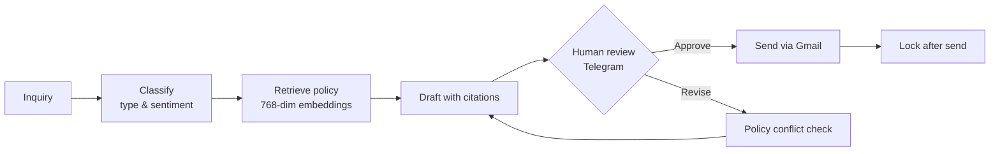
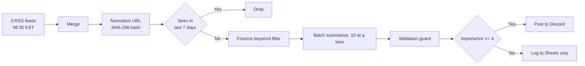

<div align="center">


**I build LLM-powered products and ship them to real users.**

[](mailto:noviz2025@gmail.com)
[](https://github.com/noviz-domino)
[](https://noviz-domino.github.io/)

[`한국어`](README.md) · `English`

</div>

---

## At a Glance

| &nbsp;&nbsp;&nbsp;&nbsp;&nbsp;&nbsp;&nbsp;&nbsp;&nbsp;&nbsp; | &nbsp; |
|:--|:--|
| **Name** | Kim Minseok (김민석) |
| **Focus** | AI agent engineering - building applications on top of LLMs |
| **Domain** | Financial AI (regulatory RAG, fraud detection, personal finance agents) |
| **Currently** | Multicampus **AI Agent Engineer Track**, cohort 1 |
| **Duration** | Jul 2026 – Jan 2027 · 984 hours |
| **Contact** | noviz2025@gmail.com |

**I ship what I build, and I measure it.**
One Android app is live on Google Play with real users. Two web services are deployed and publicly reachable.
In my main project, I measured the effect of adding RAG against a 50-case evaluation set: **first-pass approval rate went from 34% to 94%.**

I am still early in my career and still narrowing my focus. So far my work has centered on **safely wiring LLMs into real products** - enforcing structured output, validating what the model returns, and designing where a human must stay in the loop.

> This repository collects **source code and design documents** for each project.
> Every project lives under `projects/` in a folder matching its original repository, with a link back to that repository.

---

## Featured Projects

### 1. replygate - Customer support automation with human approval


**Problem.** Customer support replies contain numbers that cause disputes when wrong - refund windows, shipping deadlines, fee thresholds. LLMs invent those numbers convincingly. So "an AI that answers customers automatically" cannot go straight into production.

**Approach.** Instead of auto-sending, I designed it as **AI draft → human approval → send**, with 70 policy clauses retrieved via RAG so every draft cites its source. The thesis: *making an AI controllable matters more than making it fast.*


Here the operator asked to state free shipping starts at ₩30,000, but the policy document says ₩50,000. The system **does not follow the instruction** - it surfaces the conflict and leaves the judgment to the human.



**Measured results.** Evaluated against a 50-case set, compared to a no-RAG baseline.

| Metric | Baseline | With RAG |
|:--|--:|--:|
| First-pass approval rate | 34.0% | **94.0%** |
| Numeric accuracy | 43.8% | **96.0%** |

The evaluation set deliberately includes **5 trap cases with no answer in the policy documents**, to check whether the system admits what it does not know.

**A failure I kept in the record.** Sentiment classification never once picked the `neutral` class - 0 out of 20. Redefining the class did not help. The actual cause was structural: **sentiment and "needs lookup" are orthogonal axes**, and I had collapsed them into one. After separating them, accuracy reached 98% / 92%. The intermediate version was a fake improvement that only moved labels around, and I left that assessment in the development log rather than quietly deleting it.

📂 [Code](projects/replygate/) · 📄 [Evaluation design](projects/replygate/eval/) · 🔗 [Original repo](https://github.com/noviz-domino/replygate)

<br/>

### 2. englishWordApp - TOEIC vocabulary app, live on Google Play


**This app is published and installable by anyone.**

| Home | Study | Quiz |
|:--:|:--:|:--:|
|  |  |  |

**Problem.** My earlier Java version did not work as a study tool. Words and meanings were always shown together, so there was no way to test recall. The CSV parser did not handle quoted fields, leaving stray `"` characters visible in **835 of 1,225 rows**. Study history was never persisted, so rotating the screen reset all progress.

**Approach.** I rewrote it in Kotlin + Jetpack Compose.

- **CSV parsing** - reimplemented to **RFC 4180**: commas inside quoted fields are not separators, and escaped `""` resolves to a literal quote
- **Quiz logic** - extracted into pure functions and pinned with **25 JUnit tests**
- **State** - `SavedStateHandle` restores study position across configuration changes *and* process death

| | |
|:--|:--|
| Scale | ~2,286 lines of Kotlin · 42 commits · Jun 2026 – ongoing |
| Data | 1,222 vocabulary rows (day 1–30) |
| Features | Hidden-meaning study · resume progress · TTS · mistake notebook · multiple-choice quiz |

📱 [View on Google Play](https://play.google.com/store/apps/details?id=com.voca.englishwordapp) · 📂 [Code](projects/englishWordApp/) · 🔗 [Original repo](https://github.com/noviz-domino/englishWordApp)

<br/>

### 3. mealmate - AI weekly meal planning from what's in your fridge


| Public plans | Generated plan | Recipe on demand |
|:--:|:--:|:--:|
|  |  |  |

**Problem.** You have ingredients but no idea what to cook, so you order delivery instead. Planning several days at once is tedious enough that people skip it.

**Approach.** Enter your ingredients and Gemini generates a plan plus a shopping list. The important part is that **the model's output is not trusted as-is**:

```
1) responseSchema enforces the shape          → lib/gemini.ts
2) The application re-validates the result    → lib/mealPlan.ts
     ├─ validateStructure()
     └─ findAllergyViolations()
3) On failure, regenerate once, then reject   → app/api/plans/route.ts
```

Allergy checking is not a plain string match. Someone avoiding milk must not be served a plan containing condensed milk or cream, so **derived ingredients are screened too**.

| | |
|:--|:--|
| Scale | ~3,208 lines of TypeScript · 34 commits · built in 3 days |
| Security | Per-user isolation via Supabase RLS |
| Features | Plan & shopping list generation · on-demand recipes · completion tracking · public/private sharing |

🔗 [Live demo](https://mealmate-inky.vercel.app) · 📂 [Code](projects/mealmate/) · 🔗 [Original repo](https://github.com/noviz-domino/mealmate)

<br/>

### 4. n8n-finance-news-briefing - Automated financial news digest


**Problem.** A research team browses several news sites separately every morning, which produces information asymmetry between members, wasted time filtering non-financial articles, and repeated reads of the same story.



**The core of this project is design under cost constraints.**

- **188 API calls → 4.** Sending each filtered article individually hit the free tier's 5-requests-per-minute limit and returned `429`. I combined three changes: a stricter pre-LLM keyword filter, a daily cap, and batching 10 articles per call.
- **Wiring 3 RSS feeds directly into one downstream node makes n8n execute the entire chain 3 times.** I found this only when Discord received the same message three times in a live run. A Merge node is now mandatory.
- **Truncation had to be fixed the right way.** When high-importance articles grew to 17 and hit Discord's 2,000-character limit, raising the importance threshold would have fixed the symptom but violated the requirement. I restored the scoring prompt to the original specification instead.

📂 [Code](projects/n8n-finance-news-briefing/) · 🔗 [Original repo](https://github.com/noviz-domino/n8n-finance-news-briefing)

---

## All Projects

| Project | Description | Stack | Links |
|:--|:--|:--|:--|
| **replygate** | Customer support automation with human approval | n8n · Gemini · RAG · FastAPI | [code](projects/replygate/) |
| **englishWordApp** | TOEIC vocabulary app (on Google Play) | Kotlin · Compose | [code](projects/englishWordApp/) · [store](https://play.google.com/store/apps/details?id=com.voca.englishwordapp) |
| **mealmate** | AI weekly meal planning | Next.js · Supabase · Gemini | [code](projects/mealmate/) · [demo](https://mealmate-inky.vercel.app) |
| **n8n-finance-news-briefing** | Automated financial news digest | n8n · Gemini · Discord | [code](projects/n8n-finance-news-briefing/) |
| **n8n-voc-analysis-agent** | Customer VOC triage with urgent alerts | n8n · Gemini · Sheets | [code](projects/n8n-voc-analysis-agent/) |
| **go-eat** | Restaurant journal for rural areas (8-hour build) | Next.js · Supabase | [code](projects/go-eat/) · [demo](https://go-eat-noviz.vercel.app) |
| **cosmic-grazer** | Single-file bullet-hell survivor game | Vanilla JS · Canvas2D | [code](projects/cosmic-grazer/) · [play](https://noviz-domino.github.io/cosmic-grazer/) |
| **god-of-diplomacy** | Gemini-driven political text RPG | FastAPI · Gemini | [code](projects/god-of-diplomacy/) |

---

## Tech Stack

**AI / Agent**


**Frontend**


**Backend / Data**


**Mobile**


---

## Working with AI Tools

I use AI coding tools, and I treat them as tools. I decide what to build, verify the result, and own it when it is wrong - which is why I do not list them as commit co-authors.

Running several of them across a project does create real management problems, so I built rules for it: a single source of truth for instructions, a handoff board for uncommitted work, verification commands recorded in commit messages, and a growing checklist of mistakes that recurred.

📄 [Details](docs/agent-workflow.md) - including what I deliberately did **not** delegate.

---

## Training

**Multicampus AI Agent Engineer Track, Cohort 1** · Jul 2026 – Jan 2027 · 984 hours

The program is built around **financial AI services**. Each module's project targets a finance domain problem - e-KYC ID masking, personal finance and robo-advisor agents, regulatory and terms-of-service RAG, credit scoring and fraud detection, and multi-agent financial services.

| Module | Topics |
|:--|:--|
| 1 | LLM & AI agent fundamentals, prompt engineering, n8n workflows |
| 2 | Python & AI API web development, LangChain (LCEL, Memory, LangSmith) |
| 3 | Multi-agent orchestration - LangGraph, MCP, A2A |
| 4 | LLM & RAG system design (Chroma/FAISS, HyDE, re-ranking), PyTorch, LoRA |
| 5 | Production AI - FastAPI, Docker, AWS, CI/CD |
| 6 | Capstone - financial AI service (278 hours) |

> This program is in progress. Completed modules are reflected in the project list above; later deliverables will be added as they are finished.

[](https://github.com/noviz-domino/TIL)

---

<div align="center">

### Contact

[](mailto:noviz2025@gmail.com)
[](https://github.com/noviz-domino)


</div>
