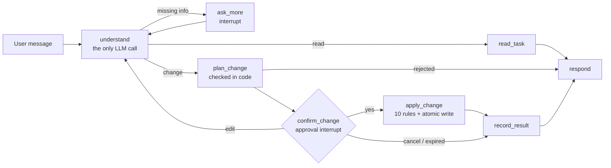
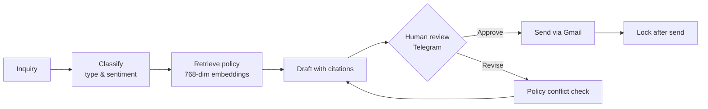

<div align="center">

# Kim Minseok

### AI Agent Engineer

**I connect LLMs to real services - safely.**<br/>
Where a plausible answer is not good enough, I split the work between what the LLM does and what code and people do.

[](mailto:noviz2025@gmail.com)
[](https://github.com/noviz-domino)
[](https://noviz-domino.github.io/)
[](https://github.com/noviz-domino/TIL)

[Featured](#featured-projects) · [All projects](#all-projects) · [Tech stack](#tech-stack) · [AI tools](#working-with-ai-tools) · [Training](#training) · [한국어](README.md)

**Try it live** · [englishWordApp (Google Play)](https://play.google.com/store/apps/details?id=com.voca.englishwordapp) · [mealmate](https://mealmate-inky.vercel.app) · [go-eat](https://go-eat-noviz.vercel.app) · [data-value-sandbox](https://noviz-domino.github.io/data-value-sandbox/) · [cosmic-grazer](https://noviz-domino.github.io/cosmic-grazer/)

</div>

<br/>

<table>
<tr>
<td width="33%" valign="top">

**🧭 LLMs at the entrance only**

The LLM interprets what people say. Calculation, validation and storage are done in code, so numbers never pass through the model.

</td>
<td width="33%" valign="top">

**✋ A human can stop it**

Wherever money moves or a message reaches a customer, there is an approval step. Controllable beats fast.

</td>
<td width="33%" valign="top">

**📏 Measure, then claim**

Instead of "it got better", I keep numbers from evaluation sets and scenarios - and record failures and limits as they are.

</td>
</tr>
</table>

<div align="center">

| First-pass approval | Dialogue scenarios | API calls | Shipped app |
|:--:|:--:|:--:|:--:|
| **34% → 94%** | **47 / 47** passed | **188 → 4** | **Google Play** |
| replygate · with RAG | financial agent · ledger intact | news digest · free-tier limits | englishWordApp |

</div>

---

## About

| | |
|:--|:--|
| **Now** | **Samsung Multicampus AI Agent Engineer Track, Cohort 1** (Jul 2026 – Jan 2027 · 984 hours) |
| **Domain interest** | Financial AI - RAG for regulations and terms, fraud detection, asset-management agents |
| **Built so far** | LangGraph agents · RAG · n8n automation · Next.js web services · an Android app · a browser game |

My Android app is published on Google Play with real users, and two web services are deployed and reachable.
I build things hands-on until they feel natural, and when the standard approach fails I am comfortable trying another.

Most of my work so far is about **enforcing structured output, validating model output, and designing where a human steps in**.
Lately I have been carrying the same principle into LangGraph agents: *decisions that must not wobble are made by code, not by the LLM.*

> This repository collects **source code and design documents** per project.
> The original repositories are private; each project lives under `projects/` as a copy with sensitive data removed.

---

## Featured Projects

### 1. langgraph-financial-agent - A conversational banking agent that acts only after approval


**Problem.** Hand "move ₩100,000 from living expenses to savings" entirely to an LLM and it may **invent a source account the user never named**, or get the balance math wrong without anyone noticing. When money moves you need an answer that is not wrong, not one that merely sounds right.

**Approach.** The LLM is used **in exactly one place** - the `understand` node that interprets what the user said. Balance math, checks, storage and reply text are all code, so no number passes through the LLM. Anything that changes money or card state pauses on a LangGraph `interrupt` and **runs only after the user approves**, and a save happens only after 10 integrity rules pass, replacing the ledger atomically.


```mermaid
flowchart LR
    A[User message] --> B[understand<br/>the only LLM call]
    B -->|missing info| C[ask_more<br/>interrupt]
    C --> B
    B -->|read| D[read_task] --> R[respond]
    B -->|change| E[plan_change<br/>checked in code]
    E -->|rejected| R
    E --> F{confirm_change<br/>approval interrupt}
    F -->|yes| G[apply_change<br/>10 rules + atomic write] --> H[record_result] --> R
    F -->|cancel / expired| H
    F -->|edit| B
```

**Measured results.** Dialogue scenarios, including failure cases, run automatically.

| Check | Result |
|:--|--:|
| Dialogue scenarios (insufficient balance, unknown account, balance drops while awaiting approval, save failure, AI server 503, …) | **47 / 47** |
| Ledger integrity after the scenarios | **10 / 10** |
| Task-code unit checks (no API) | 31 / 31 |

**Failures I kept in the record.** 27 design changes are logged with their reasons. Two of them:

- Even with *"account to carry over: none"* written in the prompt, the LLM filled in a source account. **It passed once and failed once - a prompt is a probability.** So the rule no longer stops at telling the model; **code validates** the LLM's answer.
- While using it myself I found the LLM **inventing** the source account for *"move ₩100,000 to savings"*. Code cannot tell "understood by meaning" from "made up", so I restricted **only the high-risk field - the source account** - to names the user said, carried over, or picked from shown candidates.

📂 [Code](projects/langgraph-financial-agent/) · 📄 [Design change log (KR)](projects/langgraph-financial-agent/docs/설계변경기록.md)

<br/>

### 2. replygate - Customer support automation with human approval


**Problem.** Customer support replies contain numbers that cause disputes when wrong - refund windows, shipping deadlines, fee thresholds. LLMs invent those numbers convincingly. So "an AI that answers customers automatically" cannot go straight into production.

**Approach.** Instead of auto-sending, I designed it as **AI draft → human approval → send**, with 70 policy clauses retrieved via RAG so every draft cites its source. The thesis: *making an AI controllable matters more than making it fast.*


Here the operator asked to state free shipping starts at ₩30,000, but the policy document says ₩50,000. The system **does not follow the instruction** - it surfaces the conflict and leaves the judgment to the human.


```mermaid
flowchart LR
    A[Inquiry] --> B[Classify<br/>type & sentiment]
    B --> C[Retrieve policy<br/>768-dim embeddings]
    C --> D[Draft with citations]
    D --> E{Human review<br/>Telegram}
    E -->|Approve| F[Send via Gmail]
    E -->|Revise| G[Policy conflict check]
    G --> D
    F --> H[Lock after send]
```

**Measured results.** Evaluated against a 50-case set, compared to a no-RAG baseline.

| Metric | Baseline | With RAG |
|:--|--:|--:|
| First-pass approval rate | 34.0% | **94.0%** |
| Numeric accuracy | 43.8% | **96.0%** |

The evaluation set deliberately includes **5 trap cases with no answer in the policy documents**, to check whether the system admits what it does not know.

**A failure I kept in the record.** Sentiment classification never once picked the `neutral` class - 0 out of 20. Redefining the class did not help. The actual cause was structural: **sentiment and "needs lookup" are orthogonal axes**, and I had collapsed them into one. After separating them, accuracy reached 98% / 92%. The intermediate version was a fake improvement that only moved labels around, and I left that assessment in the development log rather than quietly deleting it.

📂 [Code](projects/replygate/) · 📄 [Evaluation design](projects/replygate/eval/)

<br/>

### 3. legal_secretary - A labor-law RAG assistant that cites the article (rebuild in progress)


**Problem.** The 2024 capstone version claimed *"legal documents are sensitive, so we use a local LLM"* - but for lack of hardware it actually sent questions through a public ngrok tunnel to Colab. **The implementation did not deliver what the design claimed.** I found that gap myself and started a full rebuild.

**Approach.** Legal questions contain **tokens that must match exactly**, like *"Labor Standards Act, Article 56"*, which vector search alone easily misses. So chunks follow article boundaries (`제N조`), and retrieval is a **hybrid of BM25 and dense vectors (bge-m3) fused with RRF**. **Citations are streamed (SSE) before the answer** so the user sees the source first, and one setting switches the LLM between an API and a self-hosted backend.

| | |
|:--|:--|
| Progress | **Stage 3 of 6 done** (skeleton · RAG core · streaming) - agent loop, eval set, UI and deploy are next |
| Data | 2 statute PDFs → 264 chunks |
| Measured | Retrieval ~1.4–2 s · free-tier Gemini answer 8.8 s (a 503 is rejected within 3 s) → the reason streaming was moved earlier |

📂 [Code](projects/legal_secretary/) · 📄 [Rebuild plan (KR)](projects/legal_secretary/docs/리빌딩계획.md)

<br/>

### 4. englishWordApp - TOEIC vocabulary app, live on Google Play


**This app is published and installable by anyone.**

| Home | Study | Quiz |
|:--:|:--:|:--:|
|  |  |  |

**Problem.** My earlier Java version did not work as a study tool. Words and meanings were always shown together, so there was no way to test recall. The CSV parser did not handle quoted fields, leaving stray `"` characters visible in **835 of 1,225 rows**. Study history was never persisted, so rotating the screen reset all progress.

**Approach.** I rewrote it in Kotlin + Jetpack Compose.

- **CSV parsing** - reimplemented to **RFC 4180**: commas inside quoted fields are not separators, and escaped `""` resolves to a literal quote
- **Quiz logic** - extracted into pure functions and pinned with **25 JUnit tests**
- **State** - `SavedStateHandle` restores study position across configuration changes *and* process death

| | |
|:--|:--|
| Scale | ~2,286 lines of Kotlin · 42 commits · Jun 2026 – ongoing |
| Data | 1,222 vocabulary rows (day 1–30) |
| Features | Hidden-meaning study · resume progress · TTS · mistake notebook · multiple-choice quiz |

📱 [View on Google Play](https://play.google.com/store/apps/details?id=com.voca.englishwordapp) · 📂 [Code](projects/englishWordApp/)

<br/>

### 5. mealmate - AI weekly meal planning from what's in your fridge


| Public plans | Generated plan | Recipe on demand |
|:--:|:--:|:--:|
|  |  |  |

**Problem.** You have ingredients but no idea what to cook, so you order delivery instead. Planning several days at once is tedious enough that people skip it.

**Approach.** Enter your ingredients and Gemini generates a plan plus a shopping list. The important part is that **the model's output is not trusted as-is**:

```
1) responseSchema enforces the shape          → lib/gemini.ts
2) The application re-validates the result    → lib/mealPlan.ts
     ├─ validateStructure()
     └─ findAllergyViolations()
3) On failure, regenerate once, then reject   → app/api/plans/route.ts
```

Allergy checking is not a plain string match. Someone avoiding milk must not be served a plan containing condensed milk or cream, so **derived ingredients are screened too**.

| | |
|:--|:--|
| Scale | ~3,208 lines of TypeScript · 34 commits · built in 3 days |
| Security | Per-user isolation via Supabase RLS |
| Features | Plan & shopping list generation · on-demand recipes · completion tracking · public/private sharing |

🔗 [Live demo](https://mealmate-inky.vercel.app) · 📂 [Code](projects/mealmate/)

*The demo may be paused on the free tier. The screenshots above show the actual screens.*

---

## All Projects

<table>
<thead>
<tr><th>Project</th><th>Summary</th><th>Stack</th><th>Links</th></tr>
</thead>
<tbody>

<tr><td colspan="4"><b>🤖 AI agents · LLM</b></td></tr>

<tr><td><b>langgraph-financial-agent</b></td><td>Conversational banking agent that acts only after approval</td><td>LangGraph · Gemini · FastAPI</td><td><a href="projects/langgraph-financial-agent/">Code</a></td></tr>

<tr><td><b>replygate</b></td><td>Customer support: AI draft + human approval</td><td>n8n · Gemini · RAG · FastAPI</td><td><a href="projects/replygate/">Code</a></td></tr>

<tr><td><b>legal_secretary</b></td><td>Labor-law RAG assistant with citations (rebuild 3/6)</td><td>FastAPI · LangChain · Chroma · BM25</td><td><a href="projects/legal_secretary/">Code</a></td></tr>

<tr><td><b>rag-experiment-script</b></td><td>RAG experiment harness comparing chunking, retrieval and reranking over 20 configs</td><td>LangChain · Chroma · BM25 · Gemini</td><td><a href="projects/rag-experiment-script/">Code</a> · <a href="projects/rag-experiment-script/2026-09-07%20RAG%20실험%20보고서.md">Report (KR)</a></td></tr>
<tr><td colspan="4">
<details>
<summary><b>rag-experiment-script results</b></summary>

- Best setup: **chunk 500 + hybrid retrieval** - Page Hit@1 **0.943**, MRR 0.943 (baseline 0.886 / 0.907)
- BM25 alone at chunk 500 still reaches MRR 0.914 with **zero embedding calls** in 43.5 s
- On the hard set, reranking lifts 0.600 → 0.800 but is **~8× slower** (37 s)
- Found and fixed a bug where only part of the chunks were embedded; Page Hit@1 recovered from 0.686 to 0.857
- The report states the limit up front: with 35 questions, **one question = 2.86 pp**

</details>
</td></tr>

<tr><td><b>multi-agent-tax-prep</b></td><td>Multi-agent helper for preparing a Korean income tax return (research · planning · review)</td><td>LangGraph · Gemini · Pydantic</td><td><a href="projects/multi-agent-tax-prep/">Code</a></td></tr>
<tr><td colspan="4">
<details>
<summary><b>multi-agent-tax-prep highlights</b></summary>

- A router picks which agents to run; each agent hands off with `Command(goto=...)`. The review agent runs a Reflection loop (max 2 rounds) and can send the plan back
- Deliberately **not a tax calculator** - it decides filing obligation and method and builds the document checklist. Rules live in code, per-year thresholds in config
- 57 tests that make no LLM calls
- **Failure kept in the record:** all 5 router tests passed, yet the precondition check had never run once. The lesson in the work log: *"passing" is not the same as "my code works"*

</details>
</td></tr>

<tr><td><b>n8n-finance-news-briefing</b></td><td>Automated financial news digest (API calls 188 → 4)</td><td>n8n · Gemini · Discord</td><td><a href="projects/n8n-finance-news-briefing/">Code</a></td></tr>
<tr><td colspan="4">
<details>
<summary><b>n8n-finance-news-briefing highlights</b></summary>

- Daily at 08:30: collect 3 RSS feeds → dedupe → finance keyword filter → batch summaries of 10 → send only importance ≥ 4 to Discord
- **188 API calls → 4.** When the free tier's 5 requests/min limit produced `429`s, I moved the keyword filter ahead of the LLM, added a daily cap and switched to batch summaries
- **URL normalization + SHA-256 hashes** checked against 7 days of history block duplicate articles
- Wiring 3 RSS nodes directly downstream made **n8n run the whole chain three times** (three identical Discord messages) - found in a live run, fixed with a mandatory Merge node

</details>
</td></tr>

<tr><td><b>n8n-voc-analysis-agent</b></td><td>Automatic VOC classification and urgent alerts</td><td>n8n · Gemini · Sheets</td><td><a href="projects/n8n-voc-analysis-agent/">Code</a></td></tr>

<tr><td><b>personal-budget-ai-agent</b></td><td>Natural-language budgeting agent with Gemini function calling (7 tools)</td><td>Gemini Function Calling · Python</td><td><a href="projects/personal-budget-ai-agent/">Code</a></td></tr>

<tr><td><b>god-of-diplomacy</b></td><td>Gemini-powered political and diplomatic text RPG</td><td>FastAPI · Gemini</td><td><a href="projects/god-of-diplomacy/">Code</a></td></tr>

<tr><td colspan="4"><b>📱 Apps · web services</b></td></tr>

<tr><td><b>englishWordApp</b></td><td>TOEIC vocabulary app (on Google Play)</td><td>Kotlin · Compose</td><td><a href="projects/englishWordApp/">Code</a> · <a href="https://play.google.com/store/apps/details?id=com.voca.englishwordapp">Store</a></td></tr>

<tr><td><b>mealmate</b></td><td>AI weekly meal planner</td><td>Next.js · Supabase · Gemini</td><td><a href="projects/mealmate/">Code</a> · <a href="https://mealmate-inky.vercel.app">Demo</a></td></tr>

<tr><td><b>go-eat</b></td><td>Rural restaurant log web app (built under an 8-hour limit)</td><td>Next.js · Supabase</td><td><a href="projects/go-eat/">Code</a> · <a href="https://go-eat-noviz.vercel.app">Demo</a> (<code>test1@goeat.test</code>/<code>test1234</code>)</td></tr>
<tr><td colspan="4">
<details>
<summary><b>go-eat screens</b></summary>
<br/>

<br/>

</details>
</td></tr>

<tr><td colspan="4"><b>📊 Data · games</b></td></tr>

<tr><td><b>data-value-sandbox</b></td><td>Measuring which data makes events predictable, in a synthetic world with known answers</td><td>deck.gl · Vanilla JS · Jupyter</td><td><a href="https://github.com/noviz-domino/data-value-sandbox">Repo</a> · <a href="https://noviz-domino.github.io/data-value-sandbox/">Demo</a></td></tr>

<tr><td><b>cosmic-grazer</b></td><td>Single-file bullet-hell survivor game</td><td>Vanilla JS · Canvas2D</td><td><a href="projects/cosmic-grazer/">Code</a> · <a href="https://noviz-domino.github.io/cosmic-grazer/">Play</a></td></tr>
<tr><td colspan="4">
<details>
<summary><b>cosmic-grazer screen</b></summary>
<br/>

</details>
</td></tr>

</tbody>
</table>

> `data-value-sandbox` is already public, so it is linked rather than copied.

> `mealmate` and `go-eat` run on Supabase's free plan, so their demos may be paused. The screenshots show the actual screens. ([How they are kept awake](docs/supabase-keepalive.md))

---

## Tech Stack

| Area | Used |
|:--|:--|
| **AI / Agent** |       |
| **RAG / Retrieval** |      |
| **Backend** |      |
| **Frontend** |     |
| **Mobile** |   |
| **Tooling** |      |

---

## Working with AI Tools

I use AI coding tools, and I treat them as tools. I decide what to build, verify the result, and own it when it is wrong - which is why I do not list them as commit co-authors.

Running several of them across a project does create real management problems, so I built rules for it: a single source of truth for instructions, a handoff board for uncommitted work, verification commands recorded in commit messages, and a growing checklist of mistakes that recurred.

📄 [Details](docs/agent-workflow.md) - including what I deliberately did **not** delegate.

---

## Training

**Samsung Multicampus AI Agent Engineer Track, Cohort 1** · Jul 2026 – Jan 2027 · 984 hours

The program is built around **financial AI services**. Each module's project targets a finance domain problem - e-KYC ID masking, personal finance and robo-advisor agents, regulatory and terms-of-service RAG, credit scoring and fraud detection, and multi-agent financial services.

| Module | Topic | Related work |
|:--|:--|:--|
| 1 | LLMs and AI agents, prompt engineering, n8n no-code workflows | n8n-voc-analysis-agent · n8n-finance-news-briefing · replygate |
| 2 | Python and AI API web development, LangChain (LCEL, Memory, LangSmith) | personal-budget-ai-agent · rag-experiment-script |
| 3 | Multi-agent orchestration - LangGraph, MCP, A2A | multi-agent-tax-prep · langgraph-financial-agent |
| 4 | LLM and RAG system design (Chroma/FAISS, HyDE, re-ranking), PyTorch, LoRA | *upcoming* |
| 5 | AI production - FastAPI, Docker, AWS, CI/CD | *upcoming* |
| 6 | Capstone - financial AI service (278 hours) | *upcoming* |

> The program is in progress; later modules' work will be added as it is completed.
> Outside the program I have also deployed to an Oracle Cloud free-tier server and set up local LLMs (Ollama · vLLM), keeping notes as I go.

Daily notes are in the [TIL repository](https://github.com/noviz-domino/TIL).

---

<div align="center">

### Contact

[](mailto:noviz2025@gmail.com)
[](https://github.com/noviz-domino)

<sub>Last tidied: 2026-09-30 · <a href="docs/CHANGELOG.md">Change log (KR)</a></sub>

</div>
