

**LLM과 AI 에이전트로, 실제로 배포되어 쓰이는 것을 만듭니다.**

`한국어` · [`English`](README.en.md)

---

## 30초 요약

| &nbsp;&nbsp;&nbsp;&nbsp;&nbsp;&nbsp;&nbsp;&nbsp;&nbsp;&nbsp; | &nbsp; |
|:--|:--|
| **이름** | 김민석 (Kim Minseok) |
| **목표** | AI 에이전트 엔지니어 - LLM 응용 서비스 개발 |
| **관심 도메인** | 금융 AI (RAG 기반 규제·약관 상담, 이상탐지, 자산관리 에이전트) |
| **현재** | 멀티캠퍼스 **AI 에이전트 엔지니어 트랙 1회차** 수강 중 |
| **기간** | 2026.07 ~ 2027.01 · 984시간 |
| **연락** | noviz2025@gmail.com |

**진행하기로 한 것은 정말 끈기를 가지고 달성하며, 다양한 분야에 대한 전반적인 경험을 하면
남들이 접근하거나 상상하지 못한 획기적인 접근법과 해결책을 시도하고 생각하는 게 강점입니다.**

안드로이드 앱은 Google Play에 출시해 실제 사용자가 쓰고 있고, 웹 서비스 두 개는 배포된 상태로 접속할 수 있습니다.
대표 프로젝트에서는 RAG 도입 효과를 평가셋 50건으로 측정해 **1차 응답 승인률 34% → 94%** 를 확인했습니다.

아직 배우는 중이고, 트랙을 마치며 관심 분야를 좁혀가고 있습니다.
지금까지의 작업은 **LLM을 실제 서비스에 안전하게 붙이는 일** - 구조화 출력 강제, 출력 검증, 사람 개입 지점 설계 - 에 몰려 있습니다.

> 이 저장소는 프로젝트별 **소스 코드와 설계 문서**를 한 곳에 모은 것입니다.
> 각 프로젝트는 `projects/` 아래 같은 이름의 폴더에 있고, 원본 저장소 링크를 함께 표기했습니다.

---

## 대표 프로젝트

### 1. replygate - 고객 문의 응대 자동화 (AI 초안 + 사람 승인)

**문제.** 고객 문의 답변에는 환불 수수료·배송 기한처럼 **틀리면 곧바로 분쟁이 되는 수치**가 들어갑니다. 그리고 LLM은 이런 수치를 그럴듯하게 지어냅니다. 그래서 "AI가 자동으로 답장하는 시스템"은 실무에 그대로 넣을 수 없습니다.

**접근.** 자동 발송 대신 **AI 초안 → 사람 승인 → 발송** 구조로 설계하고, 정책 문서 70개 조항을 RAG로 검색해 근거 조항을 인용하게 했습니다. 핵심 주장은 이것입니다 - *AI를 빠르게 만드는 것보다, 통제 가능하게 만드는 것이 실무의 문제다.*

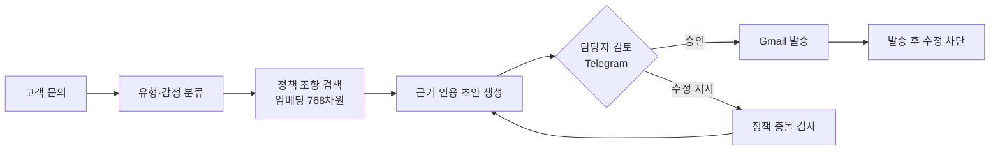

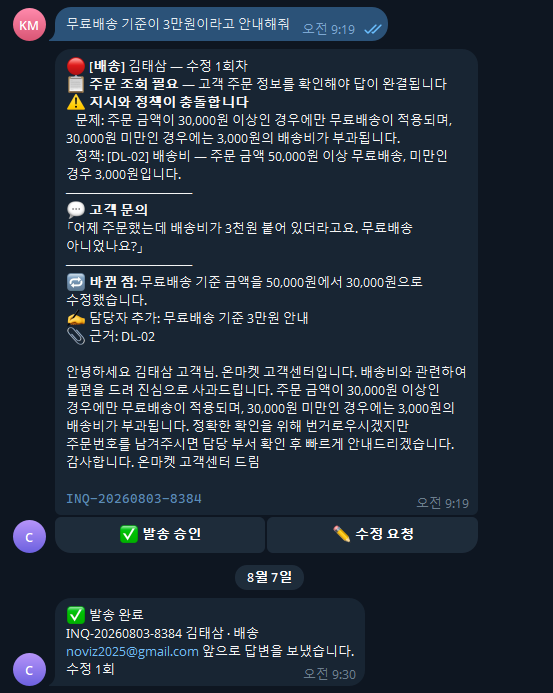

담당자가 *"무료배송 기준이 3만원이라고 안내해줘"* 라고 지시했지만 정책 문서에는 **5만원**으로 되어 있습니다. 시스템은 지시를 그대로 따르지 않고 **충돌 사실만 드러내고, 판단은 사람에게 넘깁니다.**

**측정 결과.** 베이스라인(RAG 없음)과 비교해 평가셋 50건으로 실측했습니다.

| 지표 | 베이스라인 | RAG 적용 |
|:--|--:|--:|
| 1차 승인률 | 34.0% | **94.0%** |
| 수치 정확률 | 43.8% | **96.0%** |

평가셋에는 **정책 문서에 의도적으로 답이 없는 함정 5건**을 넣어, 모르는 것을 모른다고 답하는지까지 확인했습니다.

**기록해둔 실패.** 감정 분류에서 `중립` 클래스가 20번 중 0번 선택되는 문제를 만나 정의를 고쳤지만 여전히 0이었고, 결국 **"감정과 조회필요는 직교하는 두 축"** 이라는 구조적 원인을 찾아 축을 분리했습니다(98% / 92%로 개선). 중간 버전은 *"라벨만 옮긴 가짜 개선"* 이었다고 문서에 그대로 남겨뒀습니다.

📂 [코드 보기](projects/replygate/) · 📄 [평가셋 설계](projects/replygate/eval/) · 🔗 [원본 저장소](https://github.com/noviz-domino/replygate)

 

### 2. englishWordApp - 토익 단어 학습 앱 (Google Play 출시)

**실제 스토어에 출시되어 다운로드할 수 있는 앱입니다.**

| 홈 | 단어 학습 | 퀴즈 |
|:--:|:--:|:--:|
| 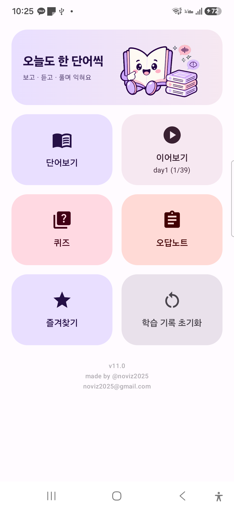 | 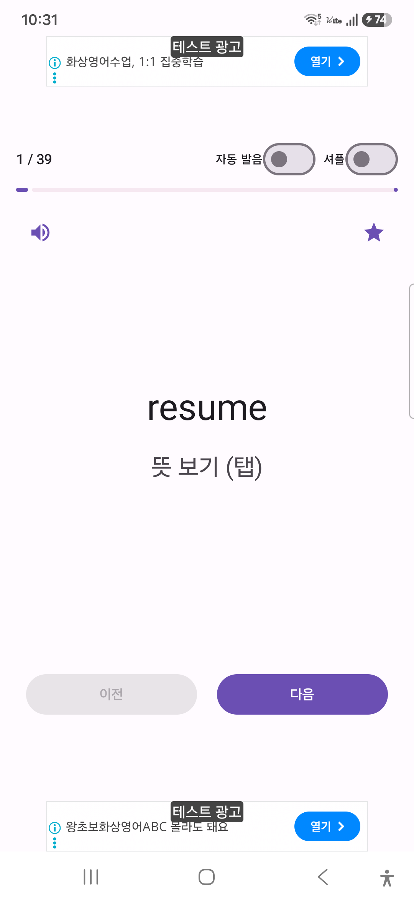 | 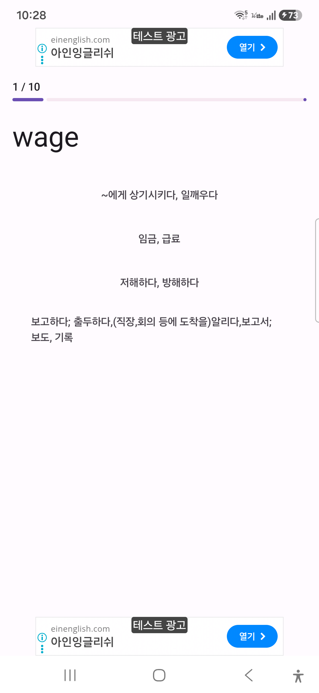 |

**문제.** 직접 만들었던 Java 버전이 학습 도구로 작동하지 않았습니다. 단어와 뜻이 항상 같이 보여 암기 검증이 불가능했고, CSV 파서가 따옴표를 처리하지 못해 **1,225행 중 835행에 `"` 문자가 그대로 노출**됐으며, 학습 이력이 저장되지 않아 화면 회전만으로 진행도가 초기화됐습니다.

**접근.** Kotlin + Jetpack Compose로 전면 재작성했습니다. CSV 파서를 RFC 4180 기준으로 다시 만들고, 퀴즈 출제 로직을 순수 함수로 분리해 **JUnit 테스트 25건**으로 고정했으며, `SavedStateHandle`로 프로세스 재생성까지 상태를 복원하게 했습니다.

| | |
|:--|:--|
| 규모 | Kotlin 약 2,286줄 · 커밋 42개 · 2026.06 ~ 진행 중 |
| 데이터 | 단어 1,222행 (day 1~30) |
| 기능 | 뜻 가리기 학습 · 진행도 이어보기 · TTS 발음 · 오답노트 · 4지선다 퀴즈 |

📱 [Google Play에서 보기](https://play.google.com/store/apps/details?id=com.voca.englishwordapp) · 📂 [코드 보기](projects/englishWordApp/) · 🔗 [원본 저장소](https://github.com/noviz-domino/englishWordApp)

 

### 3. mealmate - 냉장고 재료 기반 AI 주간 식단 생성

| 공개 식단 | AI가 만든 식단 | 끼니별 조리법 |
|:--:|:--:|:--:|
| 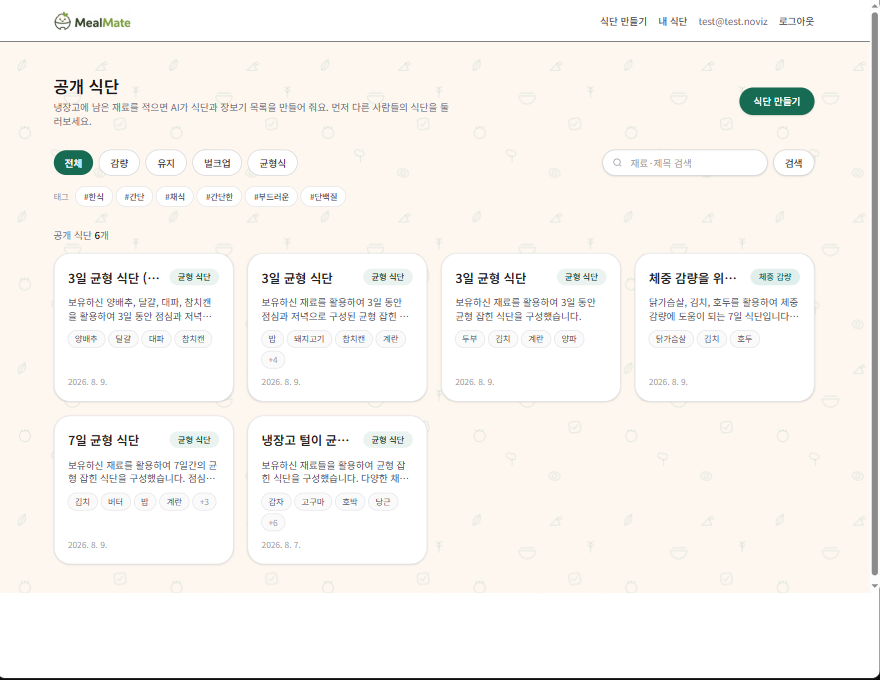 | 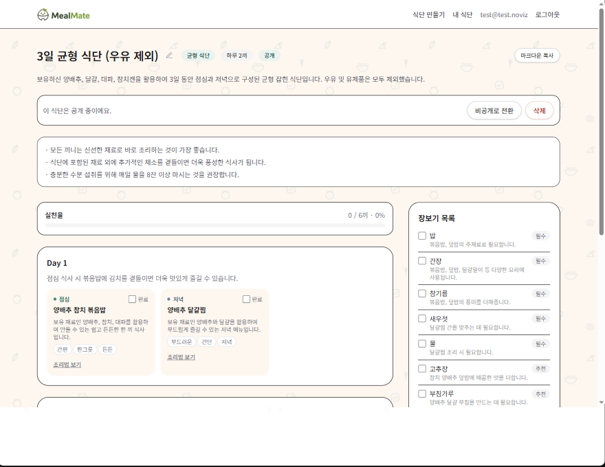 | 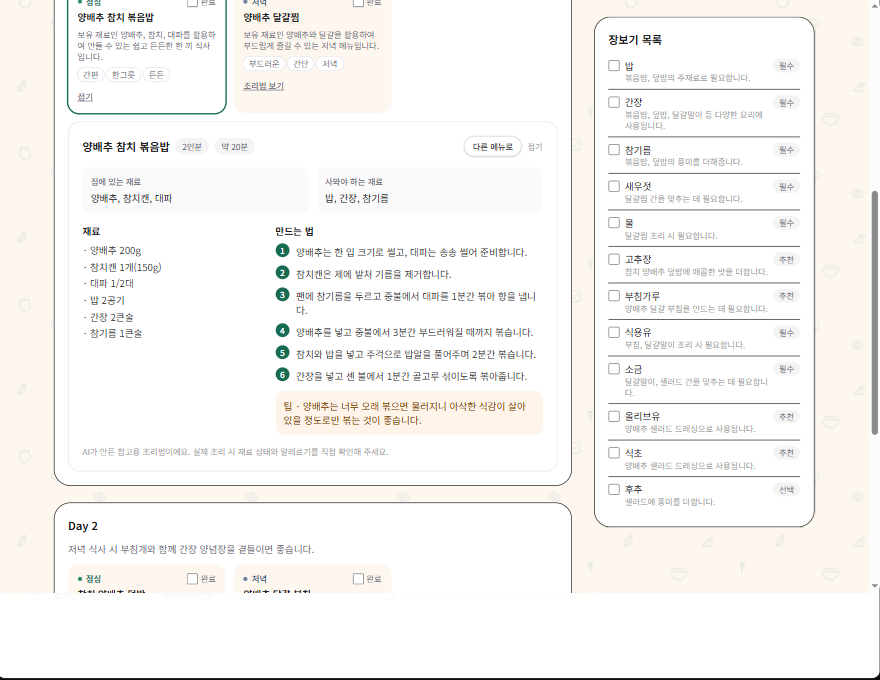 |

**문제.** 냉장고에 재료는 있는데 뭘 해먹을지 고민하다 결국 배달을 시킵니다. 식단을 짜려 해도 며칠치를 한 번에 계획하는 게 번거롭습니다.

**접근.** 재료를 입력하면 Gemini가 주간 식단과 장보기 목록을 생성합니다. 여기서 중요한 건 **LLM 출력을 그대로 믿지 않는다**는 점입니다. `responseSchema`로 구조를 강제한 뒤, 애플리케이션 단에서 **구조 검증**과 **알레르기 위반 검사**(파생어까지 차단)를 다시 돌리고, 실패하면 1회 재생성합니다.

| | |
|:--|:--|
| 규모 | TypeScript 약 3,208줄 · 커밋 34개 · 개발 3일 |
| 보안 | Supabase RLS 기반 사용자별 데이터 격리 |
| 기능 | 식단·장보기 생성 · 끼니별 조리법 온디맨드 생성 · 실천율 추적 · 공개/비공개 토글 |

🔗 [라이브 데모](https://mealmate-inky.vercel.app) · 📂 [코드 보기](projects/mealmate/) · 🔗 [원본 저장소](https://github.com/noviz-domino/mealmate)

 

### 4. n8n-finance-news-briefing - 금융 뉴스 자동 요약 브리핑

**문제.** 리서치팀이 매일 아침 여러 뉴스 사이트를 각자 순회하면서 (1) 팀원 간 정보 비대칭, (2) 비금융 기사 선별에 드는 시간 낭비, (3) 동일 기사 반복 열람이 발생합니다.

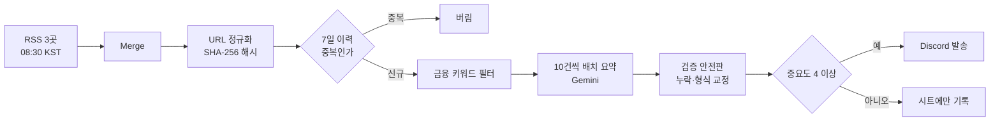

중복 차단과 키워드 필터를 **LLM 호출보다 앞에** 둔 것이 이 설계의 핵심입니다.

**접근.** 매일 08:30에 RSS 3곳을 수집해 요약 브리핑을 Discord로 발송합니다. **이 프로젝트의 핵심은 비용 제약 아래서의 설계 결정**입니다.

- **API 호출 188회 → 4회.** 무료 티어 분당 5요청 한도에 걸려 `429`가 터졌습니다. 키워드 필터를 LLM 앞단으로 옮기고, 일일 상한을 두고, 10건씩 묶어 배치 요약하는 세 가지를 동시에 적용해 해결했습니다.
- **URL 정규화 + SHA-256 해시**로 7일 이력과 대조해 중복 기사를 차단했습니다.
- **RSS 3개를 하류 노드에 직결하면 n8n이 체인 전체를 3번 실행**한다는 사실을 실기동에서 발견했습니다 (Discord에 같은 메시지 3통 발송). Merge 노드를 필수로 정정했습니다.

📂 [코드 보기](projects/n8n-finance-news-briefing/) · 🔗 [원본 저장소](https://github.com/noviz-domino/n8n-finance-news-briefing)

---

## 전체 프로젝트

| 프로젝트 | 한 줄 설명 | 주요 스택 | 링크 |
|:--|:--|:--|:--|
| **replygate** | AI 초안 + 사람 승인 CS 응대 자동화 | n8n · Gemini · RAG · FastAPI | [코드](projects/replygate/) |
| **englishWordApp** | 토익 단어 학습 앱 (Play 출시) | Kotlin · Compose | [코드](projects/englishWordApp/) · [스토어](https://play.google.com/store/apps/details?id=com.voca.englishwordapp) |
| **mealmate** | AI 주간 식단 생성 | Next.js · Supabase · Gemini | [코드](projects/mealmate/) · [데모](https://mealmate-inky.vercel.app) |
| **n8n-finance-news-briefing** | 금융 뉴스 자동 브리핑 | n8n · Gemini · Discord | [코드](projects/n8n-finance-news-briefing/) |
| **n8n-voc-analysis-agent** | 고객 VOC 자동 분류·긴급 알림 | n8n · Gemini · Sheets | [코드](projects/n8n-voc-analysis-agent/) |
| **go-eat** | 시골 맛집 기록 웹앱 (8시간 제약 개발) | Next.js · Supabase | [코드](projects/go-eat/) · [데모](https://go-eat-noviz.vercel.app) |
| **cosmic-grazer** | 단일 파일 탄막 서바이버 게임 | Vanilla JS · Canvas2D | [코드](projects/cosmic-grazer/) · [플레이](https://noviz-domino.github.io/cosmic-grazer/) |
| **god-of-diplomacy** | Gemini 기반 정치·외교 텍스트 RPG | FastAPI · Gemini | [코드](projects/god-of-diplomacy/) |

<b>그 외 프로젝트 화면 보기</b>

 

**go-eat** - 시골 맛집 기록. 사이드바의 "24곳 중 17곳 정복" 진행률은 필터와 무관하게 전체를 집계합니다.

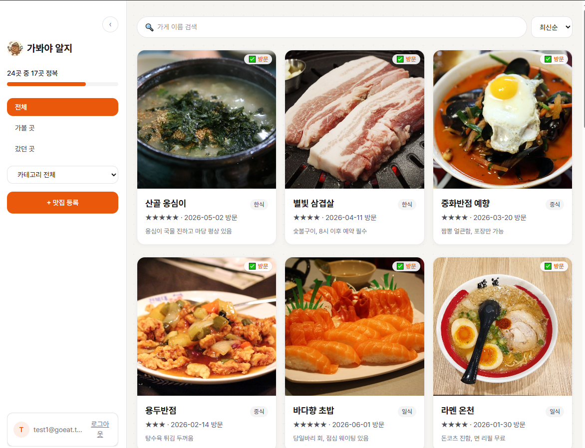

| 상세 | 모바일 |
|:--:|:--:|
| 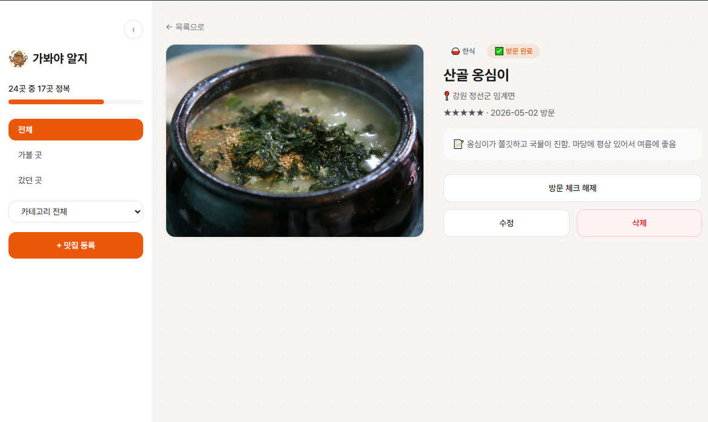 | 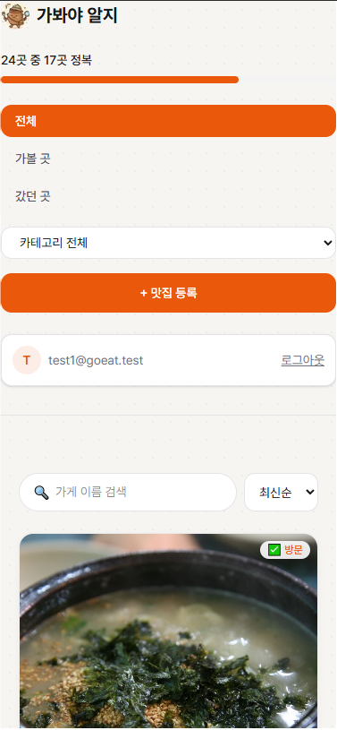 |

**cosmic-grazer** - 프레임워크 없이 단일 HTML 파일(2,925줄)로 만든 탄막 서바이버.

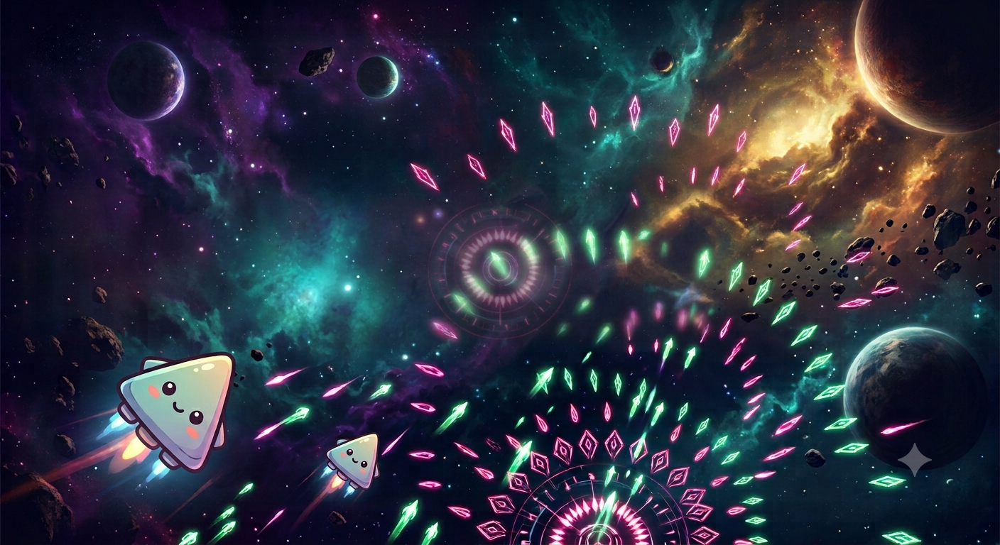

---

## 기술 스택

**AI / Agent**

**Frontend**

**Backend / Data**

**Mobile**

**Tooling**

---

## AI 에이전트를 운용하는 방식

프로젝트마다 AI 에이전트를 **도구가 아니라 팀원처럼** 다뤘고, 그 운용 규칙을 저장소에 문서로 남겼습니다.

- **지침의 단일 원본을 정합니다.** `englishWordApp`에서는 `CLAUDE.md`만 지침 원본으로 두고 `AGENTS.md`는 그것을 가리키는 스텁으로 만들었습니다. 예전에 지침을 복사해뒀다가 사본이 낡아 **이미 삭제된 화면을 참조하는 사고**를 겪었기 때문입니다.
- **세션 간 인수인계 규칙을 만듭니다.** 같은 프로젝트에서 `AI_WORKLOG.md`로 "현재 미커밋 작업과 담당 에이전트"만 추적했습니다. 여러 에이전트가 번갈아 작업할 때 서로의 작업을 덮어쓰지 않게 하기 위해서입니다.
- **재발한 실수를 문서에 축적합니다.** `mealmate`의 *"이 프로젝트에서 실제로 겪은 함정"*, `englishWordApp`의 *"자주 반복된 실수"* 는 모두 같은 버그를 두 번 만난 뒤 만든 체크리스트입니다.
- **검증을 커밋에 남깁니다.** 커밋 메시지에 `검증: <실행한 명령> 성공` 형식으로 무엇을 확인했는지 기록합니다.

📄 [자세히 보기](docs/agent-workflow.md)

---

## 학습 기록

**멀티캠퍼스 AI 에이전트 엔지니어 트랙 1회차** · 2026.07 ~ 2027.01 · 984시간

**금융 AI 서비스 개발을 실습 축으로 삼는 과정**입니다. 매 단위기간의 미니프로젝트가 금융 도메인 과제로 구성되어 있습니다 - e-KYC 신분증 마스킹, PFM·로보어드바이저 대화형 에이전트, 금융 규제·약관 상담 RAG, 신용평가 및 이상탐지(FDS) 모델, 멀티에이전트 금융 서비스.

| 단위기간 | 주제 |
|:--|:--|
| 1 | LLM · AI Agent 이해, 프롬프트 엔지니어링, n8n 노코드 워크플로우 |
| 2 | Python · AI API 웹개발, LangChain (LCEL, Memory, LangSmith) |
| 3 | Multi-Agent Orchestration - LangGraph, MCP, A2A |
| 4 | LLM · RAG 시스템 설계 (Chroma/FAISS, HyDE, Re-ranking), PyTorch · LoRA |
| 5 | AI 프로덕션 개발 - FastAPI, Docker, AWS, CI/CD |
| 6 | 종합 프로젝트 - 금융 AI 서비스 개발 (278시간) |

> 진행 중인 과정입니다. 위 항목 중 완료된 단위기간의 결과물은 프로젝트 목록에 반영되어 있고, 이후 단위기간의 산출물은 완성되는 대로 추가됩니다.

매일의 학습 내용은 [TIL 저장소](https://github.com/noviz-domino/TIL)에 기록하고 있습니다.

---

### 연락처

