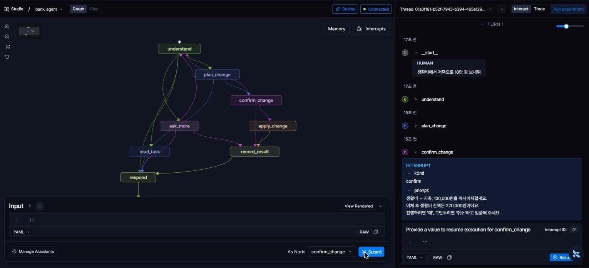
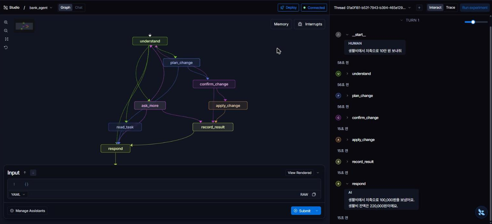
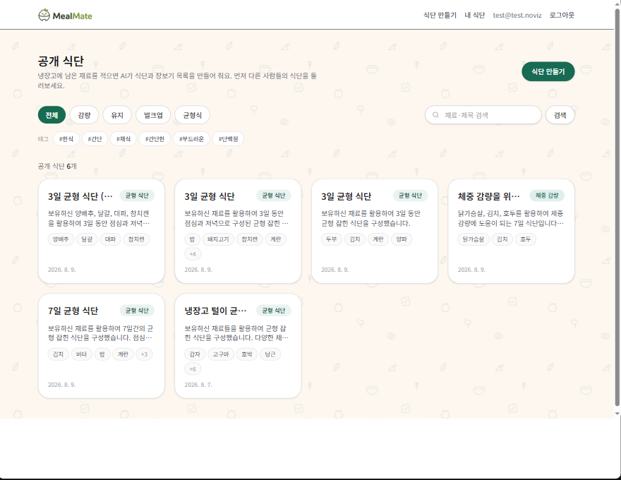
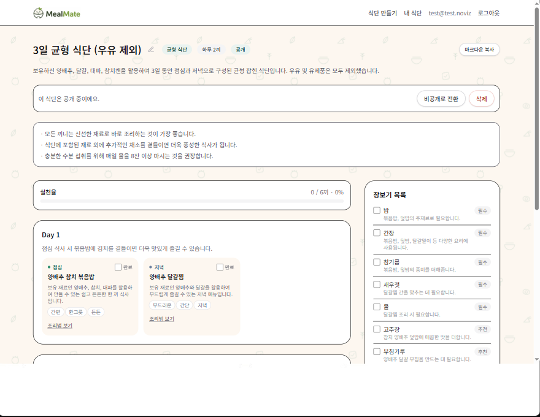
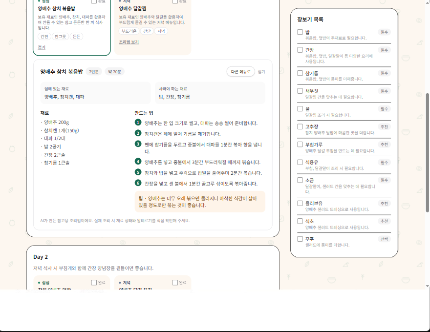
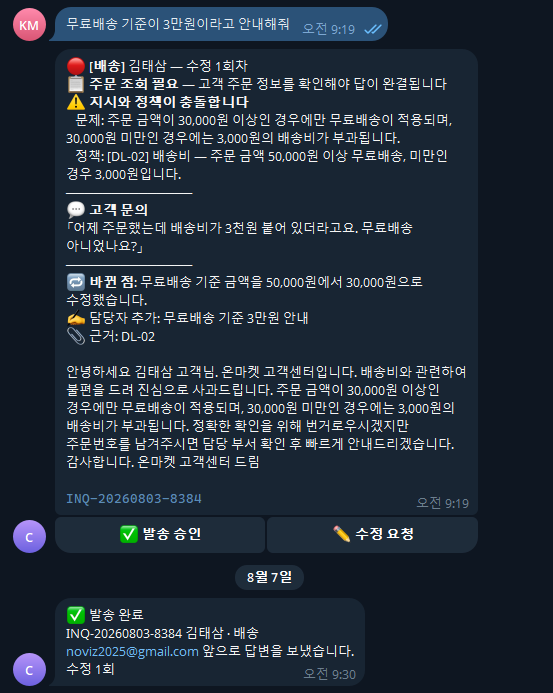
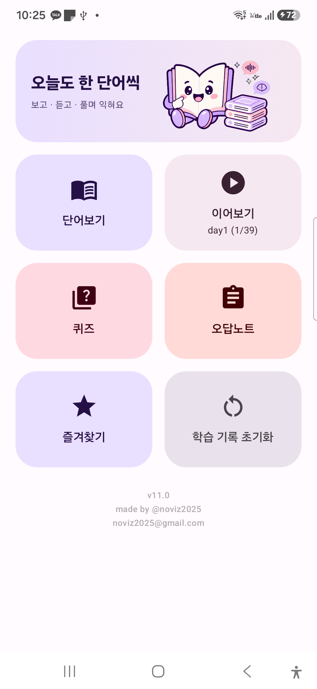
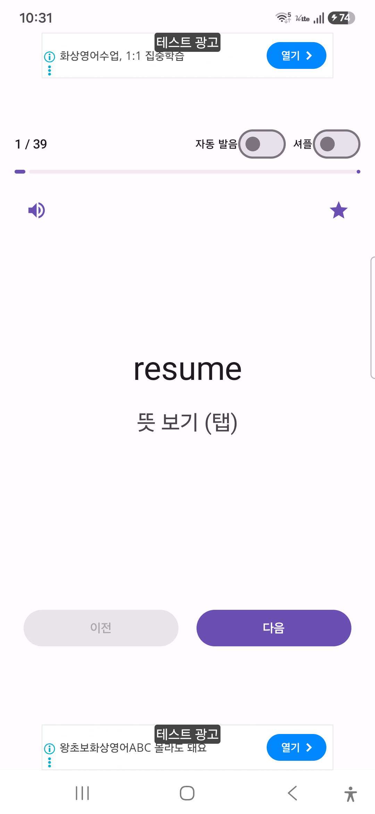
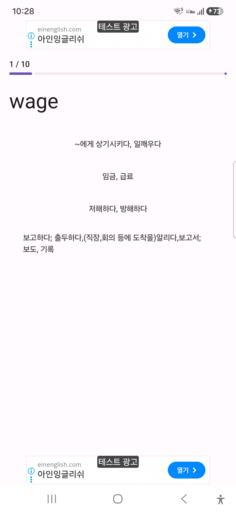

# 김민석

### AI Agent Engineer · 신입

**LLM을 실제 서비스에 안전하게 붙이는 일을 합니다.** 
출력 검증과 사람 승인 단계를 설계해, LLM이 할 일과 코드·사람이 할 일을 나눕니다.

🎂 1998. 02. 01 &nbsp;·&nbsp; 🎖️ 육군 만기 전역 &nbsp;·&nbsp; 🎓 삼성 멀티캠퍼스 AI 에이전트 엔지니어 트랙 수강 중 (2026.07 ~ 2027.01)

[라이브 데모](#-라이브-데모) · [소개](#-소개) · [핵심 성과](#-핵심-성과) · [프로젝트](#-프로젝트) · [그 외 프로젝트](#-그-외-프로젝트) · [기술](#-기술-스택) · [학력 · 교육](#-학력--교육) · [자격 · 수상](#-자격--수상) · [English](README.en.md)

---

## 🚀 라이브 데모

바로 눌러서 써볼 수 있는 결과물입니다. 모두 가상 데이터로 동작합니다.

> 가봐야 알지 데모 계정 `test1@goeat.test` / `test1234` · 무료 서버를 쓰는 데모는 첫 접속에 몇 초 걸릴 수 있습니다.

---

## 👋 소개

컴퓨터정보보안을 전공했고, 지금은 삼성 멀티캠퍼스 AI 에이전트 엔지니어 트랙에서 **LLM · RAG · 멀티 에이전트**를 배우며 금융 도메인 과제를 중심으로 프로젝트를 진행하고 있습니다. AI 에이전트 외에도 Google Play에 출시한 Android 앱, 배포 중인 Next.js 웹 서비스 두 개를 혼자 만들어 운영해봤습니다.

<table>
<tr>
<td width="33%" valign="top">

**🧭 LLM은 입구에만**

말을 해석하는 곳에서만 LLM을 쓰고, 계산·검증·저장은 코드가 합니다. 숫자가 LLM을 거치지 않게 합니다.

</td>
<td width="33%" valign="top">

**✋ 사람이 멈출 수 있게**

돈이 나가거나 고객에게 발송되는 지점에는 승인 단계를 둡니다. AI를 빠르게보다 통제 가능하게 만듭니다.

</td>
<td width="33%" valign="top">

**📏 측정해서 말하기**

"좋아졌다" 대신 평가셋과 시나리오로 확인한 숫자를 남기고, 실패와 설계를 바꾼 이유도 기록합니다.

</td>
</tr>
</table>

---

## 🏆 핵심 성과

| 1차 응답 승인률 | 대화 시나리오 | RAG 검색 정확도 | 앱 출시 |
|:--:|:--:|:--:|:--:|
| **34% → 94%** | **47 / 47** 통과 | **0.886 → 0.943** | **Google Play** |
| replygate · RAG 적용 수치 정확률 43.8% → 96.0% | 금융 에이전트 실패 상황 포함, 장부 무결성 유지 | RAG 실험 · Page Hit@1 설정 20개 비교, 하이브리드 검색 | englishWordApp JUnit 25건 |

---

## 📂 프로젝트

*최신순 · 모두 개인 프로젝트*

### 1. langgraph-financial-agent · 대화형 은행 업무 AI 에이전트

`2026.09` · KDT 과제 · ✅ **완성 · 배포 중**

"생활비에서 저축으로 10만 원 보내줘" 같은 말을 이해해 계좌 조회·이체·카드 잠금을 처리합니다. 돈이나 카드 상태가 바뀌는 일은 사용자 승인을 받은 뒤에만 실행합니다.

- **설계** - LLM은 말을 해석하는 노드 한 곳에서만 사용하고, 잔액 계산·검사·저장·답변 문장은 모두 코드로 처리해 숫자가 LLM을 거치지 않게 했습니다.
- **안전장치** - LangGraph `interrupt`로 승인 전 실행을 멈추고, 저장은 무결성 규칙 10개를 통과해야만 한 번에 교체되도록(atomic write) 구현했습니다.
- **검증** - 실패 상황을 포함한 대화 시나리오 47개를 자동으로 돌려 전부 통과했고, 설계 변경 29건을 이유와 함께 기록했습니다.
- **문제 해결** - 프롬프트로 금지해도 LLM이 출금 계좌를 지어내는 것을 발견해, 규칙을 LLM 응답을 코드가 검증하는 방식으로 바꿨습니다.
- **관찰** - LangSmith로 실행 기록과 LLM 해석 평가(Experiment)를 남기고, LangGraph Studio에서 그래프가 승인 단계에서 멈췄다가 이어지는 흐름을 확인했습니다.

| 이체 요청 → 승인 카드 | 승인 후 잔액 변화 |
|:--:|:--:|
|  |  |
| **LangGraph Studio - 승인 대기 (`interrupt`)** | **"예"로 이어 간 뒤** |
|  |  |

🔗 [직접 써보기](https://noviz-bank.duckdns.org) · 📂 [원본 저장소](https://github.com/noviz-domino/langgraph-financial-agent) · 📄 [설계 변경 기록](projects/langgraph-financial-agent/docs/설계변경기록.md)

 

### 2. legal_secretary · 노동법 조문 인용 RAG 비서

`2024.09 ~ 11` 캡스톤 → `2026.09 ~` 재구축 · 졸업논문 주제 · 🚧 **재구축 3 / 6단계**

법률 질문에 관련 조문을 찾아 근거와 함께 답합니다. 2024년 캡스톤 버전을 기획·개발·인프라까지 단독으로 만들었고, 2026년에 구조를 전면 재구축하고 있습니다.

- **재구축 이유** - "민감한 법률 문서라 로컬 LLM을 쓴다"는 설계와 달리 실제로는 질문이 외부 터널을 거쳐 나가고 있던 문제를 스스로 찾아냈습니다.
- **검색** - "근로기준법 제56조"처럼 정확히 일치해야 하는 표현을 놓치지 않도록 조문 단위로 나누고, 키워드(BM25)와 의미(벡터) 검색을 합쳤습니다.
- **응답** - 근거 조문을 답변보다 먼저 보내는 스트리밍(SSE)으로, 느린 무료 API(실측 8.8초)에서도 사용자가 기다리지 않게 했습니다.

📂 [코드 보기](projects/legal_secretary/) · 📄 [재구축 계획](projects/legal_secretary/docs/리빌딩계획.md)

 

### 3. mealmate · 냉장고 재료 기반 AI 주간 식단 생성

`2026.08 ~ 09` · ✅ **배포 · 라이브 데모**

재료를 입력하면 AI가 주간 식단과 장보기 목록을 만들고, 끼니별 조리법은 필요할 때 생성합니다.

- **출력 검증** - AI 출력 형식을 스키마로 강제한 뒤에도 구조를 다시 검사하고, 실패하면 한 번 재생성합니다.
- **알레르기** - 우유를 피하는 사람에게 연유·생크림이 나오지 않도록 파생 재료까지 차단했습니다.
- **보안** - Supabase RLS로 사용자별 데이터를 격리했습니다. TypeScript 약 3,200줄을 3일 동안 개발했습니다.

| 공개 식단 | AI가 만든 식단 | 끼니별 조리법 |
|:--:|:--:|:--:|
|  |  |  |

🔗 [라이브 데모](https://mealmate-inky.vercel.app) · 📂 [코드 보기](projects/mealmate/)

 

### 4. replygate · AI 초안 + 사람 승인 고객 응대 자동화

`2026.08` · KDT 미니프로젝트 · ✅ **완성 · 실측 평가**

고객 문의가 오면 AI가 사내 정책 문서를 근거로 답변 초안을 쓰고, 담당자가 텔레그램에서 승인해야만 메일이 발송됩니다.

- **설계** - 틀리면 분쟁이 되는 수치(환불 수수료·배송 기한) 때문에 자동 발송 대신 사람 승인 단계를 두었습니다.
- **성과** - 평가셋 50건 기준 1차 승인률을 34% → 94%, 수치 정확률을 43.8% → 96.0%로 개선했습니다. 정책에 답이 없는 함정 질문 5건도 포함했습니다.
- **문제 해결** - 감정 분류에서 한 클래스가 전혀 선택되지 않는 원인이 두 기준을 하나로 섞은 데 있음을 찾아, 두 축으로 분리해 정확도 98% / 92%를 얻었습니다.

📂 [코드 보기](projects/replygate/) · 📄 [평가셋 설계](projects/replygate/eval/)

 

### 5. englishWordApp · 토익 단어 학습 Android 앱

`2026.06 ~ 08` · ✅ **Google Play 출시**

뜻을 가리고 외우는 학습, 진행도 이어보기, TTS 발음, 오답노트, 4지선다 퀴즈를 제공합니다. 단어 1,222개.

- **재작성** - 직접 만든 Java 버전의 문제(뜻이 항상 보임, 1,225행 중 835행에 따옴표 노출, 화면 회전 시 진행도 초기화)를 Kotlin·Compose로 전면 재작성해 해결했습니다.
- **품질** - 퀴즈 출제 로직을 순수 함수로 분리해 JUnit 테스트 25건으로 고정하고, 앱이 종료됐다 다시 켜져도 학습 위치를 복원합니다.

| 홈 | 단어 학습 | 퀴즈 |
|:--:|:--:|:--:|
|  |  |  |

📱 [Google Play에서 보기](https://play.google.com/store/apps/details?id=com.voca.englishwordapp) · 📂 [코드 보기](projects/englishWordApp/)

---

## 📦 그 외 프로젝트

<table>
<thead>
<tr><th>기간</th><th>프로젝트</th><th>기술</th><th>링크</th></tr>
</thead>
<tbody>

<tr><td colspan="4"><b>🤖 AI 에이전트 · LLM</b></td></tr>
<tr><td>2026.09</td><td><b>multi-agent-tax-prep</b> 종합소득세 신고 준비 멀티 에이전트 (리서치·계획·검토) · LLM 없이 도는 테스트 57개</td><td>LangGraph · Gemini</td><td><a href="projects/multi-agent-tax-prep/">코드</a></td></tr>
<tr><td>2026.09</td><td><b>rag-experiment-script</b> 설정 20개로 청킹·검색·리랭킹을 비교한 RAG 실험 · 하이브리드 검색 Page Hit@1 0.943 (기준 0.886)</td><td>LangChain · Chroma · BM25</td><td><a href="projects/rag-experiment-script/">코드</a></td></tr>
<tr><td>2026.08 ~ 09</td><td><b>personal-budget-ai-agent</b> 자연어로 쓰는 가계부 에이전트 (도구 7개)</td><td>Gemini Function Calling</td><td><a href="projects/personal-budget-ai-agent/">코드</a></td></tr>
<tr><td>2026.08</td><td><b>n8n-finance-news-briefing</b> 금융 뉴스 자동 요약 브리핑 · 하루 API 호출 188회 → 4회</td><td>n8n · Gemini · Discord</td><td><a href="projects/n8n-finance-news-briefing/">코드</a></td></tr>
<tr><td>2026.08</td><td><b>n8n-voc-analysis-agent</b> 고객 VOC 자동 분류·긴급 알림</td><td>n8n · Gemini · Sheets</td><td><a href="projects/n8n-voc-analysis-agent/">코드</a></td></tr>
<tr><td>2026.07</td><td><b>대통령: 외교의 신 (god-of-diplomacy)</b> Gemini 기반 정치·외교 텍스트 RPG</td><td>FastAPI · Gemini</td><td><a href="projects/god-of-diplomacy/">코드</a></td></tr>

<tr><td colspan="4"><b>📱 웹 · 앱</b></td></tr>
<tr><td>2026.08 ~ 09</td><td><b>가봐야 알지 (go-eat)</b> 시골 맛집 기록 웹앱, 8시간 제약 개발</td><td>Next.js · Supabase</td><td><a href="https://go-eat-noviz.vercel.app">데모</a> · <a href="projects/go-eat/">코드</a></td></tr>

<tr><td colspan="4"><b>📊 데이터 · 게임</b></td></tr>
<tr><td>2026.07 ~ 08</td><td><b>스쳐야 산다 (cosmic-grazer)</b> 단일 HTML 파일 탄막 서바이버 게임</td><td>Vanilla JS · Canvas2D</td><td><a href="https://noviz-domino.github.io/cosmic-grazer/">플레이</a> · <a href="projects/cosmic-grazer/">코드</a></td></tr>
<tr><td>2026.04 ~ 09</td><td><b>data-value-sandbox</b> 합성 세계로 "어떤 데이터가 사건을 예측 가능하게 하는가" 측정 · 표적 추론 top-1 51.5% (기준선의 3.81배)</td><td>deck.gl · Jupyter</td><td><a href="https://noviz-domino.github.io/data-value-sandbox/">데모</a> · <a href="https://github.com/noviz-domino/data-value-sandbox">저장소</a></td></tr>
<tr><td>2021.12</td><td><b>GTD 테러예측모델</b> 글로벌 테러 데이터 분석·예측 (2인 팀)</td><td>Python · Scikit-learn</td><td><a href="https://github.com/noviz-domino/gtd-terror-analysis-project">저장소</a></td></tr>

</tbody>
</table>

---

## 🧰 기술 스택

| 분야 | 프로젝트에서 사용 |
|:--|:--|
| **AI · Agent** |       |
| **RAG · 검색** |      |
| **Backend** |       |
| **Frontend · Mobile** |       |
| **Infra · Tool** |        |
| *학습 경험 (프로젝트 미사용)* |     |

---

## 🎓 학력 · 교육

**삼성 멀티캠퍼스 · AI 에이전트 엔지니어 트랙 1회차** · `2026.07 ~ 2027.01` · 🟢 수강 중 
984시간 · 금융 AI 서비스 개발을 실습 축으로 하는 과정

| 단위기간 | 주제 | 관련 결과물 |
|:--:|:--|:--|
| ✅ 1 | LLM · 프롬프트 · n8n | replygate · n8n-voc-analysis-agent · n8n-finance-news-briefing |
| ✅ 2 | Python AI 웹개발 · LangChain | personal-budget-ai-agent · rag-experiment-script |
| ✅ 3 | LangGraph · MCP · 멀티 에이전트 | langgraph-financial-agent · multi-agent-tax-prep |
| ⏳ 4 ~ 6 | RAG 시스템 설계 · 프로덕션(Docker·AWS·CI/CD) · 종합 프로젝트 | *예정* |

| 기간 | 학교 | |
|:--|:--|:--|
| 2017.03 ~ 2026.03 | **우송대학교** 컴퓨터정보보안학과 | 수료 |
| 2019.03 ~ 2024.01 | **베이징이공대학** 공동학위과정 | 중퇴 · 다국적 팀 프로젝트 수행 |

매일의 학습 기록은 [TIL 저장소](https://github.com/noviz-domino/TIL)에 남기고 있습니다.

---

## 🏅 자격 · 수상

| 시기 | 내용 |
|:--|:--|
| 🥇 군 복무 중 | **C4I 체계 전산운용 1위** - 대한민국 육군 정보통신학교 준장 표창 |
| 📝 2026.03 | TOEIC 545 |
| 🚁 보유 | 초경량비행장치 1급 (드론) |
| 📚 준비 중 | 정보처리기사 · 정보보안기사 실기 |

---

### 📬 연락처

이 저장소는 프로젝트별 소스 코드와 설계 문서를 `projects/`에 모은 것입니다. 원본 저장소는 대부분 비공개라 민감정보를 뺀 사본을 두었습니다. 
AI 코딩 도구 운용 방식: [docs/agent-workflow.md](docs/agent-workflow.md)

최종 수정 2026-09-30 · <a href="docs/CHANGELOG.md">정돈 기록</a>

