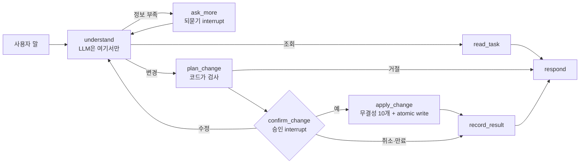
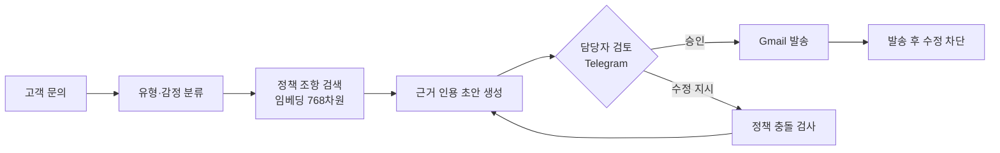
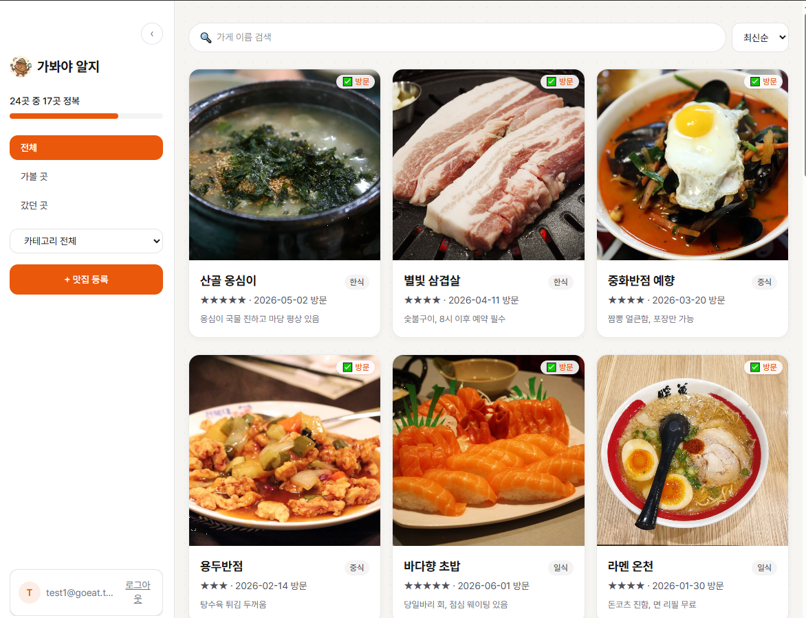
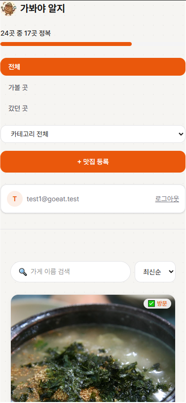

# 김민석 · Kim Minseok

### AI Agent Engineer

**LLM을 실제 서비스에 안전하게 붙이는 일을 합니다.** 
그럴듯한 답보다 틀리지 않는 답이 필요한 곳에서, LLM이 할 일과 코드·사람이 할 일을 나눕니다.

[대표 프로젝트](#대표-프로젝트) · [전체 프로젝트](#전체-프로젝트) · [기술 스택](#기술-스택) · [AI 도구 운용](#ai-에이전트를-운용하는-방식) · [학습 기록](#학습-기록) · [English](README.en.md)

 

<table>
<tr>
<td width="33%" valign="top">

**🧭 LLM은 입구에만**

말을 해석하는 곳에서만 LLM을 쓰고, 계산·검증·저장은 코드가 합니다. 숫자가 LLM을 거치지 않게 합니다.

</td>
<td width="33%" valign="top">

**✋ 사람이 멈출 수 있게**

돈이 나가거나 고객에게 발송되는 지점에는 승인 단계를 둡니다. AI를 빠르게보다 통제 가능하게 만듭니다.

</td>
<td width="33%" valign="top">

**📏 측정해서 말하기**

"좋아졌다" 대신 평가셋과 시나리오로 확인한 숫자를 남기고, 실패와 한계도 그대로 기록합니다.

</td>
</tr>
</table>

| 1차 응답 승인률 | 대화 시나리오 | API 호출 | 앱 출시 |
|:--:|:--:|:--:|:--:|
| **34% → 94%** | **47 / 47** 통과 | **188 → 4회** | **Google Play** |
| replygate · RAG 적용 | 금융 에이전트 · 장부 무결성 유지 | 뉴스 브리핑 · 무료 티어 대응 | englishWordApp |

---

## 소개

| | |
|:--|:--|
| **현재** | 멀티캠퍼스 **AI 에이전트 엔지니어 트랙 1회차** 수강 중 (2026.07 ~ 2027.01 · 984시간) |
| **관심 도메인** | 금융 AI - RAG 기반 규제·약관 상담, 이상탐지, 자산관리 에이전트 |
| **해온 일** | LangGraph 에이전트 · RAG · n8n 자동화 · Next.js 웹 서비스 · Android 앱 · 브라우저 게임 |

안드로이드 앱은 Google Play에 출시해 실제 사용자가 쓰고 있고, 웹 서비스 두 개는 배포된 상태로 접속할 수 있습니다.
분야를 가리지 않고 손에 익을 때까지 직접 만들어보고, 정해진 방법이 안 통하면 다른 접근을 시도하는 데 거부감이 없습니다.

지금까지의 작업은 **구조화 출력 강제, 출력 검증, 사람 개입 지점 설계**에 몰려 있습니다.
최근에는 같은 원칙을 LangGraph 에이전트로 옮겨, *"흔들리면 안 되는 판단은 LLM이 아니라 코드가 한다"* 는 쪽으로 설계를 좁혀가고 있습니다.

> 이 저장소는 프로젝트별 **소스 코드와 설계 문서**를 한 곳에 모은 것입니다.
> 원본 저장소는 비공개이며, 각 프로젝트는 `projects/` 아래 같은 이름의 폴더에 민감정보를 뺀 사본으로 들어 있습니다.

---

## 대표 프로젝트

### 1. langgraph-financial-agent - 승인 후에만 실행하는 대화형 은행 업무 에이전트

**문제.** "생활비에서 저축으로 10만 원 보내줘"를 LLM에게 통째로 맡기면, 모델이 **말하지 않은 출금 계좌를 지어내거나** 잔액 계산을 틀려도 알 수 없습니다. 돈이 움직이는 일에서는 그럴듯한 답이 아니라 **틀리지 않는 답**이 필요합니다.

**접근.** LLM은 **사람의 말을 해석하는 입구 한 곳**(`understand` 노드)에서만 씁니다. 잔액 계산·검사·저장·답변 문장은 전부 코드가 하므로 숫자가 LLM을 거치지 않습니다. 돈이나 카드 상태가 바뀌는 일은 LangGraph `interrupt`로 멈춰 **사용자 승인을 받은 뒤에만** 실행하고, 저장은 무결성 규칙 10개를 통과해야만 한 번에 교체됩니다(atomic write).

```mermaid
flowchart LR
    A[사용자 말] --> B[understand<br/>LLM은 여기서만]
    B -->|정보 부족| C[ask_more<br/>되묻기 interrupt]
    C --> B
    B -->|조회| D[read_task] --> R[respond]
    B -->|변경| E[plan_change<br/>코드가 검사]
    E -->|거절| R
    E --> F{confirm_change<br/>승인 interrupt}
    F -->|예| G[apply_change<br/>무결성 10개 + atomic write] --> H[record_result] --> R
    F -->|취소·만료| H
    F -->|수정| B
```

**측정 결과.** 실패 상황을 포함한 대화 시나리오를 자동으로 돌려 확인했습니다.

| 확인 항목 | 결과 |
|:--|--:|
| 대화 시나리오 (잔액 부족·없는 계좌·승인 대기 중 잔액 감소·저장 실패·AI 서버 503 등) | **47 / 47** |
| 시나리오 후 장부 무결성 | **10 / 10** |
| 업무 코드 단위 확인 (API 없음) | 31 / 31 |

**기록해둔 실패.** 설계 변경 26건을 이유와 함께 남겼습니다. 대표적인 두 가지:

- *"이어받을 계좌: 없음"* 이라고 프롬프트에 적어줘도 LLM이 출금 계좌를 채웠습니다. **한 번은 통과, 한 번은 실패 - 프롬프트는 확률입니다.** 그래서 규칙을 "알려주기"에서 끝내지 않고 LLM 응답을 **코드가 검증**하도록 바꿨습니다.
- 직접 써보다가 *"저축으로 10만 원 옮겨줘"* 에 LLM이 출금 계좌를 **지어내는** 것을 발견했습니다. 뜻으로 알아들은 것과 지어낸 것은 코드로 구분할 수 없어서, **피해가 큰 출금 계좌만** "말했거나·이어받았거나·후보에서 고른 이름"으로 엄격히 제한했습니다.

📂 [코드 보기](projects/langgraph-financial-agent/) · 📄 [설계 변경 기록](projects/langgraph-financial-agent/docs/설계변경기록.md)

 

### 2. replygate - 고객 문의 응대 자동화 (AI 초안 + 사람 승인)

**문제.** 고객 문의 답변에는 환불 수수료·배송 기한처럼 **틀리면 곧바로 분쟁이 되는 수치**가 들어갑니다. 그리고 LLM은 이런 수치를 그럴듯하게 지어냅니다. 그래서 "AI가 자동으로 답장하는 시스템"은 실무에 그대로 넣을 수 없습니다.

**접근.** 자동 발송 대신 **AI 초안 → 사람 승인 → 발송** 구조로 설계하고, 정책 문서 70개 조항을 RAG로 검색해 근거 조항을 인용하게 했습니다. 핵심 주장은 이것입니다 - *AI를 빠르게 만드는 것보다, 통제 가능하게 만드는 것이 실무의 문제다.*

```mermaid
flowchart LR
    A[고객 문의] --> B[유형·감정 분류]
    B --> C[정책 조항 검색<br/>임베딩 768차원]
    C --> D[근거 인용 초안 생성]
    D --> E{담당자 검토<br/>Telegram}
    E -->|승인| F[Gmail 발송]
    E -->|수정 지시| G[정책 충돌 검사]
    G --> D
    F --> H[발송 후 수정 차단]
```

담당자가 *"무료배송 기준이 3만원이라고 안내해줘"* 라고 지시했지만 정책 문서에는 **5만원**으로 되어 있습니다. 시스템은 지시를 그대로 따르지 않고 **충돌 사실만 드러내고, 판단은 사람에게 넘깁니다.**

**측정 결과.** 베이스라인(RAG 없음)과 비교해 평가셋 50건으로 실측했습니다.

| 지표 | 베이스라인 | RAG 적용 |
|:--|--:|--:|
| 1차 승인률 | 34.0% | **94.0%** |
| 수치 정확률 | 43.8% | **96.0%** |

평가셋에는 **정책 문서에 의도적으로 답이 없는 함정 5건**을 넣어, 모르는 것을 모른다고 답하는지까지 확인했습니다.

**기록해둔 실패.** 감정 분류에서 `중립` 클래스가 20번 중 0번 선택되는 문제를 만나 정의를 고쳤지만 여전히 0이었고, 결국 **"감정과 조회필요는 직교하는 두 축"** 이라는 구조적 원인을 찾아 축을 분리했습니다(98% / 92%로 개선). 중간 버전은 *"라벨만 옮긴 가짜 개선"* 이었다고 문서에 그대로 남겨뒀습니다.

📂 [코드 보기](projects/replygate/) · 📄 [평가셋 설계](projects/replygate/eval/)

 

### 3. legal_secretary - 조문을 인용하는 노동법 RAG 비서 (재구축 진행 중)

**문제.** 2024년 캡스톤 버전은 *"법률 문서는 민감하니 로컬 LLM을 쓴다"* 고 주장했지만, 실제로는 자원이 부족해 질문을 ngrok 공개 터널로 Colab에 보내고 있었습니다. **보안을 위한 설계라는 주장을 구현이 달성하지 못한 상태**였고, 이 간극을 스스로 찾아내 전면 재구축을 시작했습니다.

**접근.** 법률 질문에는 *"근로기준법 제56조"* 처럼 **정확히 일치해야 하는 토큰**이 많아 벡터 검색만으로는 놓치기 쉽습니다. 그래서 조문 경계(`제N조`)로 청킹하고, **BM25 + 벡터(bge-m3)를 RRF로 합치는 하이브리드 검색**을 붙였습니다. 답변보다 **근거 조문을 먼저 스트리밍(SSE)** 해서 사용자가 출처부터 확인하게 했고, LLM 백엔드는 설정 하나로 API ↔ self-hosted를 전환합니다.

| | |
|:--|:--|
| 진행 | 6단계 중 **3단계 완료** (골격 · RAG 코어 · 스트리밍) - 에이전트 루프·평가셋·UI·배포는 진행 예정 |
| 데이터 | 법령 PDF 2종 → 청크 264개 |
| 실측 | 검색 약 1.4~2초 · 무료 티어 Gemini 응답 8.8초(503은 3초 만에 즉시 거절) → 스트리밍을 앞당긴 근거 |

📂 [코드 보기](projects/legal_secretary/) · 📄 [리빌딩 계획](projects/legal_secretary/docs/리빌딩계획.md)

 

### 4. englishWordApp - 토익 단어 학습 앱 (Google Play 출시)

**실제 스토어에 출시되어 다운로드할 수 있는 앱입니다.**

| 홈 | 단어 학습 | 퀴즈 |
|:--:|:--:|:--:|
|  |  |  |

**문제.** 직접 만들었던 Java 버전이 학습 도구로 작동하지 않았습니다. 단어와 뜻이 항상 같이 보여 암기 검증이 불가능했고, CSV 파서가 따옴표를 처리하지 못해 **1,225행 중 835행에 `"` 문자가 그대로 노출**됐으며, 학습 이력이 저장되지 않아 화면 회전만으로 진행도가 초기화됐습니다.

**접근.** Kotlin + Jetpack Compose로 전면 재작성했습니다. CSV 파서를 RFC 4180 기준으로 다시 만들고, 퀴즈 출제 로직을 순수 함수로 분리해 **JUnit 테스트 25건**으로 고정했으며, `SavedStateHandle`로 프로세스 재생성까지 상태를 복원하게 했습니다.

| | |
|:--|:--|
| 규모 | Kotlin 약 2,286줄 · 커밋 42개 · 2026.06 ~ 진행 중 |
| 데이터 | 단어 1,222행 (day 1~30) |
| 기능 | 뜻 가리기 학습 · 진행도 이어보기 · TTS 발음 · 오답노트 · 4지선다 퀴즈 |

📱 [Google Play에서 보기](https://play.google.com/store/apps/details?id=com.voca.englishwordapp) · 📂 [코드 보기](projects/englishWordApp/)

 

### 5. mealmate - 냉장고 재료 기반 AI 주간 식단 생성

| 공개 식단 | AI가 만든 식단 | 끼니별 조리법 |
|:--:|:--:|:--:|
|  |  |  |

**문제.** 냉장고에 재료는 있는데 뭘 해먹을지 고민하다 결국 배달을 시킵니다. 식단을 짜려 해도 며칠치를 한 번에 계획하는 게 번거롭습니다.

**접근.** 재료를 입력하면 Gemini가 주간 식단과 장보기 목록을 생성합니다. 여기서 중요한 건 **LLM 출력을 그대로 믿지 않는다**는 점입니다. `responseSchema`로 구조를 강제한 뒤, 애플리케이션 단에서 **구조 검증**과 **알레르기 위반 검사**(파생어까지 차단)를 다시 돌리고, 실패하면 1회 재생성합니다.

| | |
|:--|:--|
| 규모 | TypeScript 약 3,208줄 · 커밋 34개 · 개발 3일 |
| 보안 | Supabase RLS 기반 사용자별 데이터 격리 |
| 기능 | 식단·장보기 생성 · 끼니별 조리법 온디맨드 생성 · 실천율 추적 · 공개/비공개 토글 |

🔗 [라이브 데모](https://mealmate-inky.vercel.app) · 📂 [코드 보기](projects/mealmate/)

*무료 플랜이라 데모가 일시정지되어 있을 수 있습니다. 위 스크린샷이 실제 화면입니다.*

---

## 전체 프로젝트

<table>
<thead>
<tr><th>프로젝트</th><th>한 줄 설명</th><th>주요 스택</th><th>링크</th></tr>
</thead>
<tbody>

<tr><td colspan="4"><b>🤖 AI 에이전트 · LLM</b></td></tr>

<tr>
<td><b>langgraph-financial-agent</b></td>
<td>승인 후에만 실행하는 대화형 은행 업무 에이전트</td>
<td>LangGraph · Gemini · FastAPI</td>
<td><a href="projects/langgraph-financial-agent/">코드</a></td>
</tr>

<tr>
<td><b>replygate</b></td>
<td>AI 초안 + 사람 승인 CS 응대 자동화</td>
<td>n8n · Gemini · RAG · FastAPI</td>
<td><a href="projects/replygate/">코드</a></td>
</tr>

<tr>
<td><b>legal_secretary</b></td>
<td>조문을 인용하는 노동법 RAG 비서 (재구축 3/6단계)</td>
<td>FastAPI · LangChain · Chroma · BM25</td>
<td><a href="projects/legal_secretary/">코드</a></td>
</tr>

<tr>
<td><b>rag-experiment-script</b></td>
<td>설정 20개로 청킹·검색·리랭킹을 비교한 RAG 실험 하네스</td>
<td>LangChain · Chroma · BM25 · Gemini</td>
<td><a href="projects/rag-experiment-script/">코드</a> · <a href="projects/rag-experiment-script/2026-09-07%20RAG%20실험%20보고서.md">보고서</a></td>
</tr>
<tr>
<td colspan="4">

<b>rag-experiment-script 결과 요약</b>

- 최고 조합은 **청크 500 + 하이브리드 검색**: Page Hit@1 **0.943** · MRR 0.943 (베이스라인 0.886 / 0.907)
- BM25 단독(청크 500)도 MRR 0.914 - **임베딩 호출 0회**, 43.5초
- 어려운 질문셋에서 리랭킹은 0.600 → 0.800으로 올렸지만 **약 8배 느려짐** (37초)
- 일부 청크만 임베딩되던 버그를 찾아 고친 뒤 Page Hit@1이 0.686 → 0.857로 회복
- 질문이 35개라 **1문항 = 2.86%p** 라는 한계를 보고서에 함께 적었습니다

</td>
</tr>

<tr>
<td><b>multi-agent-tax-prep</b></td>
<td>종합소득세 신고 준비 멀티 에이전트 (리서치·계획·검토)</td>
<td>LangGraph · Gemini · Pydantic</td>
<td><a href="projects/multi-agent-tax-prep/">코드</a></td>
</tr>
<tr>
<td colspan="4">

<b>multi-agent-tax-prep 요점</b>

- 라우터가 실행할 에이전트 목록을 정하고, 각 에이전트가 `Command(goto=...)`로 다음 에이전트에 넘깁니다. 검토 에이전트는 Reflection 루프(최대 2회)로 계획을 되돌려 보낼 수 있습니다
- 세액 계산기가 아니라 **신고 의무·방식 판단과 서류 체크리스트**까지만 합니다. 판단 규칙은 코드로, 연도별 기준은 설정 파일로 분리했습니다
- LLM을 부르지 않는 테스트 57개
- **기록해둔 실패:** 라우터 테스트 5개가 전부 통과했는데, 알고 보니 전제조건 검사 코드는 한 번도 실행되지 않았습니다. *"통과했다"와 "내 코드가 동작한다"는 다르다*는 교훈을 작업일지에 남겼습니다

</td>
</tr>

<tr>
<td><b>n8n-finance-news-briefing</b></td>
<td>금융 뉴스 자동 브리핑 (API 호출 188회 → 4회)</td>
<td>n8n · Gemini · Discord</td>
<td><a href="projects/n8n-finance-news-briefing/">코드</a></td>
</tr>
<tr>
<td colspan="4">

<b>n8n-finance-news-briefing 요점</b>

- 매일 08:30 RSS 3곳 수집 → 중복 차단 → 금융 키워드 필터 → 10건씩 배치 요약 → 중요도 4 이상만 Discord 발송
- **API 호출 188회 → 4회.** 무료 티어 분당 5요청 한도로 `429`가 났을 때, 키워드 필터를 LLM 앞단으로 옮기고 · 일일 상한을 두고 · 배치 요약을 적용했습니다
- **URL 정규화 + SHA-256 해시**로 7일 이력과 대조해 중복 기사를 막았습니다
- RSS 3개를 하류 노드에 바로 연결하면 **n8n이 체인 전체를 3번 실행**한다는 것을 실제 실행에서 발견해(Discord에 같은 메시지 3통), Merge 노드를 필수로 넣었습니다

</td>
</tr>

<tr>
<td><b>n8n-voc-analysis-agent</b></td>
<td>고객 VOC 자동 분류·긴급 알림</td>
<td>n8n · Gemini · Sheets</td>
<td><a href="projects/n8n-voc-analysis-agent/">코드</a></td>
</tr>

<tr>
<td><b>personal-budget-ai-agent</b></td>
<td>자연어로 가계부를 쓰는 Function Calling 에이전트 (도구 7개)</td>
<td>Gemini Function Calling · Python</td>
<td><a href="projects/personal-budget-ai-agent/">코드</a></td>
</tr>

<tr>
<td><b>god-of-diplomacy</b></td>
<td>Gemini 기반 정치·외교 텍스트 RPG</td>
<td>FastAPI · Gemini</td>
<td><a href="projects/god-of-diplomacy/">코드</a></td>
</tr>

<tr><td colspan="4"><b>📱 앱 · 웹 서비스</b></td></tr>

<tr>
<td><b>englishWordApp</b></td>
<td>토익 단어 학습 앱 (Play 출시)</td>
<td>Kotlin · Compose</td>
<td><a href="projects/englishWordApp/">코드</a> · <a href="https://play.google.com/store/apps/details?id=com.voca.englishwordapp">스토어</a></td>
</tr>

<tr>
<td><b>mealmate</b></td>
<td>AI 주간 식단 생성</td>
<td>Next.js · Supabase · Gemini</td>
<td><a href="projects/mealmate/">코드</a> · <a href="https://mealmate-inky.vercel.app">데모</a></td>
</tr>

<tr>
<td><b>go-eat</b></td>
<td>시골 맛집 기록 웹앱 (8시간 제약 개발)</td>
<td>Next.js · Supabase</td>
<td><a href="projects/go-eat/">코드</a> · <a href="https://go-eat-noviz.vercel.app">데모</a> (<code>test1@goeat.test</code>/<code>test1234</code>)</td>
</tr>
<tr>
<td colspan="4">

<b>go-eat 화면 보기</b>

 

 

</td>
</tr>

<tr><td colspan="4"><b>📊 데이터 · 게임</b></td></tr>

<tr>
<td><b>data-value-sandbox</b></td>
<td>정답을 아는 합성 세계로 "어떤 데이터가 사건을 예측 가능하게 만드는가"를 측정</td>
<td>deck.gl · Vanilla JS · Jupyter</td>
<td><a href="https://github.com/noviz-domino/data-value-sandbox">저장소</a> · <a href="https://noviz-domino.github.io/data-value-sandbox/">데모</a></td>
</tr>

<tr>
<td><b>cosmic-grazer</b></td>
<td>단일 파일 탄막 서바이버 게임</td>
<td>Vanilla JS · Canvas2D</td>
<td><a href="projects/cosmic-grazer/">코드</a> · <a href="https://noviz-domino.github.io/cosmic-grazer/">플레이</a></td>
</tr>
<tr>
<td colspan="4">

<b>cosmic-grazer 화면 보기</b>

 

</td>
</tr>

</tbody>
</table>

> `data-value-sandbox`는 원본 저장소가 이미 공개되어 있어 사본을 두지 않고 링크로 연결했습니다.

> `mealmate`와 `go-eat`은 Supabase 무료 플랜을 쓰기 때문에 데모가 일시정지되어 있을 수 있습니다.
> 그럴 때는 각 프로젝트의 스크린샷으로 화면을 확인하실 수 있습니다. ([유지 방법](docs/supabase-keepalive.md))

---

## 기술 스택

| 분야 | 사용해본 것 |
|:--|:--|
| **AI / Agent** |       |
| **RAG / 검색** |      |
| **Backend** |      |
| **Frontend** |     |
| **Mobile** |   |
| **Tooling** |      |

---

## AI 에이전트를 운용하는 방식

프로젝트마다 AI 에이전트를 **도구가 아니라 팀원처럼** 다뤘고, 그 운용 규칙을 저장소에 문서로 남겼습니다.

- **지침의 단일 원본을 정합니다.** `englishWordApp`에서는 `CLAUDE.md`만 지침 원본으로 두고 `AGENTS.md`는 그것을 가리키는 스텁으로 만들었습니다. 예전에 지침을 복사해뒀다가 사본이 낡아 **이미 삭제된 화면을 참조하는 사고**를 겪었기 때문입니다.
- **세션 간 인수인계 규칙을 만듭니다.** 같은 프로젝트에서 `AI_WORKLOG.md`로 "현재 미커밋 작업과 담당 에이전트"만 추적했습니다. 여러 에이전트가 번갈아 작업할 때 서로의 작업을 덮어쓰지 않게 하기 위해서입니다.
- **재발한 실수를 문서에 축적합니다.** `mealmate`의 *"이 프로젝트에서 실제로 겪은 함정"*, `englishWordApp`의 *"자주 반복된 실수"* 는 모두 같은 버그를 두 번 만난 뒤 만든 체크리스트입니다.
- **검증을 커밋에 남깁니다.** 커밋 메시지에 `검증: <실행한 명령> 성공` 형식으로 무엇을 확인했는지 기록합니다.

📄 [자세히 보기](docs/agent-workflow.md)

---

## 학습 기록

**멀티캠퍼스 AI 에이전트 엔지니어 트랙 1회차** · 2026.07 ~ 2027.01 · 984시간

**금융 AI 서비스 개발을 실습 축으로 삼는 과정**입니다. 매 단위기간의 미니프로젝트가 금융 도메인 과제로 구성되어 있습니다 - e-KYC 신분증 마스킹, PFM·로보어드바이저 대화형 에이전트, 금융 규제·약관 상담 RAG, 신용평가 및 이상탐지(FDS) 모델, 멀티에이전트 금융 서비스.

| 단위기간 | 주제 | 관련 결과물 |
|:--|:--|:--|
| 1 | LLM · AI Agent 이해, 프롬프트 엔지니어링, n8n 노코드 워크플로우 | n8n-voc-analysis-agent · n8n-finance-news-briefing · replygate |
| 2 | Python · AI API 웹개발, LangChain (LCEL, Memory, LangSmith) | personal-budget-ai-agent · rag-experiment-script |
| 3 | Multi-Agent Orchestration - LangGraph, MCP, A2A | multi-agent-tax-prep · langgraph-financial-agent |
| 4 | LLM · RAG 시스템 설계 (Chroma/FAISS, HyDE, Re-ranking), PyTorch · LoRA | *예정* |
| 5 | AI 프로덕션 개발 - FastAPI, Docker, AWS, CI/CD | *예정* |
| 6 | 종합 프로젝트 - 금융 AI 서비스 개발 (278시간) | *예정* |

> 진행 중인 과정입니다. 이후 단위기간의 산출물은 완성되는 대로 추가됩니다.
> 과정과 별개로 Oracle Cloud 무료 서버 배포, 로컬 LLM(Ollama · vLLM) 환경 구축도 직접 해보며 기록하고 있습니다.

매일의 학습 내용은 [TIL 저장소](https://github.com/noviz-domino/TIL)에 기록하고 있습니다.

---

### 연락처

마지막 정돈: 2026-09-30 · <a href="docs/CHANGELOG.md">정돈 기록</a>

