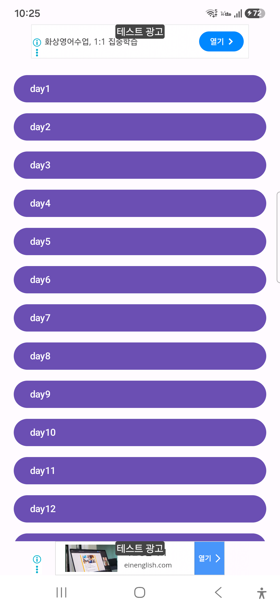
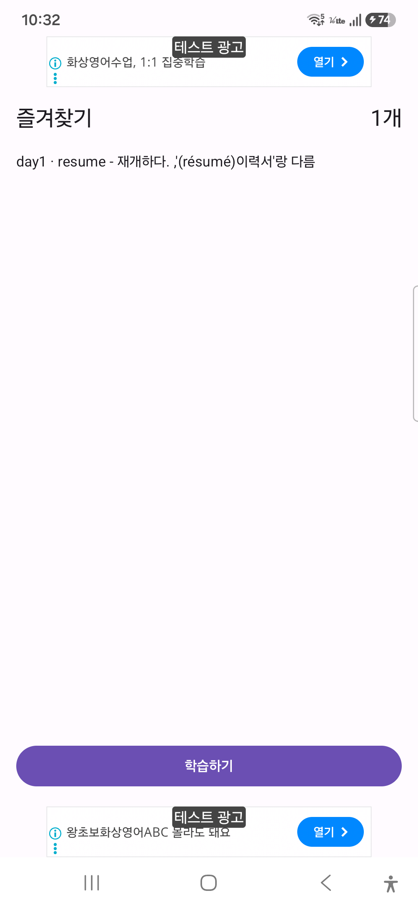
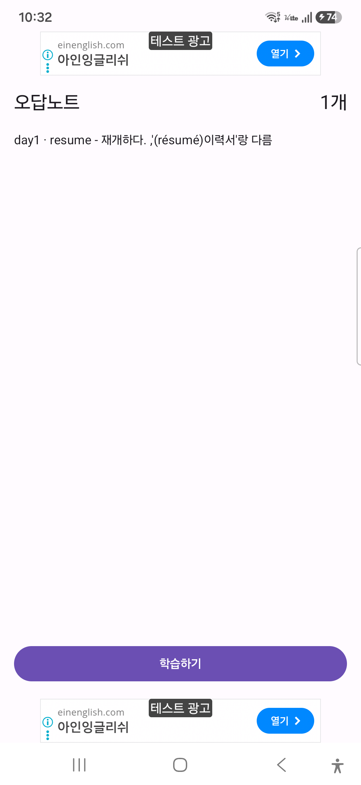

# 📱 토익 영단어 학습 앱 (englishWordApp)

> **한 줄 요약**
> 토익 필수 영단어를 day별로 학습하고, 발음을 듣고, 4지선다 퀴즈로 복습할 수 있는
> 안드로이드 앱입니다. 서버·DB 없이 로컬 CSV 데이터와 SharedPreferences만으로 동작합니다.

**실제로 출시되어 누구나 설치할 수 있는 앱입니다.**

---

## 🎯 왜 다시 만들었나

처음에는 Java로 만들었다. 그런데 쓰다 보니 **학습 도구로 작동하지 않는다**는 걸 알게 됐다.

| 문제 | 실제 증상 |
|---|---|
| 암기 검증이 불가능 | 단어와 뜻이 **항상 같이** 보여서, 아는지 모르는지 확인할 방법이 없었다 |
| 데이터가 깨져 보임 | CSV 파서가 따옴표를 처리하지 못해 **1,225행 중 835행**에 `"` 문자가 그대로 노출됐다 |
| 진행도가 사라짐 | 학습 이력을 저장하지 않아 **화면 회전만 해도** 처음으로 돌아갔다 |

세 문제 모두 부분 수정으로는 해결되지 않는 구조적 원인이 있었다. 그래서 Kotlin + Jetpack Compose로 전면 재작성했다.

- **CSV 파싱** — `String.split(",")` 대신 **RFC 4180** 규격대로 다시 구현했다. 따옴표로 감싼 필드 안의 쉼표를 구분자로 세지 않고, 이스케이프된 `""`를 실제 따옴표로 해석한다
- **퀴즈 출제 로직** — 순수 함수로 분리해 **JUnit 테스트 25건**으로 고정했다
- **상태 보존** — `SavedStateHandle`을 써서 화면 회전은 물론 **프로세스가 재생성돼도** 학습 위치를 복원한다

자세한 재설계 근거는 [`docs/PLAN_v9.md`](docs/PLAN_v9.md)에 있다.

---

## 📅 개발 기간
* 2025.07 ~ (계속 개발중)
* 2026.07: Kotlin + Jetpack Compose로 전면 재작성 (v9)
* 2026.08: 브랜드 개편 — Word Buddy 마스코트, 새 런처 아이콘, 홈 화면 리뉴얼 (v11)
* 개인 프로젝트 (기획, 디자인, 개발 100%)

## 🛠️ 사용 기술 및 개발 환경
* **Language:** Kotlin (Java 코드 없음)
* **IDE:** Android Studio
* **SDK Version:** Min 24 / Compile 36 / Target 36
* **Build:** Gradle 9.5.0 + AGP 9.3.1, Kotlin DSL(`.kts`) + 버전 카탈로그(`libs.versions.toml`),
  AGP 9 내장 Kotlin(`android.builtInKotlin=true`).
  데몬 JVM은 `gradle/gradle-daemon-jvm.properties`로 JDK 21에 고정 — `JAVA_HOME` 설정 불필요
* **UI:** Jetpack Compose (Material3) + Navigation-Compose. XML 레이아웃 없음
* **Architecture:** 단일 Activity + Compose `NavHost`. 화면별 상태는 ViewModel
  (`StudyViewModel`, `QuizViewModel`)이 담당하고, 학습 화면은 `SavedStateHandle`로 회전/
  프로세스 재생성에도 위치를 유지
* **광고:** Google AdMob (`play-services-ads` 25.4.0) 상/하단 배너.
  실제 운영 광고 단위 ID를 쓰고, 개발 기기는 AdMob 콘솔의 "테스트 기기"로 등록해 테스트 광고만 받음
* **음성:** 안드로이드 내장 `TextToSpeech`로 단어 발음 재생
* **테스트:** JUnit4 단위 테스트 25건 (CSV 파서, 데이터 정합성, 퀴즈 출제 로직, 저장 키).
  UI/네비게이션은 실기기 확인(`adb` 스크린샷 + 좌표 탭)으로 검증
* **Database:** DB 없이 `assets/words.csv`를 읽기전용으로 사용. 학습 진행도·즐겨찾기·오답노트는
  `SharedPreferences`(`StudyPrefs`)에 저장

## 📌 핵심 기능
* **날짜별 단어 학습:** day1~day30, 약 1,200개 단어를 day별로 학습. 뜻은 기본 숨김 상태로 있다가
  탭하면 공개되고, 스와이프 또는 이전/다음 버튼으로 이동
* **진행도 저장 / 이어서 학습:** 앱을 껐다 켜도 마지막으로 보던 day와 위치를 기억해 홈에서
  바로 이어서 학습할 수 있음
* **셔플 / 자동 발음:** day 안에서 단어 순서를 무작위로 섞을 수 있고, 카드가 넘어갈 때마다
  자동으로 발음을 들을 수 있음 (둘 다 토글)
* **즐겨찾기 / 오답노트:** 단어별로 즐겨찾기 표시, "모른다"로 답한 단어는 오답노트에 자동 등록.
  각각 독립 화면에서 모아서 다시 학습 가능
* **4지선다 퀴즈:** day별/즐겨찾기/오답노트 범위로 퀴즈를 볼 수 있고, 틀린 단어는 오답노트에
  자동 등록됨
* **다크 모드:** 시스템 설정에 따라 자동 적용
* **단어장 관리:** 아직 미구현. 현재는 `words.csv` 파일을 직접 편집해서 단어를 추가/수정

## 📸 앱 실행 화면

`docs/brand/play-store/capture/` 에 실기기(1080×2340) 캡처가 있습니다.

| 홈 | 학습 | 퀴즈 |
|---|---|---|
|  |  |  |

| day 목록 | 즐겨찾기 | 오답노트 |
|---|---|---|
|  |  |  |

## 💻 핵심 개발 경험 (느낀 점)
* 복잡한 버전 관리의 중요성을 깨닫고 **Git/GitHub을 활용하여 안정적인 체크포인트를 관리**하며 개발했습니다.
* 처음엔 데이터를 로컬 CSV로만 유지했지만, 학습 기록처럼 자주 바뀌는 값과 원본 단어 데이터를
  분리하는 게 중요하다는 걸 깨닫고 CSV(읽기전용)와 SharedPreferences(학습 기록)를 역할별로
  나눠서 관리했습니다.
* View 기반 UI에서 Jetpack Compose로 옮기면서, 상태를 어디에 둘지(Composable 로컬 상태 vs
  ViewModel vs SharedPreferences)를 계속 고민하게 됐고, 그 경계를 명확히 하는 연습이 됐습니다.
* 빌드/단위 테스트가 전부 통과해도 **실기기에서 직접 눌러보기 전에는 모른다**는 걸 다시
  느꼈습니다. 아이콘이 안 눌리는 문제(터치 영역이 겹쳐서 위에 있는 투명한 레이어가 클릭을
  가로챔), 라이트 모드에서 상태바 아이콘이 안 보이는 문제(edge-to-edge 강제 + 아이콘 색
  미지정), 광고가 상태바/내비게이션 바 뒤에 깔리는 문제 모두 실기기로 확인하고서야 발견했습니다.
* **문서를 복사해두면 반드시 낡는다**는 것도 배웠습니다. 같은 아키텍처 설명을 여러 파일에
  복사해뒀다가, 화면을 리팩터링한 뒤 그중 일부만 고쳐서 **이미 삭제된 클래스를 참조하는 문서**가
  남았습니다. 지금은 지침 원본을 `CLAUDE.md` 하나로 두고 나머지는 그 파일을 가리키게 했습니다.

## 📂 문서 구조

| 파일 | 용도 |
|---|---|
| `README.md` | 이 파일 — 프로젝트 소개 |
| `CLAUDE.md` | **기술 가이드 단일 원본** (아키텍처, 컨벤션, 빌드 설정, 알려진 이슈). AI 에이전트도 이 파일을 읽는다 |
| `AGENTS.md` | Codex가 `CLAUDE.md`를 읽도록 안내하는 스텁 — 지침을 복사하지 않는다 |
| `AI_WORKLOG.md` | 현재 **미커밋** 작업과 소유자만 기록하는 인수인계 게시판 (커밋되면 항목 삭제) |
| `docs/STORE_LISTING.md` | Play 스토어 앱 이름·설명 문구 원본 |
| `docs/RELEASE_NOTES_v*.md` | 버전별 출시 노트 (Play Console 출시 정보용 + 상세본) |
| `docs/brand/` | 브랜드 색상표, 마스코트/아이콘/피처 그래픽, 이미지 생성 프롬프트, 스토어 캡처 |
| `docs/PLAN_v9.md` | v9 Kotlin/Compose 재작성 기획서 |
| `docs/phase-reports/` | v9 재작성 Phase별 작업 보고서 (`PHASE_0` ~ `PHASE_7`, `PHASE_7_DEVICE_FIXES`) |
| `docs/CLAUDE_구버전.md` | v9 이전(Java/XML) 시절 가이드 보존용 — 지금 작업엔 불필요 |
