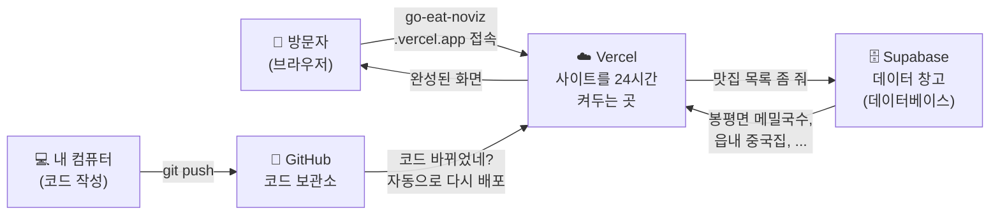

# 🤔 이게 다 뭐하는 건가요?

> 강사님이 하라는 대로 따라 치긴 했는데, **내가 뭘 한 건지 모르겠는 사람**을 위한 해설서.
> 용어를 하나도 모른다고 가정하고 씁니다. 순서대로 읽으면 됩니다.

---

## 0. 오늘 우리가 한 일을 한 문장으로

> **인터넷 주소만 있으면 누구나 볼 수 있는 웹사이트를 만들고,
> 그 웹사이트가 "데이터 창고"에서 맛집 목록을 꺼내와 화면에 뿌리게 했다.**

끝입니다. 나머지는 이걸 하기 위해 필요한 준비물들이었어요.

지금 우리가 만든 구조를 그림으로 보면 이렇습니다.



이 그림에 나오는 **Vercel, Supabase, GitHub** 이 세 개가 오늘 설치·설정한 것들의 정체입니다.

---

## 1. Next.js — 웹사이트 "밀키트"

### 우리가 한 것
```bash
npx create-next-app@latest .
```

### 이게 뭐야?

웹사이트를 처음부터 만들려면 할 일이 정말 많습니다. 주소별로 다른 페이지를 보여주고, 서버를 띄우고, 파일을 압축하고, 브라우저마다 다르게 동작하는 걸 맞춰주고...

**Next.js는 그걸 미리 다 해놓은 세트**입니다. 요리에 비유하면:

| 방식 | 요리 비유 | 개발 비유 |
| --- | --- | --- |
| 처음부터 다 만들기 | 밭에서 채소부터 키우기 | 서버·라우팅·빌드 전부 직접 구현 |
| **Next.js 쓰기** | **밀키트 사서 볶기** | **틀은 이미 있고, 내 화면만 만들면 됨** |

`npx create-next-app`은 **"밀키트 좀 뜯어서 주방에 깔아줘"** 라는 명령이었습니다. 그래서 실행하고 나니 폴더에 파일이 잔뜩 생겼죠.

### 같이 딸려온 4가지

명령어 뒤에 `--typescript --tailwind --eslint --app` 이런 게 붙어 있었는데, 각각 이런 뜻입니다.

| 옵션 | 정체 | 왜 넣었나 |
| --- | --- | --- |
| **TypeScript** | 오타·실수를 미리 잡아주는 감시자 | 숫자가 들어갈 자리에 글자를 넣으면 **저장하는 순간 빨간 줄**로 알려줍니다. 없으면 사이트를 열어보고 나서야 에러를 발견합니다 |
| **Tailwind CSS** | 디자인용 스티커 모음 | 색·여백·글씨크기를 `className="text-lg p-4"` 처럼 **미리 만들어진 이름**으로 붙입니다. CSS 파일을 따로 안 만들어도 됩니다 |
| **ESLint** | 코드 검사기 | "이 변수 만들어놓고 안 쓰는데요?" 같은 걸 잡아줍니다. 오늘 실제로 이게 한 번 걸렸습니다 (7번 항목 참고) |
| **App Router** | 폴더 = 주소 규칙 | `src/app/page.tsx` → 주소 `/`. `src/app/login/page.tsx` → 주소 `/login`. **폴더를 만들면 그게 곧 주소**가 됩니다 |

---

## 2. Git과 GitHub — 게임 세이브 파일

이 둘은 이름이 비슷해서 헷갈리는데, **완전히 다른 것**입니다.

### Git = 내 컴퓨터의 세이브 기능

게임하다가 세이브하는 것과 똑같습니다.

```bash
git add .          # "이 파일들을 세이브할 거야" 하고 골라두기
git commit         # 실제로 세이브! (여기에 "무엇을 했는지" 메모를 남김)
```

세이브를 해두면 **언제든 그 시점으로 되돌아갈 수 있습니다.** 코드를 실수로 다 지워도, 잘못 고쳐서 사이트가 망가져도 이전 세이브로 복구 가능합니다.

> 그래서 앞에서 "주석으로 남기지 말고 지우자"고 한 겁니다.
> 지운 코드도 세이브 파일에 다 남아 있으니까요.

### GitHub = 세이브 파일을 올려두는 클라우드

Git 세이브는 **내 컴퓨터 안에만** 있습니다. 컴퓨터가 고장나면 끝이죠.

```bash
git push           # 세이브 파일을 인터넷(GitHub)에 업로드
```

이러면 세 가지가 좋아집니다.
1. 컴퓨터가 고장나도 코드가 살아있다
2. 다른 컴퓨터에서 이어서 작업할 수 있다
3. **Vercel이 이걸 지켜보고 있다가 자동으로 배포해준다** ← 이게 핵심

우리 저장소 주소: https://github.com/noviz-domino/go-eat

### 왜 `master`를 `main`으로 바꿨나?

Git이 처음 만드는 기본 브랜치(작업 줄기) 이름이 옛날엔 `master`였는데, 요즘 업계 표준은 `main`입니다. GitHub·Vercel 등 대부분의 도구가 `main`을 기본으로 취급하니 맞춰준 것입니다. **기능 차이는 전혀 없고 이름만 다릅니다.**

---

## 3. Vercel — "내 컴퓨터를 끄면 사이트가 사라지는" 문제

### 문제 상황

`npm run dev`를 실행하면 `localhost:3000`에서 내 사이트를 볼 수 있습니다. 그런데 `localhost`는 **"이 컴퓨터"** 라는 뜻이에요. 즉:

- 친구에게 `localhost:3000` 주소를 줘도 **친구 컴퓨터의 아무것도 없는 곳**으로 갑니다
- 내 컴퓨터를 끄면 사이트도 같이 꺼집니다

### 해결: 24시간 켜져 있는 남의 컴퓨터를 빌린다

그게 **Vercel**입니다. 우리 코드를 자기네 서버에 올려두고 24시간 돌려줍니다. 무료입니다.

### 우리가 한 설정의 의미

**GitHub 저장소를 Vercel에 Import** 했습니다. 이게 왜 중요하냐면:

```
내가 git push
     ↓
GitHub에 새 코드 도착
     ↓
Vercel이 "어? 코드 바뀌었네?" 하고 감지
     ↓
자동으로 다시 빌드해서 배포 (1~2분)
```

**즉, 앞으로 배포하려면 그냥 `git push`만 하면 됩니다.** 따로 "배포하기" 버튼을 누를 필요가 없습니다. 오늘 여러 번 이게 자동으로 돌았습니다.

### 왜 주소에 `-xi`가 붙었나?

처음 배포하니 `go-eat-xi.vercel.app`이 나왔습니다. `-xi`는 뭘까요?

`○○○.vercel.app` 주소는 **전 세계 Vercel 사용자가 공유하는 이름표**입니다. 즉 `go-eat.vercel.app`은 지구상에 딱 하나만 존재할 수 있어요. 그런데 확인해보니 **이미 다른 사람이 쓰고 있었습니다.**

그래서 Vercel이 겹치지 않게 뒤에 아무 글자(`-xi`)를 붙여준 겁니다. 우리는 이게 마음에 안 들어서 `Settings → Domains`에서 직접 이름을 추가했습니다.

**최종 주소: https://go-eat-noviz.vercel.app**

(옛 주소로 들어가도 새 주소로 자동으로 넘겨주게 해뒀습니다.)

---

## 4. Supabase — 데이터를 어디에 저장하지?

### 문제 상황

맛집 목록을 코드 안에 직접 적으면 어떻게 될까요?

```js
const 맛집목록 = ["봉평면 메밀국수", "읍내 중국집"];   // ❌
```

- 사용자가 새 맛집을 등록하면? **코드를 고쳐서 다시 배포해야 합니다.**
- 브라우저를 새로고침하면? 사용자가 입력한 건 **다 날아갑니다.**

**데이터는 코드와 따로, 영구적으로 보관되는 곳에 있어야 합니다.** 그게 데이터베이스입니다.

### Supabase = 데이터베이스 + 편의기능 세트

데이터베이스만 직접 준비하려면 서버 빌리고, 설치하고, 보안 설정하고, 백업하고... 할 일이 산더미입니다.

**Supabase는 그걸 다 대신 해주는 서비스**입니다. 가입하고 클릭 몇 번이면 데이터베이스가 생깁니다. 게다가 이런 것도 같이 줍니다.

| 기능 | 설명 | 우리가 쓸 곳 |
| --- | --- | --- |
| **Database** | 데이터 보관 (PostgreSQL) | 맛집 목록 저장 ✅ 오늘 했음 |
| **Auth** | 회원가입·로그인 기능 | 로그인 화면 (다음 단계) |
| **Storage** | 파일·사진 보관 | 맛집 사진 (2일차 확장) |

### 테이블·컬럼이 뭐야? → 엑셀이라고 생각하세요

데이터베이스는 **엑셀 파일과 구조가 거의 같습니다.**

| 데이터베이스 용어 | 엑셀로 치면 | 우리 경우 |
| --- | --- | --- |
| **테이블 (table)** | 시트 하나 | `restaurants` 시트 |
| **컬럼 (column)** | 세로 열 (A열, B열...) | 이름, 카테고리, 별점... |
| **행 (row)** | 가로 한 줄 | 맛집 하나 |

우리가 만든 `restaurants` 테이블을 엑셀로 그리면 이렇습니다.

| id | name | category | rating | visited | visited_at | memo |
| --- | --- | --- | --- | --- | --- | --- |
| 2a2a... | 봉평면 메밀국수 | 한식 | 5 | ✅ | 2026-07-15 | 현금만 받음 |
| db0e... | 읍내 중국집 | 중식 | (빈칸) | ❌ | (빈칸) | (빈칸) |
| 4dcd... | 할매 손칼국수 | 한식 | 4 | ✅ | 2026-06-02 | 2시 이후 마감 |

### 엑셀과 다른 점 — "규칙"을 미리 정해둔다

엑셀은 별점 칸에 "매우맛있음"이라고 써도 그냥 저장됩니다. 데이터베이스는 **미리 정한 규칙을 어기면 저장을 거부합니다.**

우리가 정한 규칙들:

```sql
name       text not null                          -- 이름은 반드시 있어야 함
rating     int2 check (rating between 1 and 5)     -- 별점은 1~5 숫자만
visited    boolean not null default false          -- 방문여부는 참/거짓, 기본은 거짓
id         uuid primary key default gen_random_uuid()  -- 자동으로 고유번호 부여
```

이게 왜 중요하냐면 — **데이터가 깨지는 걸 데이터베이스가 막아줍니다.** 코드에서 실수로 별점 99를 저장하려 해도 거부당합니다.

### `id`는 왜 저런 이상한 글자야?

`2a2a96a7-b295-4e87-...` 같은 게 `id`에 들어있습니다. 이건 **UUID**라고 하는데, "지구상에서 겹치지 않는 고유번호"입니다.

1, 2, 3... 처럼 순서대로 붙이면 안 되나요? 됩니다. 다만 그러면 **남의 데이터를 쉽게 훔쳐볼 수 있습니다.** 주소창에 `/restaurants/1`, `/restaurants/2`를 넣어보면 되니까요. UUID는 추측이 불가능해서 이걸 막아줍니다.

---

## 5. MCP — Claude에게 리모컨을 쥐여주기

### 우리가 한 것
```bash
claude mcp add --scope project --transport http supabase "https://mcp.supabase.com/mcp?..."
```

### 이게 뭐야?

원래 Claude(저)는 **텍스트만 주고받을 수 있습니다.** Supabase 대시보드에 로그인해서 테이블을 만드는 건 못 하죠. 그래서 원래대로라면 이렇게 됩니다.

> Claude: "이 SQL을 복사해서 Supabase 대시보드 → SQL Editor에 붙여넣고 실행하세요"
> 사용자: (복사, 창 열기, 붙여넣기, 실행, 결과 다시 복사해서 알려주기...)

**MCP(Model Context Protocol)를 연결하면** 이 왕복이 사라집니다. Claude가 Supabase를 직접 조작할 수 있게 됩니다.

오늘 실제로 이런 일들을 MCP로 처리했습니다.

| 한 일 | MCP 없었으면 |
| --- | --- |
| `restaurants` 테이블 생성 | SQL 복사 → 대시보드 붙여넣기 → 실행 |
| 맛집 3개 넣기 | 위와 동일 |
| 접속 주소·열쇠 가져오기 | 대시보드에서 찾아서 복사 |
| 보안 문제 점검 | 어떻게 확인하는지도 모름 |
| Vercel 배포 상태 확인 | 대시보드 새로고침 반복 |

`--scope project`라고 한 건 **"이 프로젝트 폴더에서만 쓰겠다"** 는 뜻입니다. 그래서 `.mcp.json` 파일이 프로젝트 안에 생겼고, 이걸 GitHub에 커밋해뒀습니다. 나중에 이 프로젝트를 다시 열면 자동으로 연결됩니다.

### 처음에 나온 "1, 2, 3 선택하세요" 화면은?

MCP 서버는 외부 프로그램이니까, Claude Code가 **"이거 믿고 써도 되나요?"** 라고 물어본 것입니다. 본인이 직접 추가한 공식 Supabase 서버라 2번(앞으로도 허용)을 골랐습니다.

---

## 6. 환경변수 — 주소와 열쇠를 코드에 안 적는 이유

### 우리가 만든 파일

`.env.local`
```
NEXT_PUBLIC_SUPABASE_URL=https://vpykysmsrafjvnewjubu.supabase.co
NEXT_PUBLIC_SUPABASE_ANON_KEY=sb_publishable_...
```

### 이게 뭐야?

우리 사이트가 Supabase에서 데이터를 가져오려면 두 가지가 필요합니다.

1. **주소** — 어느 창고로 가야 하는지 (`...supabase.co`)
2. **열쇠** — 문을 열 수 있는 증표 (`sb_publishable_...`)

이걸 코드 파일에 직접 적으면 안 됩니다. 이유가 두 개입니다.

| 이유 | 설명 |
| --- | --- |
| **환경마다 값이 다르다** | 개발용 DB와 실제 서비스용 DB는 보통 따로 씁니다. 코드에 박아두면 배포할 때마다 코드를 고쳐야 합니다 |
| **비밀값이 코드와 함께 공개된다** | 우리 GitHub 저장소는 **Public(누구나 볼 수 있음)** 입니다. 코드에 비밀 열쇠를 적으면 전 세계에 공개됩니다 |

### `.gitignore` — "이 파일은 GitHub에 올리지 마"

그래서 `.env.local`은 **일부러 GitHub에 안 올립니다.** `.gitignore`라는 파일에 `.env*`라고 적어두면 Git이 그 파일을 아예 무시합니다.

확인해보면 실제로 커밋 목록에 `.env.local`이 없습니다. 안전합니다.

### 그럼 Vercel은 어떻게 알아?

여기가 초보자가 **가장 많이 막히는 지점**입니다.

```
내 컴퓨터  →  .env.local 파일에서 읽음  →  잘 동작 ✅
Vercel     →  .env.local이 없음 (올리지 않았으니)  →  에러 💥
```

그래서 **Vercel에도 같은 값을 따로 등록**해줘야 합니다. 오늘 이 명령으로 했습니다.

```bash
vercel env add NEXT_PUBLIC_SUPABASE_URL production
vercel env add NEXT_PUBLIC_SUPABASE_ANON_KEY production
```

> 💡 **"로컬은 되는데 배포하면 안 돼요"의 90%가 이것입니다.** 기억해두세요.

`production`(실제 서비스용)과 `preview`(테스트용) 양쪽에 다 넣었습니다.

### `NEXT_PUBLIC_`은 무슨 뜻?

Next.js의 약속입니다. 변수 이름이 `NEXT_PUBLIC_`으로 시작하면 → **브라우저까지 전달됩니다.**

| 이름 | 어디까지 가나 | 용도 |
| --- | --- | --- |
| `NEXT_PUBLIC_XXX` | 브라우저까지 (**전 세계에 공개됨**) | 숨길 필요 없는 값 |
| `XXX` (접두어 없음) | 서버에만 머무름 | 진짜 비밀 열쇠 |

그럼 우리 열쇠를 `NEXT_PUBLIC_`으로 공개해도 되나요? **됩니다.** 우리가 쓴 `anon`(publishable) 키는 **원래부터 공개용으로 설계된 열쇠**입니다. 브라우저에서 로그인 기능을 쓰려면 반드시 브라우저에 있어야 하니까요.

**대신, 이 열쇠는 "누구나 가질 수 있다"고 가정하고 보안을 짜야 합니다.** 그게 다음 항목입니다. ⬇️

---

## 7. 오늘 실제로 터진 문제 2개

문서에서 성공만 보면 배우는 게 없으니, 실제로 걸린 걸 남겨둡니다.

### 문제 1: 페이지가 데이터를 한 번만 읽고 굳어버렸다

처음 빌드했을 때 이런 결과가 나왔습니다.

```
Route (app)
┌ ○ /              ← ○ 표시가 문제!
```

`○`는 **Static(정적)** 이라는 뜻입니다. Next.js가 성능을 위해 **"이 페이지는 안 바뀌는 것 같으니 빌드할 때 한 번 만들어서 저장해두자"** 라고 판단한 겁니다.

**왜 문제인가?** 나중에 사용자가 맛집을 등록해도 **화면이 안 바뀝니다.** 빌드 시점의 3개짜리 목록이 그대로 굳어있으니까요.

**해결:**
```ts
export const dynamic = "force-dynamic";   // "매번 새로 만들어줘"
```

한 줄 추가했더니 `ƒ (Dynamic)`으로 바뀌었습니다. 이제 요청이 올 때마다 데이터베이스를 새로 읽습니다.

> 이건 **찾기 어려운 종류의 버그**입니다. 에러가 안 나고, 로컬에서도 잘 되는 것처럼 보이고, 며칠 뒤 "왜 등록한 게 안 보이지?" 할 때 발견되니까요. 빌드 결과의 `○`/`ƒ` 표시를 보는 습관이 중요합니다.

### 문제 2: 안 쓰는 코드 한 줄 때문에 배포 실패할 수 있었다

메인 페이지에서 이미지를 다 지웠는데, 맨 위에 이 줄이 남아 있었습니다.

```ts
import Image from "next/image";   // 이제 아무도 안 씀
```

ESLint 규칙상 **"안 쓰는 걸 불러오지 말라"** 가 에러입니다. 그냥 뒀으면 Vercel 빌드가 실패했을 겁니다. 지우고 넘어갔습니다.

> 코드를 지울 때는 **위쪽의 `import`도 같이 확인**하세요.

---

## 8. 로그인과 RLS — 데이터 창고에 자물쇠 달기

> ✅ 이 항목은 **완료**되었습니다. 처음엔 문이 열려 있었는데, 지금은 잠겼습니다.

### 왜 문제였나

앞에서 열쇠(`anon` 키)는 "누구나 가질 수 있다고 가정해야 한다"고 했습니다. 그러면 **열쇠를 가진 사람이 우리 테이블을 마음대로 읽고 쓰고 지울 수 있느냐**가 문제가 되죠.

처음엔 막을 장치가 없었습니다. Supabase 보안 점검을 돌리니 이렇게 나왔어요.

```
[ERROR] RLS Disabled in Public
Table `public.restaurants` is public, but RLS has not been enabled.
```

### RLS = "행 단위 보안"

**RLS(Row Level Security)** 는 이름 그대로 **줄(행)마다 누가 볼 수 있는지 검사하는 기능**입니다.

앞에서 데이터베이스를 엑셀에 비유했죠. 엑셀 시트 하나를 여러 사람이 공유하는데, **각자 자기가 쓴 줄만 보이게** 만드는 겁니다.

```
RLS 없을 때                        RLS 켠 후
┌──────────────────┐              ┌──────────────────┐
│ 봉평면 메밀국수 (A씨)│              │ 봉평면 메밀국수 (A씨)│
│ 읍내 중국집    (A씨)│  ← B씨도    │ 읍내 중국집    (A씨)│  ← B씨에겐
│ 성수 라멘집    (B씨)│    전부 다   │ 성수 라멘집    (B씨)│    이 줄만
└──────────────────┘    보임      └──────────────────┘    보임
```

우리가 적용한 규칙의 핵심은 이 한 줄입니다.

```sql
using (auth.uid() = user_id)
```

해석하면 **"지금 로그인한 사람의 id가 이 줄의 주인(`user_id`)과 같을 때만 허용"** 입니다. 조회·등록·수정·삭제 네 가지에 각각 이 규칙을 걸어뒀습니다.

중요한 건 이게 **데이터베이스 자체에 박힌 규칙**이라는 점입니다. 코드에서 실수로 `select * from restaurants`를 해도, 데이터베이스가 알아서 남의 줄을 빼고 돌려줍니다. **코드가 아무리 허술해도 데이터는 새지 않습니다.**

### 로그인이 먼저 필요했던 이유

RLS는 `auth.uid()` — **"지금 로그인한 사람이 누구인지"** 를 알아야 작동합니다. 로그인 기능이 없으면 이 값이 항상 비어 있으니, RLS를 켜는 순간 **아무 데이터도 안 보이게** 됩니다.

그래서 순서가 이랬습니다.

```
1. 로그인 기능 만들기
2. user_id를 필수값으로 바꾸기 (주인 없는 맛집은 존재 불가)
3. RLS 켜기  ← 문을 잠금
```

### 실제로 잠겼는지 확인한 방법

말로만 "됐습니다" 하면 못 믿죠. 이렇게 검증했습니다.

1. `test1` 계정으로 가입 → 맛집 3개 넣음 → 목록에 3개 보임
2. 로그아웃 → **`test2` 계정으로 가입** → **맛집 0개**

데이터베이스에는 `test1`의 맛집 3개가 그대로 있는데도 `test2`에게는 **아예 존재하지 않는 것처럼** 보였습니다. 이게 RLS가 작동한다는 증거입니다.

보안 점검도 다시 돌렸고, 경고가 **0건**으로 사라졌습니다.

### 대신 생긴 불편함 하나

이제 **Supabase Table Editor에서 맛집을 손으로 추가하는 게 안 됩니다.** `user_id`를 직접 채워줘야 하는데 그게 번거롭기 때문이죠. 그래서 **등록 화면을 만드는 게 다음 작업**입니다.

### 로그인은 어떻게 만들었나 (곁들임 설명)

새로 생긴 파일들이 뭔지 간단히만 정리합니다.

| 파일 | 하는 일 |
| --- | --- |
| `src/app/login/page.tsx` | 로그인 화면 |
| `src/app/actions/auth.ts` | 실제 로그인·가입·로그아웃 처리 (**서버에서** 실행) |
| `src/lib/supabase/server.ts` | 서버가 Supabase에 접속할 때 쓰는 연결 |
| `src/lib/supabase/client.ts` | 브라우저가 접속할 때 쓰는 연결 |
| `src/proxy.ts` | 모든 요청을 가로채서 ① 로그인 상태 유지 ② 비로그인이면 로그인 화면으로 보내기 |

**"로그인 정보를 어디에 보관하나"** 가 중요한 결정이었습니다. 두 가지 방법이 있어요.

| 방식 | 장점 | 단점 |
| --- | --- | --- |
| 브라우저에만 저장 | 코드가 단순함 | **서버가 누가 로그인했는지 모름** → 서버에서 데이터를 걸러줄 수 없음 |
| **쿠키에 저장** (우리가 선택) | 서버도 알 수 있음 → 서버에서 미리 걸러서 보냄 | 파일이 몇 개 더 필요 |

"나중에 실제 서비스로 만들 수 있는 구조"를 원하셨으니 **쿠키 방식**을 택했습니다. 나중에 바꾸려면 거의 전부 뜯어고쳐야 하는 종류의 결정이라, 처음에 제대로 잡는 게 이득입니다.

### ⚠️ 여기서 하나 배울 점 — 공식 문서를 그대로 믿으면 안 될 때가 있다

이 프로젝트의 `AGENTS.md`에는 **"코드를 쓰기 전에 `node_modules/next/dist/docs/`를 먼저 읽어라"** 는 규칙이 있습니다. 왜 그런 규칙이 있는지 이번에 드러났어요.

| 항목 | 인터넷에 널린 안내 | **우리가 쓰는 Next.js 16** |
| --- | --- | --- |
| 요청 가로채는 파일 | `middleware.ts` | **`proxy.ts`** |
| 쿠키 읽기 | `cookies()` | **`await cookies()`** |

Next.js 16에서 `middleware`가 `proxy`로 **이름이 바뀌었습니다.** 그런데 Supabase 공식 문서와 대부분의 블로그는 아직 `middleware.ts`로 안내합니다.

**그대로 따라 했으면 어떻게 됐을까요?** 에러가 안 납니다. 파일이 그냥 **조용히 무시**됩니다. 그러면 "가입은 되는데 새로고침하면 로그아웃되네? 왜지?" 하면서 몇 시간을 날렸을 겁니다.

> 💡 **버전이 올라가면 이름과 규칙이 바뀝니다.** 내가 쓰는 버전의 문서를 확인하는 습관이 검색보다 빠를 때가 많습니다.

---

## 9. 용어 사전 (헷갈릴 때 여기 보기)

| 용어 | 한 줄 설명 |
| --- | --- |
| **npm** | 남이 만든 코드 꾸러미를 설치하는 도구. 앱스토어 같은 것 |
| **npx** | 설치 없이 한 번만 실행. `npx create-next-app`처럼 딱 한 번 쓸 때 |
| **package.json** | 이 프로젝트가 쓰는 부품 목록표 |
| **node_modules** | 실제로 다운로드된 부품들이 쌓인 창고 폴더. 용량이 크고 GitHub에 안 올림 (필요하면 목록표 보고 다시 받으면 되니까) |
| **빌드(build)** | 사람이 읽는 코드 → 브라우저가 빠르게 읽는 형태로 변환·압축하는 작업 |
| **배포(deploy)** | 빌드한 결과물을 인터넷에 올려서 남들이 볼 수 있게 하는 것 |
| **커밋(commit)** | 세이브. 지금 상태를 기록으로 남김 |
| **푸시(push)** | 세이브 파일을 GitHub에 업로드 |
| **브랜치(branch)** | 작업 줄기. 우리는 `main` 하나만 씀 |
| **서버 컴포넌트** | 화면을 **서버에서** 만들어 완성품만 보내는 방식. 데이터베이스 열쇠가 브라우저로 안 새서 안전함. 우리 메인 페이지가 이 방식 |
| **SQL** | 데이터베이스에게 말을 거는 언어. `select`(달라), `insert`(넣어라), `create table`(만들어라) |
| **RLS** | 행 단위 보안. 줄마다 누가 접근 가능한지 정하는 규칙 (8번 항목) |
| **환경변수** | 코드 바깥에 따로 보관하는 설정값 (주소, 열쇠 등) |
| **MCP** | Claude가 외부 서비스를 직접 조작하게 해주는 연결 규격 |
| **Server Action** | 브라우저에서 호출하지만 **서버에서 실행되는** 함수. 비밀번호처럼 노출되면 안 되는 걸 다룰 때 씀. 우리 로그인 처리가 이것 |
| **Proxy** (구 Middleware) | 모든 요청이 페이지에 닿기 전에 거쳐 가는 검문소. 우리는 여기서 로그인 여부를 확인함. Next.js 16에서 `middleware` → `proxy`로 이름이 바뀜 |
| **세션(session)** | "이 사람 로그인한 상태다"라는 증표. 우리는 쿠키에 보관 |
| **쿠키(cookie)** | 브라우저가 보관하고 요청할 때마다 서버에 자동으로 보내주는 작은 쪽지 |
| **마이그레이션(migration)** | 데이터베이스 구조를 바꾼 기록. "언제 무엇을 어떻게 바꿨는지"가 파일로 남아 되돌릴 수 있음 |

---

## 10. 지금 어디까지 왔나

### ✅ 끝난 것

| 단계 | 결과 |
| --- | --- |
| 기획 | [기획서.md](기획서.md) — 서비스 정의, 테이블 설계, 화면 3개, 안 만들 것 |
| 프로젝트 세팅 | Next.js + TypeScript + Tailwind |
| 코드 보관 | https://github.com/noviz-domino/go-eat |
| 배포 | https://go-eat-noviz.vercel.app |
| 데이터베이스 | Supabase `restaurants` 테이블 |
| 첫 연결 성공 | **배포된 사이트가 데이터베이스에서 맛집 목록을 읽어옴** |
| 로그인·회원가입 | 이메일 + 비밀번호, 쿠키 세션 |
| **보안(RLS)** | **내 맛집은 나만 보임 — 계정 2개로 실제 검증 완료** |

**화면 ↔ 서버 ↔ 데이터베이스가 한 줄로 이어졌고, 그 위에 자물쇠까지 달렸습니다.** 여기까지 오면 나머지는 "화면을 늘리는 일"에 가깝습니다.

### ⬜ 남은 것

기획서에 적어둔 8시간 분량 기능은 이제 전부 끝났습니다. 테스트 계정(`test1`, `test2`)은
계속 쓸 예정이라 남겨뒀습니다.

---

## 15. 디자인 다듬기 — "정해진 값 몇 개만 바꿔도 느낌이 확 달라진다"

### 무엇을 바꿨나

기획서에는 처음부터 디자인 규칙이 적혀 있었습니다 (색·라운드·그림자·폰트 수치까지).
그런데 실제 코드는 create-next-app이 만들어준 기본 회색·검정 스타일 그대로였습니다.
이번에 그 규칙을 실제로 적용했습니다.

| 바꾼 것 | 이전 | 이후 |
| --- | --- | --- |
| 폰트 | `Arial` (기본값) | `Pretendard` (한글 전용 폰트) |
| 주요 버튼 색 | 검정 | 주황(`#EA580C`) |
| 카드 테두리 | 회색 선 | 테두리 없이 옅은 그림자 |
| 다크모드 | 자동 전환됨 | 없앰 (라이트 모드 고정) |

### 왜 세 가지 색 중 하나를 골라야 했나

"주황 계열"이라고만 정해뒀지 정확한 색상 코드는 안 정해져 있었습니다. 색 하나 고르는
게 별거 아닌 것 같지만, 버튼·탭·진행률 바에 실제로 발라보면 느낌이 꽤 다릅니다.
그래서 코드를 짜기 전에 **세 가지 후보를 실제 UI 모양(버튼, 탭, 진행률 바)에
입혀서 비교 화면을 먼저 보여드리고 골라달라고** 했습니다. 이러면 "그냥 코드로
짜봤는데 마음에 안 든다"며 다시 짜는 시간 낭비가 없습니다.

### 색을 한 군데만 바꾸면 온 화면에 다 퍼지는 이유

버튼 하나하나에 `#EA580C`라는 숫자를 직접 써넣지 않았습니다. 대신
`globals.css`라는 파일에 이렇게 딱 한 줄만 적었습니다.

```css
--color-accent: #ea580c;
```

이렇게 "이름 붙은 색"(변수)으로 한 번만 정의해두면, 코드 여기저기서
`bg-accent`(이 색을 배경으로 써줘)라고만 쓰면 됩니다. **나중에 색을 바꾸고
싶으면 이 한 줄만 고치면 버튼 6개, 탭, 진행률 바가 전부 한 번에 바뀝니다.**
색상 코드를 파일마다 복사해서 붙여넣었다면, 나중에 색 하나 바꾸는 데도
모든 파일을 일일이 찾아다녀야 했을 겁니다.

### 디자인이 잘 됐는지 어떻게 확인했나 — 스크린샷 대신 숫자로

원래는 화면을 찍어서(스크린샷) 보여드리는 게 가장 직관적입니다. 그런데
13번 항목에서 설명했던 것과 같은 이유로, 이번에도 화면 캡처 자체가 안 됐습니다
(테스트 도구의 탭이 화면을 실제로 그리지 않는 상태였기 때문).

대신 브라우저에게 **"지금 이 버튼의 배경색이 실제로 몇 번인지 알려줘"** 라고
직접 물어봤습니다 (`getComputedStyle`이라는 기능을 씁니다). 그랬더니:

```
rgb(234, 88, 12)
```

이 숫자가 나왔는데, 계산해보면 정확히 `#EA580C`와 같은 색입니다. 그림자·
라운드·폰트도 같은 방식으로 하나하나 확인해서, 기획서에 적어둔 수치와
전부 정확히 일치하는 걸 확인했습니다.

> 💡 화면을 눈으로 못 볼 때도, 브라우저에게 "지금 렌더링된 실제 값이 뭐야?"라고
> 물어보면 숫자로 답을 받을 수 있습니다. 디버깅할 때 꽤 유용한 방법입니다.

---

## 14. 로딩·에러 화면 — "아무것도 안 하고 있는 것"과 "고장난 것"을 구분해주기

### 왜 이게 필요한가

인터넷이 느리거나 서버가 잠깐 대답을 못 하면, 화면에 **아무것도 안 뜨는 하얀 순간**이
생깁니다. 사용자 입장에선 이게 "로딩 중"인지 "고장 난 건지" 구분이 안 됩니다.
그래서 두 가지 특수 파일을 추가했습니다.

| 파일 | 언제 나오나 |
| --- | --- |
| `loading.tsx` | 데이터를 불러오는 **동안** — "지금 하고 있어요"를 보여줌 |
| `error.tsx` | 코드에서 예상 못 한 문제가 **터졌을 때** — "문제가 생겼어요, 다시 해볼까요?"를 보여줌 |
| `not-found.tsx` | 존재하지 않는 것을 찾으려 할 때 — "그런 건 없어요" |

이 세 파일은 이름만 정확히 맞추면 Next.js가 **자동으로 알아서 끼워 넣어줍니다.**
따로 "이 페이지에서 로딩 중이면 이 컴포넌트를 보여줘" 같은 코드를 안 짜도 됩니다.

### 검증하다가 겪은 진짜 삽질 — 그리고 배운 것

로딩 화면이 실제로 뜨는지 확인하려고, 일부러 데이터 조회를 2초 느리게 만들고
새로고침을 해봤습니다. 그런데 **화면이 로딩 스켈레톤에서 영원히 안 풀렸습니다.**
지연 코드를 완전히 지워도 마찬가지였고, "배포용" 빌드로 바꿔도 똑같았습니다.

이쯤 되면 "내가 뭔가 잘못 만들었나?" 싶어지죠. 그런데 **진짜 서버에 직접
요청을 날려보니**(브라우저를 거치지 않고), 응답 안에는 로딩 화면과 실제 데이터가
**둘 다 정상적으로 들어있었습니다.** 서버는 완벽하게 일하고 있었던 겁니다.

### 그럼 뭐가 문제였나

지금 쓰는 리액트(React 19)는 "로딩 화면 → 실제 화면"으로 바뀌는 순간을
`requestAnimationFrame`이라는 브라우저 기능으로 정확히 맞춥니다. 이건
"화면이 다음번 그려지기 직전에 실행해줘"라는 예약 같은 겁니다.

그런데 제가 테스트에 쓰던 브라우저 자동화 도구의 탭이 **화면에 실제로 그려지고
있지 않은 상태**였습니다 (창이 최소화되어 있거나 백그라운드에 있는 것과 비슷한
상태라고 보면 됩니다). 화면이 안 그려지고 있으니 "다음번 그려지기 직전"이라는
예약도 영원히 실행이 안 됐고, 그래서 로딩 화면에서 안 풀린 것처럼 보였던 겁니다.

**정리하면:** 앱은 처음부터 멀쩡했고, 문제는 제가 확인하던 도구의 특수한 상황
때문이었습니다. 실제 서버 응답을 직접 뜯어봐서 이걸 증명했습니다.

> 💡 **화면에서 이상하게 보인다고 바로 "코드가 잘못됐다"고 단정하지 마세요.**
> 서버가 실제로 뭘 보내고 있는지 먼저 확인하면(개발자 도구의 Network 탭 같은 곳),
> "코드 문제"와 "화면에 보여지는 방식 문제"를 구분할 수 있습니다.

반면 `error.tsx`(에러 화면)는 다른 방식으로 동작해서 이 문제를 안 겪었고,
실제로 브라우저에서 에러 화면이 뜨고 "다시 시도" 버튼을 눌러 정상 화면으로
돌아오는 것까지 눈으로 확인했습니다.

### `error.tsx`의 재시도 버튼 — 이름이 최근에 바뀐 API

에러 화면의 "다시 시도" 버튼을 만들 때, 인터넷 예제 대부분은 `reset()`이라는
함수를 쓰라고 알려줍니다. 그런데 지금 쓰는 Next.js 버전(16.2 이상)에서는
이 함수 이름이 **`unstable_retry()`로 바뀌었습니다.** `reset()`은 이제
"다시 불러오지 않고 그냥 에러 표시만 지우기"라는 좁은 용도로 남았습니다.

문서를 확인 안 하고 인터넷 예제를 그대로 베꼈다면, 재시도 버튼이 안 되는데
왜 안 되는지 한참 찾아봤을 상황입니다.

---

## 13. 검색·필터 — "주소창에 조건을 저장한다"는 아이디어

### 왜 필터 상태를 화면 안에만 두지 않았나

검색·탭·카테고리 필터를 만드는 가장 단순한 방법은, 화면이 "지금 뭐가 선택됐는지"를
기억하는 것입니다. 그런데 이렇게 하면 **새로고침하는 순간 다 날아갑니다.**
"한식만 보고 있었는데" 실수로 새로고침하면 다시 전체 목록부터 봐야 하죠.

그래서 필터 상태를 화면(리액트 state)이 아니라 **주소창의 물음표 뒤쪽**에 저장했습니다.

```
http://localhost:3000/?visited=done&category=한식&q=할매
```

이 방식의 이름이 **URL 쿼리 파라미터**입니다. 주소 자체가 "지금 무슨 조건으로
보고 있는지"를 담고 있어서:

- 새로고침해도 조건이 그대로 유지됩니다 (주소가 안 바뀌었으니까요)
- 이 주소를 복사해서 카톡으로 보내면, 받은 사람도 같은 필터가 걸린 화면을 봅니다
- "뒤로 가기"를 누르면 이전 필터 상태로 정확히 돌아갑니다

### 왜 검색창과 탭·드롭다운을 다르게 만들었나

셋 다 "필터를 바꾼다"는 점은 같은데, 코드 방식이 다릅니다.

| | 만든 방식 | 이유 |
| --- | --- | --- |
| **검색창** | 입력을 멈추고 0.3초 뒤에 주소를 바꿈 (디바운스) | 한 글자 칠 때마다 서버에 물어보면 너무 잦다. "봉" "봉평" "봉평면" 세 번 다 서버에 갔다 오는 건 낭비 |
| **방문 탭** (전체/가볼 곳/갔던 곳) | 그냥 `<a>` 링크 | 클릭 한 번에 끝나는 선택이라 자바스크립트가 필요 없다. 링크는 자바스크립트가 아예 꺼진 브라우저에서도 동작한다 |
| **카테고리 드롭다운** | 선택하자마자 바로 주소 이동 | `<select>`는 어차피 클릭해야 값이 바뀌니 디바운스가 필요 없다 |

**"할 수 있는 한 가장 단순한 방법을 쓴다"** 는 원칙이 여기에도 적용됩니다.
검색창처럼 정말 자바스크립트가 필요한 곳에만 클라이언트 컴포넌트를 쓰고,
나머지는 평범한 링크로 처리했습니다.

### 진행률 바가 필터에 영향받지 않는 이유

"가볼 곳" 탭을 누르면 화면에는 안 가본 곳만 보입니다. 그런데 상단의
"4곳 중 3곳 정복"은 그대로입니다. 왜 같이 안 줄어들까요?

**일부러 그렇게 만들었습니다.** 진행률은 "내가 전체 중 얼마나 정복했는지"를
보여주는 숫자인데, 필터를 걸 때마다 이 숫자가 바뀌면 오히려 헷갈립니다.
그래서 코드에서 **진행률 계산용 쿼리와 화면 표시용 쿼리를 완전히 분리**했습니다.

```
전체 카운트 조회 → 필터 조건 없음  → 진행률 바에만 사용
목록 조회      → 필터 조건 적용  → 카드 목록에만 사용
```

### 검색 결과가 하나도 없을 때

"봉평"으로 검색했는데 "중식"으로도 필터를 걸면 결과가 0개가 됩니다. 이때 그냥
빈 화면을 보여주면 사용자는 "어? 고장났나?"라고 생각하기 쉽습니다.

그래서 두 가지 "텅 빈 상태"를 구분해뒀습니다.

| 상황 | 보여주는 화면 |
| --- | --- |
| 애초에 등록한 맛집이 하나도 없음 | "아직 등록한 맛집이 없어요" + 등록 버튼 |
| 맛집은 있는데 지금 조건에 맞는 게 없음 | "조건에 맞는 맛집이 없어요" + **필터 초기화** 버튼 |

"필터 초기화" 버튼은 그냥 쿼리 파라미터 없는 순수한 `/` 주소로 이동하는
링크일 뿐입니다. 복잡한 로직이 필요 없습니다 — 주소를 바꾸면 필터가
사라지는 게 이 방식의 자연스러운 결과입니다.

---

## 12. 상세·수정·삭제 — "누구 것인지"를 데이터베이스가 판단하게 만들기

### 남의 글에 URL로 직접 들어가면?

지금 상세 화면 주소는 `/restaurants/실제-id-값` 형태입니다. 이 id를 누가 알아내서
주소창에 직접 쳐서 들어가면 어떻게 될까요? 실제로 테스트해봤습니다.

```
test1 계정으로 로그인 → 맛집 하나의 id를 확인
로그아웃 → test2 계정으로 로그인
→ test1의 그 id로 주소창에 직접 접속
```

결과: **404 페이지.** "이런 맛집 없음" 취급을 받습니다. 실제로 존재하는데도요.

### 어떻게 이게 가능한가 — "조회 자체가 안 된다"

코드에서 이런 식으로 하지 않았습니다.

```
❌ 이렇게 안 함: 데이터를 가져온 뒤 "어? 이거 내 것 아니네" 하고 코드에서 걸러냄
```

대신 이렇게 했습니다.

```ts
const { data: restaurant } = await supabase
  .from("restaurants")
  .select("*")
  .eq("id", id)
  .single();

if (!restaurant) {
  notFound();  // 404 화면 띄우기
}
```

이 코드는 "내 것인지 확인"하는 로직이 **전혀 없습니다.** 그냥 id로 조회할 뿐인데
남의 글이면 `restaurant`가 `null`로 옵니다. 왜냐하면 **RLS(8번 항목)가 애초에
"당신 것이 아닌 행은 존재하지 않는 것처럼" 걸러서 돌려주기 때문**입니다.

이게 등록 화면 때(11번 항목) 말씀드렸던 원칙과 같은 결입니다. **애플리케이션
코드가 아니라 데이터베이스가 최종 방어선**입니다. 코드에서 소유권 검사를
깜빡해도, RLS가 있으면 안전합니다.

### 수정·삭제도 똑같은 원리

수정(`updateRestaurant`)과 삭제(`deleteRestaurant`) 코드에도 "이 사람이
진짜 주인이 맞나?"를 확인하는 코드가 없습니다.

```ts
await supabase.from("restaurants").delete().eq("id", id);
```

그냥 "이 id를 지워줘"라고만 요청합니다. 그런데 남의 id를 넣으면 **아무 일도
일어나지 않습니다.** RLS 정책이 "이 행은 당신 소유가 아니니 대상에서 제외"
시켜버리기 때문입니다. 0개 행에 대해 삭제가 실행된 것과 같아서, 에러도 안
나고 그냥 조용히 아무것도 안 지워집니다.

### 실제로 정책이 걸려있는지 데이터베이스에서 직접 확인

말로만 믿지 않고 Supabase에 물어봤습니다.

```sql
select policyname, cmd from pg_policies where tablename = 'restaurants';
```

```
본인 맛집만 조회   SELECT
본인 맛집만 등록   INSERT
본인 맛집만 수정   UPDATE
본인 맛집만 삭제   DELETE
```

**조회·등록·수정·삭제 네 가지 전부**에 "본인 것만"이라는 규칙이 걸려있는 게
확인됐습니다. 이 네 개가 다 있어야 완전한 CRUD(Create·Read·Update·Delete)가
안전하게 보호됩니다.

### 방문 체크를 끄면 별점이 사라지는 이유

상세 화면에서 "방문 체크 해제"를 누르면 화면에서 별점과 방문일이 즉시 사라집니다.
기획서에 적어둔 규칙 때문입니다.

> `visited = false`면 `rating`, `visited_at`은 반드시 `null`이어야 한다

"안 가본 곳인데 별점이 5점"인 모순된 데이터가 생기지 않도록, 방문 체크를 끄는
순간 서버가 별점·방문일을 함께 지웁니다. 나중에 다시 방문 체크를 켜면 새로
입력해야 합니다 (예전 값이 기억나서 자동으로 돌아오지 않습니다).

---

## 11. 등록 화면 — "누가 봐도 알 수 있는 검사"와 "몰래 들어와도 막는 검사"

### 왜 서버에서 다시 검사하나

등록 폼에는 이미 이런 게 있었습니다.

- 이름 칸에 `required` 표시
- 이름을 안 쓰면 저장 버튼이 회색으로 비활성화

**그런데 이것만으로는 안전하지 않습니다.** 왜냐하면 이건 전부 **브라우저 안에서** 일어나는 검사고, 브라우저는 사용자가 마음대로 조작할 수 있는 공간이기 때문입니다. 개발자 도구를 열면 `disabled` 속성을 지우는 것도, `required`를 지우는 것도 몇 초면 됩니다.

그래서 실제로 이렇게 테스트해봤습니다.

```
1. 개발자 도구로 저장 버튼의 disabled를 강제로 false로 바꿈
2. 이름 칸의 required 속성도 지움
3. 이름을 빈 채로 저장 버튼 클릭
```

브라우저 방어를 다 무력화했는데도, 화면에 이렇게 떴습니다.

```
가게 이름을 입력해주세요.
```

**서버가 다시 한번 검사한 것**입니다. 우리 코드(`createRestaurant` 함수) 안에 이런 로직이 있습니다.

```ts
if (!name) {
  return { error: "가게 이름을 입력해주세요." };
}
```

### 왜 두 번 검사하나 — "친절함"과 "안전"은 다른 목적

| 검사 위치 | 목적 | 우회 가능? |
| --- | --- | --- |
| 브라우저 (`required`, `disabled`) | 실수로 빈칸 제출하는 걸 **즉시** 알려줌 (친절함) | ✅ 누구나 우회 가능 |
| 서버 (`if (!name) ...`) | **진짜로** 잘못된 데이터가 저장되는 걸 막음 (안전) | ❌ 우회 불가 |

브라우저 검사만 있으면 "정상적으로 화면을 쓰는 사람"만 막습니다. 서버 검사가 있어야 **화면을 거치지 않고 직접 요청을 보내는 경우**까지 막을 수 있습니다.

실제로 Next.js 공식 문서에도 이런 경고가 있습니다.

> Server Function은 화면의 폼을 거치지 않고 누구나 직접 호출할 수 있다. 그러니 모든 Server Function 안에서 인증·권한을 반드시 확인하라.

그래서 `createRestaurant` 맨 앞에는 항상 이게 있습니다.

```ts
const { data: { user } } = await supabase.auth.getUser();
if (!user) {
  return { error: "로그인이 필요합니다." };
}
```

이것도 같은 이유입니다. 화면에서는 로그인 안 하면 아예 이 페이지에 못 들어오게 막아뒀지만, **그 우회를 대비해 서버에서 한 번 더 확인**합니다.

### `user_id`를 누가 정하는가 — 아주 중요한 디테일

폼에는 `user_id`를 입력하는 칸이 없습니다. 대신 서버 코드에 이렇게 되어 있습니다.

```ts
user_id: user.id,   // 클라이언트가 보낸 값이 아니라, 서버가 방금 확인한 로그인 사용자
```

만약 `user_id`를 폼에서 받아서 그대로 저장했다면 어떻게 될까요? 나쁜 마음을 먹은 사람이 개발자 도구로 **다른 사람의 id**를 몰래 넣어서 "남의 이름으로" 맛집을 등록할 수 있습니다. 그래서 `user_id`는 **폼에서 받지 않고, 서버가 로그인 정보로 직접 확인해서 넣습니다.**

이 세 가지(브라우저 검사, 서버 검사, `user_id` 서버 확정)가 합쳐져서, 로그인한 사람이 자기 이름으로만 정확한 데이터를 등록할 수 있게 됩니다.

---

## 📎 함께 보면 좋은 파일

| 파일 | 내용 |
| --- | --- |
| [기획서.md](기획서.md) | 무엇을 만들 것인가 — 서비스 정의, 테이블, 화면, 안 만들 것 |
| [개발일지.md](개발일지.md) | 언제 무엇을 했는가 — 시간순 기록 |
| **이 파일** | 그게 왜 필요했는가 — 초보자용 해설 |
