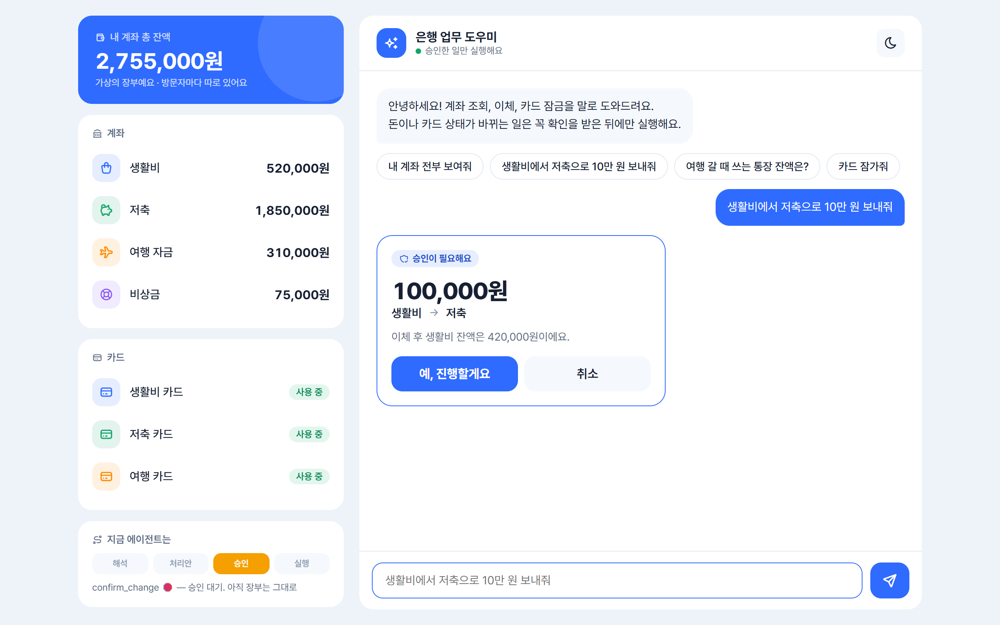
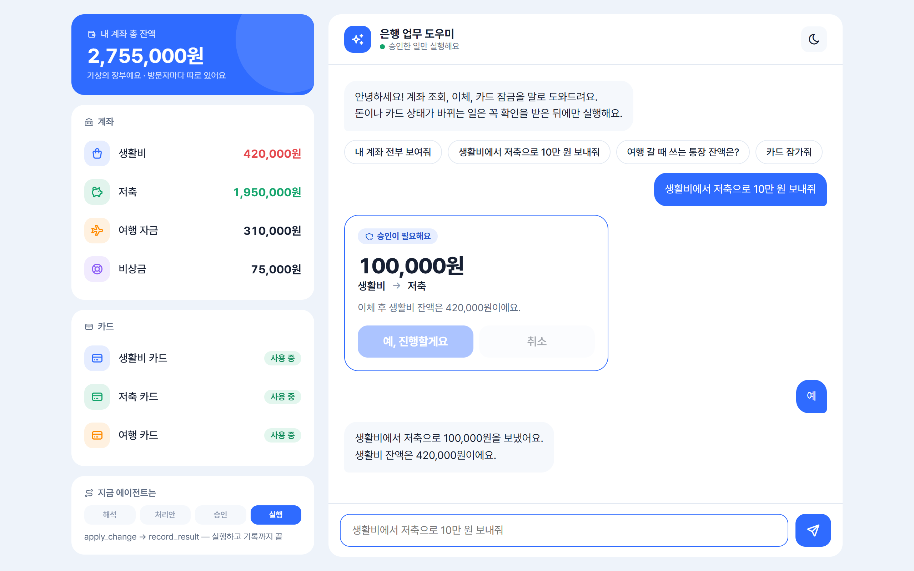
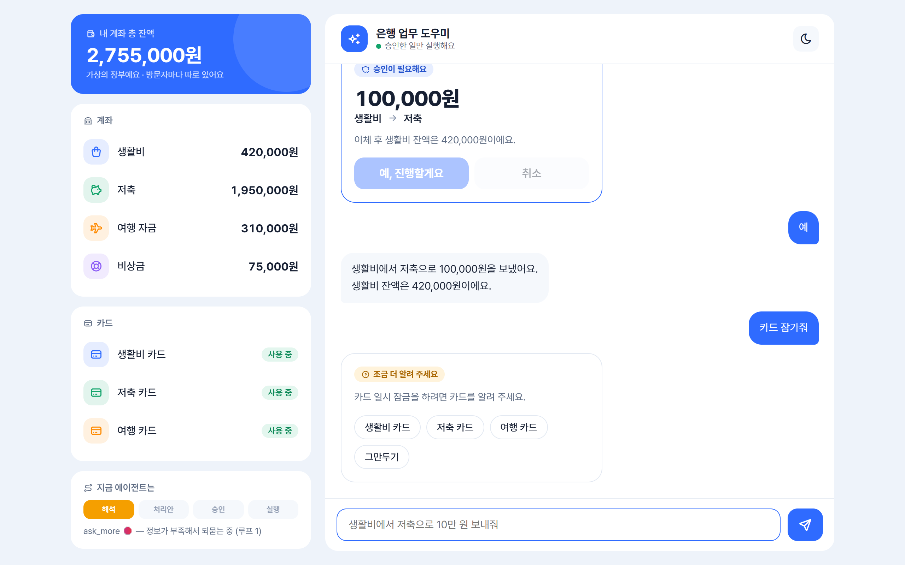
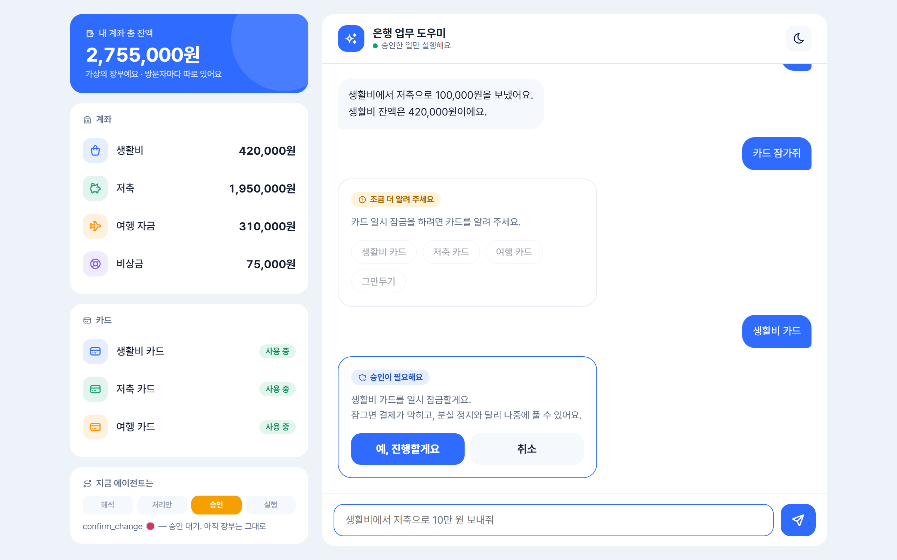
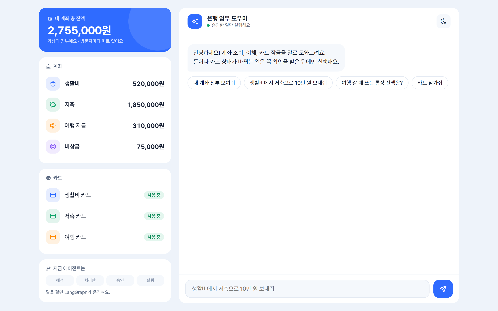
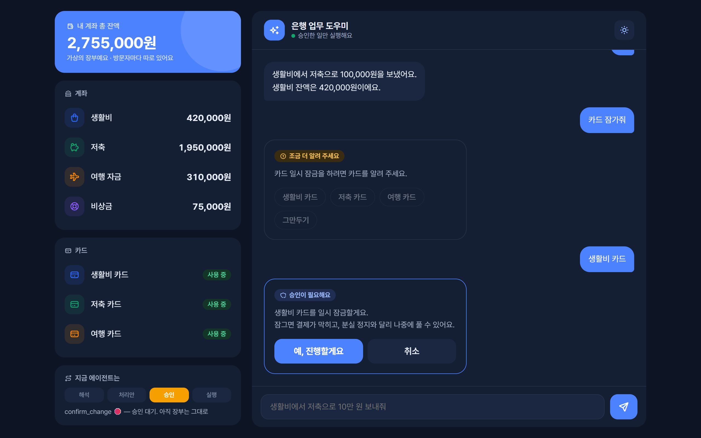
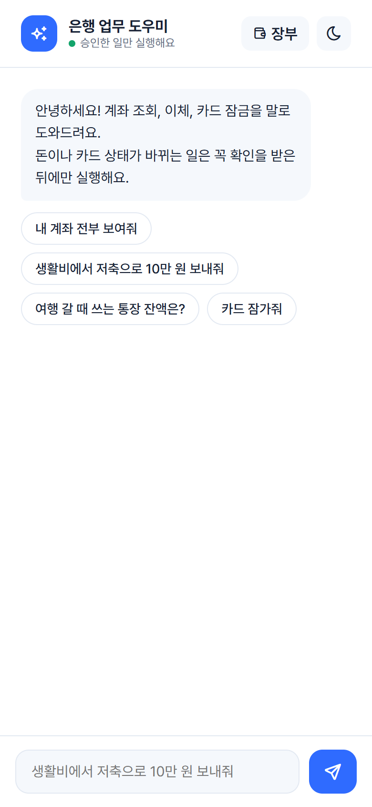

# langgraph-financial-agent

말로 하는 은행 업무 AI Agent. "생활비에서 저축으로 10만 원 보내줘" 같은 요청을 이해하고, **돈이나 카드 상태가 바뀌는 일은 사용자 승인(LangGraph `interrupt`)을 받은 뒤에만** 실행한다.

- LLM(Gemini)은 **사람의 말을 해석하는 입구 한 곳**에서만 쓴다. 잔액 계산·검사·저장·답변 문장은 모두 코드가 한다 → 숫자가 LLM을 거치지 않는다
- 저장은 **한 통로**(`data_store.save`)로만, 저장 전에 **무결성 규칙 10개**를 검사하고 한 번에 교체한다(atomic write)
- 업무를 추가할 때 그래프는 고치지 않는다 — `functions.py`의 표(`READ_TASKS`, `HANDLERS`)에 한 줄

KDT 과제 미니 프로젝트 · Python 3.13 · LangGraph 1.2 · LangChain 1.4 · Gemini `gemini-3.5-flash-lite`

**직접 써 보기: https://noviz-bank.duckdns.org** (가상의 장부예요. 방문자마다 따로 있고 "처음으로"를 누르면 되돌아가요. Gemini 무료 등급이라 호출 횟수가 제한돼 있어요)

---

## 실행 화면

**이체 요청 → 승인 카드.** 장부는 아직 그대로이고, 그래프는 `confirm_change`에서 멈춰 승인을 기다린다.



**승인 → 실행.** "예"를 누르면 `apply_change → record_result`까지 진행하고 왼쪽 잔액이 바뀐다 (생활비 520,000 → 420,000, 저축 1,850,000 → 1,950,000).



**정보가 부족하면 되묻기.** "카드 잠가줘"에는 어느 카드인지 몰라 `ask_more`에서 멈추고 후보를 버튼으로 보여 준다. 고르면 다시 승인 카드로 이어진다.

| 되묻기 (`ask_more`) | 고른 뒤 승인 (`confirm_change`) |
|---|---|
|  |  |

| 첫 화면 | 어두운 모드 | 폰 화면 |
|---|---|---|
|  |  |  |

---

## 실행 방법

### 1. 준비

[uv](https://docs.astral.sh/uv/)가 필요하다 (Python 3.13은 uv가 알아서 받는다).

```bash
git clone <저장소 주소>
cd langgraph-financial-agent
uv sync --locked
```

### 2. API 키

```bash
cp .env.example .env
```

`.env`를 열어 `GEMINI_API_KEY=` 뒤에 Gemini API 키를 넣는다. 확인:

```bash
uv run python src/config.py      # "GEMINI_API_KEY 설정됨: True" (키 값은 출력하지 않는다)
```

### 3. 실행

```bash
uv run python src/main.py
```

끝내려면 `종료`(또는 `exit`, `quit`, Ctrl+C). 장부는 처음 실행할 때 `data/initial_data.json`(원본)에서 `data/bank_data.json`(작업용 복사본)으로 복사되고, 이후 변경은 복사본에만 쌓인다. 처음 상태로 돌리려면 `data/bank_data.json`을 지우면 된다.

> Windows에서 한글이 깨지면 PowerShell에서 `$env:PYTHONIOENCODING = "utf-8"` 후 실행한다.
> `bank_data.json`을 편집기로 열어 둔 채 이체하면 파일이 잠겨 저장에 실패할 수 있다 (3번 재시도 후 안내).

### 4. 웹 화면 (선택)

```bash
uv run python -m uvicorn web:app --app-dir src --port 8000
```

브라우저에서 http://localhost:8000 을 연다. 왼쪽은 내 장부(계좌·카드·최근 처리 기록), 오른쪽은 채팅이다. 승인과 되묻기는 버튼으로 답할 수 있고, 지금 그래프가 멈춘 노드(`ask_more` / `confirm_change`)가 표시된다.

- 방문자마다 장부가 따로 있다 (`data/ledgers/`). "처음으로"를 누르면 원본 상태로 돌아간다
- 호출 제한: 방문자마다 1분에 3번·10분에 10번, 서버 전체 하루 50번, 한 번에 300자 (API 비용 보호)
- Windows에서 `uvicorn` 실행 파일이 앱 제어 정책에 막히면 위처럼 `python -m uvicorn`으로 실행한다

---

## 구현한 기능

| 기능 | 승인 | 예시 |
|---|---|---|
| **계좌 조회** — 목록과 잔액, 지정한 계좌만 | 필요 없음 | "내 계좌 전부 보여줘", "생활비랑 저축 잔액" |
| **즉시이체** — 내 계좌 사이 | 필요 | "생활비에서 저축으로 10만 원 보내줘" |
| **카드 일시 잠금** | 필요 | "생활비 카드 잠가줘" |

함께 동작하는 것

- **이전 상태 이어받기**: "생활비랑 저축 잔액" → "여행 자금도" → "비상금은?" → "전부 보여줘". 이체 중 "아니 5만 원"이면 금액만 바뀐다
- **뜻으로 찾기 + 해석 밝히기**: "여행 갈 때 쓰는 통장" → "'여행 자금' 계좌로 이해했어요."
- **되묻기**: 필요한 정보가 없으면 후보와 함께 묻는다. 순서로 골라도 된다("두 번째 거")
- **승인 전 수정**: 승인 화면에서 "아니, 5만 원만" → 다시 검사한 뒤 새 승인 화면
- **처리 기록**: 승인 화면까지 간 요청은 결과(완료·취소·만료·실패)를 `requests`에 남긴다

---

## 대화 예시

```
> 저축으로 10만 원 옮겨줘
즉시이체를 하려면 출금 계좌를 알려 주세요.
고를 수 있는 계좌: 생활비, 저축, 여행 자금, 비상금
(그만두려면 '취소')

> 생활비에서
생활비 → 저축, 100,000원을 즉시이체할게요.
이체 후 생활비 잔액은 420,000원이에요.
진행하려면 '예', 그만두려면 '취소'라고 말씀해 주세요.

> 아니 5만 원만
생활비 → 저축, 50,000원을 즉시이체할게요.
이체 후 생활비 잔액은 470,000원이에요.
진행하려면 '예', 그만두려면 '취소'라고 말씀해 주세요.

> 예
생활비에서 저축으로 50,000원을 보냈어요.
생활비 잔액은 470,000원이에요.
```

```
> 생활비 잔액 얼마야?
생활비 계좌 잔액은 520,000원입니다.

> 저축으로 3만 원 보내줘
출금 계좌는 방금 보신 '생활비'로 했어요.
생활비 → 저축, 30,000원을 즉시이체할게요.
...
```

---

## 실패 상황 확인 결과

`uv run python src/scenarios.py` 대화 시나리오(47개)의 실제 출력이다. 모든 경우에 **잔액·거래는 바뀌지 않았고**, 마지막에 장부 무결성 10/10을 통과했다.

| 상황 | 입력 | 실제 출력 |
|---|---|---|
| 잔액 부족 | "비상금에서 저축으로 100만 원 보내줘" | 비상금 계좌 잔액이 부족해요. (잔액 75,000원, 이체 금액 1,000,000원) — 승인 화면 없이 |
| 없는 계좌 | "주식 계좌 잔액 알려줘" | 말씀하신 계좌를 찾지 못했어요. 이 중에서 골라 주세요: 생활비, 저축, 여행 자금, 비상금 |
| 없는 카드 | "주식 카드 잠가줘" | 말씀하신 카드를 찾지 못했어요. 이 중에서 골라 주세요: 생활비 카드, 저축 카드, 여행 카드 |
| 이미 잠긴 카드 | "생활비 카드 잠가줘" (잠금 후) | 생활비 카드는 이미 잠겨 있어요. |
| 처리할 수 없는 요청·인사 | "오늘 날씨 어때?", "안녕" | 저는 은행 업무만 도와드릴 수 있어요. 할 수 있는 일: 계좌 조회, 즉시이체, 카드 일시 잠금 + 예시 문장 |
| 승인 화면에서 취소 | "취소" | 즉시이체를 취소했어요. 아무것도 바뀌지 않았어요. (`cancelled`로 기록) |
| 예/취소가 아닌 답 | "음 잠깐만" | '예' 또는 '취소'로 답해 주세요. 바꾸고 싶은 내용이 있으면 말씀해 주세요. + 승인 화면 |
| 방치 후 승인 | 5분 지나 "예" | 승인 시간(5분)이 지나 안전을 위해 실행하지 않았어요. 다시 요청해 주세요. (`expired`) |
| 승인 사이 잔액 감소 | 비상금 75,000 → 승인 대기 중 65,000으로 → "예" | 승인하시는 사이 상황이 바뀌어 실행하지 않았어요. 비상금 계좌 잔액이 부족해요. (잔액 65,000원, 이체 금액 70,000원) (`failed`) |
| 잔액 넘는 수정 | 승인 화면에서 "아니 1000만 원으로" | 생활비 계좌 잔액이 부족해요. (잔액 420,000원, 이체 금액 10,000,000원) 그래서 처음 내용 그대로 여쭤볼게요. + 이전 승인 화면 |
| 저장 실패 | 파일 교체가 3번 모두 실패 | 장부에 저장하지 못해 실행하지 않았어요. 잠시 후 다시 시도해 주세요. (`failed`) |
| AI 서버가 바쁨 | 503·429 또는 20초 안에 답이 없음 (1번 재시도 후) | 지금 AI 서버가 바빠요. 잠시 후 같은 말을 다시 보내 주세요. — 가짜 오류로 확인 |
| 되묻기 중 그만두기 | "여행 자금으로 보내줘" → "취소" | 알겠어요, 요청을 그만둘게요. |

---

## 구조

```
START → understand ─┬─ 정보 부족 → ask_more 🛑 ──(답)──→ understand           (루프 1)
                    ├─ 조회 → read_task ──────────────────────────→ respond → END
                    └─ 변경 → plan_change ─┬─ 거절 ──────────────→ respond
                                           └─ confirm_change 🛑
                                                ├─ 예 → apply_change → record_result → respond
                                                ├─ 취소·만료 ──────→ record_result → respond
                                                └─ 그 밖의 답(수정) → understand           (루프 2)
```

| 파일 | 역할 |
|---|---|
| `src/main.py` | 터미널 입력 루프. 멈춰 있으면 다음 입력을 `Command(resume=...)`로 |
| `src/graph.py` | State, 노드 8개, 조건부 Edge 4개. LLM은 `understand` 한 곳 |
| `src/web.py`, `web/index.html` | 웹 서버(FastAPI)와 채팅 화면. 그래프는 그대로, 입구만 다름 |
| `src/scenarios.py` | 대화 시나리오 확인 (그래프 + 업무 코드 + 저장을 함께) |
| `src/intents.py` | intent와 slot의 유일한 정의처 |
| `src/functions.py` | 업무 코드 — 조회 함수, 이체·카드 잠금 Handler(`validate`·`describe`·`apply`) |
| `src/data_store.py` | 장부 읽기·저장의 유일한 통로 (무결성 검사 + atomic write + 재시도) |
| `src/integrity.py` | 무결성 규칙 10개 |
| `data/initial_data.json` | 원본 장부 (프로그램이 고치지 않음) |

### 자체 확인

```bash
uv run python src/integrity.py    # 무결성 10/10 (API 없음)
uv run python src/data_store.py   # 저장 통로 10/10 (API 없음, 작업용 복사본을 다시 만듦)
uv run python src/functions.py    # 업무 코드 31/31 (API 없음)
uv run python src/graph.py        # 그래프 모양을 Mermaid로 출력 (API 없음)
uv run python src/scenarios.py    # 대화 시나리오 47개 (Gemini 41회 호출 + 가짜 LLM 시나리오)
```

---

## 문서

| 문서 | 내용 |
|---|---|
| [docs/기획서.md](docs/기획서.md) | 목표와 범위 |
| [docs/설계서.md](docs/설계서.md) | 현재 설계 — 흐름, State, 데이터, 규칙 |
| [docs/설계변경기록.md](docs/설계변경기록.md) | 초안에서 무엇이 왜 바뀌었나 |
| [docs/구현계획.md](docs/구현계획.md) | 단계별 작업과 완료 기준 |
| [docs/코드읽기가이드.md](docs/코드읽기가이드.md) | 파일별로 코드를 읽는 순서와 확인 질문 |
| [devlog/](devlog/) | 날짜별 개발일지 |

## 알려진 한계

- 한 사용자(`user_01`) 고정 — 로그인은 범위 밖
- 대화 상태는 메모리(`InMemorySaver`)에만 있어서 프로그램을 끄면 승인 대기 중인 요청은 사라진다 (장부와 처리 기록은 파일에 남음)
- Gemini 무료 등급을 쓴다. 사용자가 몰리면 503이나 지연이 생길 수 있어 한 번 다시 보내고, 그래도 안 되면 "AI 서버가 바빠요"라고 안내한다 (요청당 최대 약 40초)
- 사용한 모델은 `temperature` 설정을 무시한다. 같은 말에도 해석이 흔들릴 수 있어서, 흔들리면 안 되는 판단(개수 세기, 이어받기 규칙, 승인 답)은 코드가 한다
