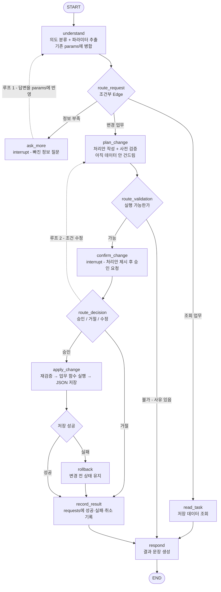

# 개발일지 2026-09-22 — LangGraph 워크플로우 설계 이해

| 항목 | 내용 |
|---|---|
| 프로젝트 | 가상 금융 업무 AI Agent (LangGraph 미니 프로젝트) |
| 세션 주제 | 워크플로우 초안 설계 + LangGraph 개념 정리 + 저장소·환경·데이터·문서 준비 |
| 단계 | **설계** — 코드 구현 전 |
| 결과물 | v1 워크플로우 그래프, State 초안, GitHub 저장소, uv 환경, 초기 데이터, 기획서·구현계획, 결정 사항 17건 |
| 다음 일지 | [2026-09-25 문서 검토, intent 설계, 데이터 무결성](2026-09-25_문서검토-intent설계-데이터무결성.md) |

> 이 문서의 형식을 다른 프로젝트에 재사용하는 방법은 맨 아래 [부록 A](#부록-a--이-형식을-다른-프로젝트에-쓰는-법)에 정리.

> ⚠️ **이후 바뀐 내용** (이 일지는 그날의 기록이라 고치지 않고 남겨둠)
> - intent 이름: `list_accounts` → `account_list_with_balance`, `transfer` → `transfer_instant`, `lock_card` → `card_lock_temporary`
> - Handler 클래스 이름: `TransferHandler` → `TransferInstantHandler`, `LockCardHandler` → `CardLockTemporaryHandler`
> - Handler 안의 `required = [...]` 줄은 빠지고 `src/intents.py`로 옮겨감
> - 초기 데이터는 무결성 규칙에 맞게 재구성됨 (거래 20건 → 30건)
> - 이유는 [09-25 일지](2026-09-25_문서검토-intent설계-데이터무결성.md) 참고
> - **2026-09-26 문서 재구성**: 이 일지에서 말하는 "기획서"의 설계 내용은 [docs/설계서.md](../docs/설계서.md)로 옮겨졌다. 초안(FigJam)과의 차이는 [docs/설계변경기록.md](../docs/설계변경기록.md) A장

---

## 목차

1. [TL;DR](#tldr)
2. [오늘의 목표](#오늘의-목표)
3. [진행 내용](#진행-내용)
4. [결정 사항 (Decision Log)](#결정-사항-decision-log)
5. [헷갈렸던 것 / 배운 것](#헷갈렸던-것--배운-것)
6. [용어 정리](#용어-정리)
7. [다음 할 일](#다음-할-일)
8. [참고 자료](#참고-자료)
9. [부록 A — 이 형식을 다른 프로젝트에 쓰는 법](#부록-a--이-형식을-다른-프로젝트에-쓰는-법)

---

## TL;DR

1. FigJam으로 그렸던 초안을 검토하고, 뼈대만 담은 **v1 워크플로우(노드 9개)** 를 다시 설계했다.
2. **네모=노드 / 마름모=조건부 Edge**, `interrupt`의 중단 범위, `graph.invoke()` 횟수와 LLM 호출 횟수가 별개라는 점을 확인했다.
3. 승인 응답 분류는 **규칙 기반 + LLM 혼합**(Hybrid Routing + Fallback)으로 하기로 결정했다.
4. GitHub private 저장소와 `uv` 환경을 만들고, 초기 데이터를 직접 설계했다. `uv`는 강의와 다른 방식으로 설치했는데 그 차이와 단점을 기록했다.
5. **Checkpointer는 대화 맥락만 저장하고, 잔액·거래는 JSON에 따로 저장된다**는 점을 정리했다. 1차 범위(계좌 조회·즉시이체·카드 일시 잠금)로 기획서와 구현계획을 썼다.

---

## 오늘의 목표

- [x] 과제 명세 확인 (제출물 5종, 필수 구현 범위)
- [x] 기존 FigJam 초안 검토 — 무엇이 부족한지
- [x] 뼈대만 담은 v1 워크플로우를 Mermaid로 재설계
- [x] 노드 개수가 기능 개수와 다른 이유 이해
- [x] `interrupt` / `graph.invoke()` 동작 원리 정확히 이해
- [ ] Handler 인터페이스 구체화 → 다음 세션
- [x] git 저장소 + `uv` 환경 세팅
- [x] 초기 데이터 설계
- [x] 설계 결정 4가지 (사용자, 기준일, 실행 형태, Checkpointer)
- [x] 기획서 + 구현계획 작성

---

## 진행 내용

### 1. 과제 명세 확인

강의 페이지에서 요구사항을 추렸다.

**제출물 5종**

| 제출물 | 핵심 |
|---|---|
| 실행 코드 | — |
| README | 실행 방법, 구현 기능, 요청 예시, **실패 상황 동작 확인 결과** |
| 설계 초안 | ⚠️ **AI 없이 직접 작성**. 손그림 허용 |
| 최종 설계 자료 | 초안에서 **바꾼 내용과 이유** |
| 회고 | 배운 점, 어려웠던 점, 남은 한계 |

**최소 구현 조건**

- 조회 기능 + 승인 후 데이터를 변경하는 기능
- 두 기능이 **하나의 업무 흐름**으로 연결될 것
- 승인은 **LangGraph의 중단·재개(`interrupt`)** 로 처리 (명세에 명시됨)

> ⚠️ 설계 초안은 AI 없이 직접 작성해야 한다는 규칙이 있다.
> 그래서 아래 v1 그래프는 **비교·검토용**으로만 쓰고,
> 제출용 "초안"은 내가 FigJam에 직접 그린 것을 낸다.
> 대신 둘의 차이를 **최종 설계 자료의 "변경 이유"** 로 정리하면 제출물 두 개가 자연스럽게 채워진다.

---

### 2. 기존 FigJam 초안 검토

내가 FigJam에 그려둔 초안(Gemini 도움을 받아 제작)을 놓고 잘된 점과 빠진 점을 나눴다.

**잘 잡힌 부분**

- `Intent & Parameter Parser`를 맨 앞에 둬서 자연어 → 구조화 데이터 변환을 한 곳에 모음
- 승인 노드에 `Interrupt` 명시 — 과제의 핵심을 짚음
- 조건 수정 → 재검증으로 되돌아가는 루프가 닫혀 있음

**빠진 부분 (v1에서 보완)**

| 문제 | 왜 문제인가 |
|---|---|
| `END`가 3개 (성공/실패/취소) | `END`는 노드가 아니라 **sentinel**. 하나여야 함 |
| 노드 이름이 "Transfer"에 묶임 | 카드·청구서를 얹으면 그래프를 또 그려야 함 |
| 저장 실패 경로 없음 | 명세: "검증이나 저장에 실패하면 이체 전 상태를 유지한다" |
| 처리 기록을 남기는 노드 없음 | 명세: "아까 이체가 됐어?" 후속 조회의 근거가 사라짐 |
| 실행 직전 재검증 없음 | 승인 대기 중 잔액이 바뀔 수 있음 → TOCTOU |
| `Receive User Answer`가 일반 노드 | LangGraph에서 "답변 받기"는 노드가 아니라 **중단** 그 자체 |

---

### 3. v1 워크플로우 재설계



**구성**: 노드 9개 · 조건부 Edge 4개 · 루프 2개 · 중단 지점 2개 · `END` 1개

#### 노드 9개

| 노드 | 한 줄 설명 | State에 남기는 것 |
|---|---|---|
| `understand` | 사용자 말을 의도와 파라미터로 바꾸고, 부족한 정보를 표시 | `intent`, `params`, `missing` |
| `ask_more` | 부족한 정보를 질문하고 **멈춤**(`interrupt`) | `messages` |
| `read_task` | 데이터를 읽어 조회 결과를 만듦 (아무것도 안 바꿈) | `result` |
| `plan_change` | 처리안을 짜고 실행 가능한지 검증 (아직 안 바꿈) | `plan`, `request_id` |
| `confirm_change` | 처리안을 보여주고 **멈춤**(`interrupt`), 응답을 3갈래로 분류 | `decision`, 수정 시 `params` |
| `apply_change` | 한 번 더 검증한 뒤 실제로 바꾸고 JSON에 저장 | `result` |
| `rollback` | 저장 실패 시 변경 전 상태 유지를 보장하고 사유를 남김 | `result` |
| `record_result` | 성공·실패·취소를 `requests` 배열에 기록 | `plan` 비움 |
| `respond` | 결과를 사람이 읽을 문장으로 만듦 | `messages`, 작업 필드 비움 |

#### 조건부 Edge 4개 (마름모)

| 이름 | 무엇을 보고 판단 | 갈래 |
|---|---|---|
| `route_request` | `missing`이 비었는지 + `intent`가 조회 계열인지 | `ask_more` / `read_task` / `plan_change` |
| `route_validation` | `plan`이 만들어졌는지 vs 실패 사유가 담겼는지 | `confirm_change` / `respond` |
| `route_decision` | `decision` 값 | `apply_change` / `record_result` / `plan_change` |
| `route_save` | `result.ok`가 참인지 | `record_result` / `rollback` |

#### 루프 2개

| 루프 | 경로 | 언제 도나 | 탈출 조건 |
|---|---|---|---|
| 루프 1 | `ask_more` → `understand` | 필요한 정보가 아직 부족할 때 | `missing`이 빌 때까지 |
| 루프 2 | `route_decision` → `plan_change` | 승인 전에 조건을 고칠 때 | `revision_count` 상한 (5회) |

#### State 초안

```python
from typing import TypedDict, Annotated, Literal
from operator import add

# 그래프 실행 중 노드들이 주고받는 데이터 보따리
class AgentState(TypedDict):
    messages: Annotated[list, add]   # Reducer: 덮어쓰지 않고 누적
    intent: str | None               # "transfer", "lock_card", "pay_bill" 등
    params: dict                     # 계좌ID, 금액 등. understand에서 병합
    missing: list[str]               # 비어있지 않으면 ask_more로 분기
    plan: dict | None                # 승인 대기 중인 처리안
    decision: Literal["approved", "rejected", "modify"] | None
    result: dict | None              # 성공·실패와 사유
    request_id: str | None           # 멱등성 키 겸 후속 조회 연결고리
    revision_count: int              # 루프 2 탈출 조건
```

**필드별 생성·소멸 시점**

| 필드 | 채워지는 곳 | 비워지는 곳 |
|---|---|---|
| `intent`, `params` | `understand` | 업무 완료 후 `respond` |
| `missing` | `understand` | `understand` (재진입 시 재계산) |
| `plan` | `plan_change` | `record_result` |
| `decision` | `confirm_change` 재개 시 | **재시작 직후** ← 아래 참고 |
| `result` | `apply_change` / `rollback` | `respond` |
| `request_id` | `plan_change` | `record_result` |

> `decision`을 **재시작 시 반드시 비워야** 하는 이유:
> 명세에 "이전 승인만으로 변경을 자동 실행하지 않는다"는 조건이 있다.
> Checkpointer가 State를 복원해줄 때 `decision="approved"`가 남아 있으면
> 사람 확인 없이 이체가 실행돼버린다. 필드 하나로 이 요구사항을 막는 셈.

---

### 4. 노드 vs 조건부 Edge 구분

헷갈렸던 부분이라 표로 정리.

| 그림 | LangGraph 실체 | 등록 방법 | State를 바꾸나 |
|---|---|---|---|
| 네모 | Node | `add_node("이름", 함수)` | ✅ 바꿈 |
| 마름모 | 라우팅 함수 | `add_conditional_edges`의 **인자** | ❌ 판단만 함 |
| 화살표 (마름모 없음) | 고정 Edge | `add_edge("A", "B")` | — |
| 둥근 것 | sentinel | `START`, `END` 상수 그대로 | — |

```python
# graph.py — 네모와 마름모가 코드에서 어떻게 갈리는지
builder = StateGraph(AgentState)

# 네모: 노드로 등록
builder.add_node("understand", understand)
builder.add_node("plan_change", plan_change)
# ... 나머지 7개 노드도 같은 방식으로 add_node

# 둥근 것: START/END는 add_node 하지 않음
builder.add_edge(START, "understand")
builder.add_edge("respond", END)

# 마름모: add_node가 아니라 add_conditional_edges의 두 번째 인자로 들어감
builder.add_conditional_edges(
    "understand",          # ① 이 노드가 끝난 다음에
    route_request,         # ② 이 함수로 판단해서       ← 마름모가 이것
    {                      # ③ 이 표대로 보낸다
        "ask_more":    "ask_more",
        "read_task":   "read_task",
        "plan_change": "plan_change",
    },
)
```

**구분 기준 한 줄**: State를 바꾸면 노드, 방향만 정하면 마름모.

> 라우팅 함수는 State를 반환하지 않고 **다음 노드 이름 문자열**만 돌려준다.
> 그래서 "왜 이쪽으로 갔는지"를 기록하고 싶으면 라우팅 함수가 아니라
> **그 직전 노드**에서 State에 남겨야 한다. (예: `understand`가 `missing`을 채워둠)

> 12번에서 쓴 `tools_condition`이 바로 이 "마름모"였다.
> 새 개념이 아니라, 이미 쓰던 걸 직접 만드는 것.

---

### 5. 기능 20개인데 노드가 9개인 이유

md 파일에 적은 기능은 20개가 넘는데 노드는 9개다. 두 가지 축의 정리가 동시에 일어난 결과.

#### ① 세로 — 승인이 있으면 최소 3단계가 강제된다

`interrupt()`는 함수 중간에서 일시정지하는 게 아니라, **그래프 전체가 종료되고 State가 저장된 뒤 빠져나가는** 방식이다. 재개하면 **그 노드를 처음부터 다시 실행**한다.

그래서 검증 / 승인 요청 / 실행을 한 노드에 합치면 "승인 전에는 절대 실행되지 않는다"를 코드로 보장하기 어렵다. 물리적으로 나눠야 한다.

```
plan_change  →  confirm_change 🛑  →  apply_change
  검증만          승인 요청만           승인된 경우만 실행
```

각 노드의 **실행 횟수가 다르다**는 점이 "왜 한 노드일 수 없는가"의 답이다.

| 노드 | 언제 몇 번 실행되나 |
|---|---|
| `plan_change` | 매 턴마다 (정보 보충, 수정 등으로 여러 번) |
| `confirm_change` | 중단할 때 1번 + 재개할 때 1번 = 2번 (부작용 없어야 함) |
| `apply_change` | 승인된 경우 **딱 1번** |

#### ② 가로 — 기능마다 다른 부분만 Handler로 뺀다

업무마다 다른 건 딱 세 가지뿐이다: **검증 규칙 / 승인 문구 / 바꿀 필드**.
이 셋을 `functions.py`의 Handler로 뽑으면, 그래프 노드는 기능이 몇 개든 그대로다.

```python
# functions.py — 업무마다 다른 "세 가지"만 정의한다
class TransferHandler:
    intent = "transfer"
    required = ["from_account", "to_account", "amount"]   # 어떤 정보가 필요한가

    def validate(self, params, data):
        ...   # 출금 계좌 잔액이 충분한지 검사. (처리안, 에러메시지) 튜플을 돌려줌

    def describe(self, plan):
        ...   # "생활비 → 저축 100,000원" 같은 승인 화면 문구를 만듦

    def apply(self, plan, data):
        ...   # accounts의 balance 수정 + transactions에 2건 추가 + 저장


class LockCardHandler:
    intent = "lock_card"
    required = ["card_id"]

    def validate(self, params, data):
        ...   # 카드 status가 active인지 검사 (잔액은 안 봄)

    def describe(self, plan):
        ...   # "생활비 카드를 일시 잠금합니다" 문구

    def apply(self, plan, data):
        ...   # cards의 status만 수정 + 저장


# 레지스트리 — intent 문자열로 담당 Handler를 찾는 표
HANDLERS = {h.intent: h() for h in [TransferHandler, LockCardHandler]}   # 기능 추가 시 여기에 한 줄
```

```python
# graph.py — 노드는 Handler를 표에서 찾아 부르기만 한다 (기능이 늘어도 이 코드는 안 바뀜)
def plan_change(state):
    handler = HANDLERS[state["intent"]]                      # 담당자를 표에서 찾음
    data = data_store.load()                                  # 현재 JSON 읽기
    plan, error = handler.validate(state["params"], data)     # 업무별 검증 위임
    if error:
        return {"result": {"ok": False, "reason": error}}     # 실행 불가 → respond로
    return {"plan": plan, "request_id": new_id()}             # 처리안 확정
```

**판단 기준**: 차이가 *데이터·검증 규칙*이면 → Handler로.
차이가 *절차 자체*(예: 승인을 두 번 받아야 함)면 → 그래프 구조를 건드려야 한다.

---

### 6. Subgraph / Handoff를 지금 안 쓰는 이유

| 검토한 기법 | 왜 지금 안 쓰나 |
|---|---|
| **Subgraph** (24번) | 업무 축으로 나누면 `plan→confirm→apply` 승인 로직이 업무 수만큼 복제됨. 반복되는 건 "절차"인데 "업무"로 나누는 꼴 |
| **Subgraph** — 추가 이유 | `interrupt`가 Subgraph 안에 들어가면 부모/자식 checkpoint 경계 때문에 재개 처리가 복잡해짐 |
| **Supervisor / Handoff** (25·26번) | 업무들이 "전문성"이 다른 게 아니라 "데이터"만 다름. Multi-Agent로 나눌 이유가 없음 |
| **`Command`** (26번) | 쓸 수는 있지만 분기가 노드 안으로 숨어서 설계도와 코드가 1:1로 안 맞게 됨. 제출물에 설계도가 있으므로 조건부 Edge 유지 |

**나중에 Subgraph가 정당해지는 시점** — 절차 자체가 갈라질 때.

| 기능 | 왜 후보인가 |
|---|---|
| 일괄 납부 | 청구서 건별로 검증→납부→저장을 반복 = **그래프 안의 루프** |
| 정지 후 재발급 | 승인을 **두 번 연쇄**로 받음. 단일 `plan→confirm→apply`로 표현 불가 |

그때 도입하면 최종 설계 자료의 "변경 이유"가 저절로 채워진다.

---

### 7. `interrupt` / `graph.invoke()` 동작 정확히 이해

**헷갈렸던 지점**: "`graph.invoke()`가 2번 불리면 LLM도 2번 불리는 거 아닌가?"

**결론**: 아니다. 둘은 별개의 숫자다.

이름이 같은 `.invoke()`라도 **어느 객체의 메서드인지**가 다르다. LangChain 세계에서는 거의 모든 것이 Runnable이라 다들 `.invoke()`를 갖고 있다 (01번 Runnable 개념).

- `model.invoke()` → 실제로 Gemini 서버에 요청을 보냄 (돈·시간 발생)
- `graph.invoke()` → 내 컴퓨터에서 노드 함수들을 순서대로 실행 (그 안에서 `model.invoke()`를 부를 수도, 안 부를 수도 있음)

**실제 흐름**

```
[1차 graph.invoke()]  "생활비에서 저축으로 10만원 옮겨줘"
START → understand(LLM 1회) → plan_change → confirm_change
                                                  ↓
                                        interrupt() → 그래프 종료, State 저장
                                        (아직 END에 도달 못함)

     ... 사용자가 화면 보고 고민 ...

[2차 graph.invoke(Command(resume="응, 진행해"))]
confirm_change 재진입 → interrupt()가 저장된 응답을 즉시 반환
  → apply_change → record_result → respond → END
```

| | 1차 invoke | 2차 invoke | 총합 |
|---|---|---|---|
| `graph.invoke()` | 1 | 1 | **2회** |
| `understand` 실행 | 1 | 0 (건너뜀) | 1회 |
| `model.invoke()` (Gemini) | 1 | 0 | **1회** |

**재개 시 재실행되는 범위는 "그래프 전체"가 아니라 "멈춘 노드 하나"** 다. 이미 완료된 노드는 Checkpointer가 건너뛴다. 그래서 `understand`의 LLM 호출이 중복되지 않는다.

> 여기서 나오는 실무 규칙: **`interrupt()` 호출 이전 줄에는 부작용 있는 코드를 두지 말 것.**
> 재개할 때마다 그 줄들이 다시 실행되기 때문이다.
> `confirm_change`에서 `handler.describe()`는 문자열 조립이라 안전하지만,
> 거기서 파일을 쓰거나 API를 불렀다면 중복 실행된다.

---

### 8. 승인 응답 분류 — Hybrid 방식으로 결정

**문제 상황**

| 방식 | 문제 |
|---|---|
| 전부 규칙(키워드 매칭) | "아니, 5만 원만"이 **"아니"에 걸려 거절로 오분류**됨. 게다가 금액 5만을 추출할 방법이 없음 |
| 전부 LLM | "응", "취소해줘" 같은 뻔한 응답까지 매번 API를 태워 비용·지연 낭비 |

**핵심 통찰**: `classify`가 사실 **두 가지 일**을 하고 있었다.

| 갈래 | 필요한 일 |
|---|---|
| 승인 / 거절 | **분류만** — 키워드 매칭으로 충분 |
| 수정 | **분류 + 추출** — "5만 원"이라는 새 값을 뽑아야 함 |

**결정**: 15번 Hybrid Routing + Fallback 패턴 적용.

```python
# confirm_change 안에서 사용자 응답을 3갈래로 나누는 함수
def classify_decision(answer: str, state) -> dict:
    # ① 규칙으로 빠르게 판단 시도 — 대부분의 응답이 여기서 끝남 (LLM 호출 0회)
    quick = quick_classify(answer)          # "승인"/"거절"/None 중 하나를 돌려줌
    if quick is not None:
        return {"decision": quick}

    # ② 규칙으로 판단이 안 서면(수정 요청 등) 여기서만 LLM 사용
    #    understand에서 쓴 구조화 추출(Structured Output)을 그대로 재사용
    parsed = model.invoke(수정_추출_프롬프트(answer, state["plan"]))
    return {
        "decision": "modify",
        "params": {**state["params"], **parsed.변경값},   # 기존 params에 바뀐 값만 덮어씀
    }
```

**비용 효과**

| 시나리오 | LLM 호출 |
|---|---|
| "응" / "취소해줘" (대부분) | **0회** |
| "아니, 5만 원만" | 1회 |

> ⚠️ **구현 시 주의**: `REJECT_WORDS`에 "아니"를 단독으로 넣으면
> "아니, 5만 원만"도 걸려버린다. "아니요" / "취소" / "거절"처럼 **더 구체적인 표현**으로 좁힐 것.
> 이 케이스는 테스트로 반드시 확인해야 한다.

> **남은 과제**: 규칙에 안 걸리는 문장이 "수정 요청"인지 "그냥 딴소리"인지 구분이 필요하다.
> `parsed.변경값`이 비어 있으면 "승인/거절/수정 중 골라달라"고 되묻는 처리가 있어야 한다.
> 이것도 명세의 "불완전하거나 실행할 수 없는 요청 안내"에 해당한다.

---

### 9. GitHub 저장소와 `.gitignore`

**저장소 이름: `langgraph-financial-agent` (private)**

| 후보 | 평가 |
|---|---|
| `langgraph-financial-agent` ✅ | 기술 + 도메인이 다 보임. GitHub에서 `langgraph`로 검색될 때 노출 |
| `financial-agent-mini-project` | 강의 파일명과 같지만 "mini-project"가 **스스로를 깎는 이름** |
| `bank-agent` | 짧지만 어떤 기술을 썼는지 안 보임 |

> 저장소 이름은 포트폴리오에서 채용담당자가 제일 먼저 보는 한 줄이다.
> "mini-project", "practice", "study" 같은 단어는 빼고, **무슨 기술로 무엇을 만들었는지**를 넣는다.

**`.gitignore`에서 신경 쓴 것**

```gitignore
# 비밀 정보 — 커밋 전에 먼저 막아둔다 (키가 한 번 올라가면 삭제해도 히스토리에 남음)
.env
.env.*
!.env.example          # ! = 예외. 키 이름만 있고 값은 빈 견본 파일은 올린다

# 실행 중 계속 바뀌는 작업용 복사본 — 원본(initial_data.json)만 추적
data/bank_data.json

# 각 컴퓨터에서 다시 만드는 가상환경
.venv/
```

> **"생성되는 것은 커밋하지 않는다"** 가 일반 원칙. 작업용 데이터를 추적하면
> 테스트 한 번 돌릴 때마다 diff가 생겨서 진짜 코드 변경이 묻힌다.

**커밋 습관**

- **atomic commit** — 하나의 커밋에는 하나의 논리적 변경만. "`.gitignore` 설정"과 "문서 추가"를 따로 커밋했다
- **Conventional Commits** — 메시지 앞에 종류를 붙인다: `feat`(기능) `fix`(버그) `docs`(문서) `chore`(설정·잡무) `refactor`(구조 개선)
- 기준은 **"되돌리고 싶은 단위로 커밋"**. 두 작업이 한 커밋에 섞이면, 하나만 되돌리고 싶을 때 다른 것까지 날아간다

**`git status -sb` 첫 줄 읽는 법**

| 표시 | 뜻 |
|---|---|
| `## main...origin/main` | 로컬과 원격이 완전히 같음 |
| `## main...origin/main [ahead 2]` | 내가 커밋 2개 앞섬 → push 필요 |
| `## main...origin/main [behind 1]` | 원격이 앞섬 → pull 필요 |
| `## main...origin/main [ahead 1, behind 2]` | 양쪽 다 바뀜 → 충돌 가능성 |

마지막 경우는 GitHub 웹에서 파일을 직접 고친 뒤 로컬에서 모르고 커밋하면 생긴다. 그래서 커밋 전에 `git fetch`로 먼저 확인한다.

---

### 10. `uv` 환경 세팅 — 강의 방식과 비교

강의(lesson 1224)에서 배운 방식과 **다르게 한 부분**이 있다.

| 단계 | 강의 방식 | 실제로 한 것 | 같나 |
|---|---|---|---|
| uv 설치 | `powershell -ExecutionPolicy ByPass -c "irm https://astral.sh/uv/install.ps1 \| iex"` | `python -m pip install uv` | **다름** |
| 프로젝트 생성 | `uv init --python 3.13` | `uv init --bare --name langgraph-financial-agent` | **다름** |
| Python 버전 고정 | (위에 포함) | `uv python pin 3.13` (나중에 보완) | 결과 같음 |
| 패키지 설치 | `uv add requests` | `uv add google-genai langchain langchain-google-genai langsmith langgraph python-dotenv` | 같음 |
| 실행 | `uv run main.py` | `uv run python src/main.py` | 같음 |

**설치 방법이 다른 이유**

강의 방식의 `irm ... | iex`를 풀어 읽으면:

| 조각 | 뜻 |
|---|---|
| `irm` | Invoke-RestMethod. 인터넷 주소에서 내용을 받아온다 |
| `\|` | 받아온 걸 다음 명령에 넘긴다 |
| `iex` | Invoke-Expression. 넘어온 텍스트를 코드로 실행한다 |
| `-ExecutionPolicy ByPass` | PowerShell의 스크립트 실행 제한을 잠시 푼다 |

→ **인터넷에서 받은 스크립트를 검토 없이 그대로 실행**하는 형태("curl pipe shell"). 공식 사이트라 실제로는 안전하고 **uv 공식 문서가 권장하는 방법이 맞지만**, 사이트가 털리거나 중간에서 가로채이면 위험하다는 논쟁이 있다. 신중한 방법은 먼저 파일로 받아서 읽어본 뒤 실행하는 것.

```powershell
irm https://astral.sh/uv/install.ps1 -OutFile install.ps1   # 일단 파일로 저장만
# 파일을 열어 내용 확인 후
.\install.ps1
```

**pip 설치의 단점**: uv가 **현재 pyenv Python 안에** 설치된다. 나중에 pyenv로 Python 버전을 바꾸면 `uv` 명령이 안 잡힐 수 있다. 그때는 공식 설치 방식으로 다시 설치하면 Python과 독립적으로 설치된다. pip으로 설치한 직후에는 `pyenv rehash`를 해야 `uv` 명령이 잡혔다.

**`--bare`를 쓴 이유와 부작용**: 그냥 `uv init`은 루트에 `main.py`, `README.md`도 만드는데, 이미 `src/main.py`가 있어서 헷갈리지 않게 `pyproject.toml`만 만드는 `--bare`를 썼다. 그 대신 `.python-version`이 안 생겼고, `uv python pin 3.13`으로 보완했다. **새 프로젝트를 빈 폴더에서 시작할 땐 강의 방식이 더 편하다.**

**uv가 관리하는 파일 4개**

| 파일 | 역할 | git |
|---|---|---|
| `.python-version` | 쓸 Python 버전 | 올림 |
| `pyproject.toml` | 필요한 패키지 목록 (`>=` 느슨한 범위 = "의도") | 올림 |
| `uv.lock` | **정확한** 버전까지 고정한 결과 = "실제" | 올림 |
| `.venv/` | 이 컴퓨터의 실제 실행 환경 | 제외 |

앞의 셋은 **설계도**, `.venv`는 **그 설계도로 지은 건물**. 건물은 각자 자기 땅에 짓고 설계도만 공유한다.
다른 컴퓨터에서 클론했을 때는 이 한 줄로 환경이 복원된다 (README에 적을 것).

```bash
uv sync --locked
```

**설치된 핵심 패키지**

| 패키지 | 버전 | 역할 |
|---|---|---|
| `langgraph` | 1.2.12 | 그래프·State·`interrupt`·Checkpointer |
| `langchain` | 1.4.2 | Runnable, 프롬프트, 파서 |
| `langchain-google-genai` | 4.4.0 | Gemini를 LangChain에서 쓰는 연결 고리 |
| `google-genai` | 2.24.0 | Google 공식 SDK |
| `langsmith` | 0.14.0 | 실행 추적·디버깅 |
| `python-dotenv` | 1.2.3 | `.env`에서 API 키 읽기 |

`uv run`을 쓰면 가상환경을 직접 활성화(`activate`)하지 않아도 된다. 실행 직전에 환경이 최신인지 확인해주므로, 깜빡하고 시스템 Python으로 실행하는 사고를 막는다.

---

### 11. 초기 데이터 설계

강의에서 제공된 데이터 파일은 **없었다.** 명세의 파일 구조는 "이렇게 구성하면 된다"는 예시였다. 그래서 명세의 개수(계좌 5·카드 4·거래 20·배송지 2·청구서 5)에 맞춰 직접 만들었다.

> ⚠️ 이 데이터는 **09-25에 무결성 규칙에 맞게 재구성**되었다 (거래 20건 → 30건, 잔액과 거래 합계 일치).
> 아래는 그날 설계한 의도의 기록.

직접 설계한다는 건, **테스트하고 싶은 상황을 데이터에 미리 심을 수 있다**는 뜻이다. 이런 데이터를 **fixture**라고 부르고, 좋은 fixture는 정상 케이스뿐 아니라 **실패 케이스를 재현할 데이터**를 반드시 포함한다.

| 심어둔 것 | 무엇을 테스트하려고 |
|---|---|
| user_01과 user_02가 **똑같이 "생활비"** 계좌 보유 | 명세의 "별명만으로 계좌를 구분할 수 없다" 상황 |
| 비상금 75,000원 | 잔액 부족 |
| 생활비 520,000원 | "40만원 남기고" → 이체액 120,000원 |
| 저축 1,850,000원 | 이체 한도(100만원) 초과 |
| 보험료 납기일 2026-09-20 | 기한 지난 청구서 납부 |

**명세의 모순처럼 보였던 부분**: "재발급 신청의 제작 중·배송 중 상태는 테스트 데이터로 준비"하라는데, 초기 데이터의 `reissue_applications`는 빈 배열이어야 한다.
→ 초기 데이터는 비워두고, **테스트용 데이터를 따로 준비**하라는 뜻으로 해석. 재발급 기능(3차)을 만들 때 별도 파일로 만든다.

**함께 만든 것**

- `src/` 4개 파일에 역할 주석만 담은 뼈대(skeleton) — "이 파일에 뭘 넣어야 하지?"를 매번 문서에서 찾지 않기 위해
- `.env.example` — 저장소를 클론한 사람이 어떤 키가 필요한지 알 수 있도록 키 이름만 적은 견본

---

### 12. 설계 결정 4가지

기획서를 쓰기 전에 네 가지를 정했다.

| 항목 | 결정 | 이유 |
|---|---|---|
| 사용자 | `user_01` 고정 | 로그인(인증)은 과제 주제가 아님 |
| 기준일 | **실행 시점의 실제 날짜** | 이번 달에 거래가 없으면 빈 목록이 나오는 게 정직한 동작 |
| 실행 형태 | CLI 대화 루프 | 명세의 `main.py` 구조와 맞고, 중단·재개 흐름을 그대로 보여주기 좋음 |
| Checkpointer | 1차는 `InMemorySaver` | 1차에 재시작 복구가 없고, 교체는 한 줄 |

**인증과 인가**

| | 뜻 | 이 프로젝트 |
|---|---|---|
| 인증 (authentication) | 너 누구야 | **생략** — `CURRENT_USER_ID = "user_01"` 상수 |
| 인가 (authorization) | 너 이거 봐도 돼? | **구현** — 내 계좌만 조회·변경 |

```python
CURRENT_USER_ID = "user_01"   # 로그인은 이미 되었다고 가정

# 인가 — 조회할 때 내 것만 걸러낸다
my_accounts = [a for a in data["accounts"] if a["owner_id"] == CURRENT_USER_ID]
```

이 필터 덕분에 "생활비"라고 말해도 user_02의 계좌는 후보에서 빠진다. 회고에는 "인증은 범위 밖으로 두고 상수로 대체, 실제 서비스라면 세션에서 가져와야 한다"고 적는다.

**기준일 — 현재 시각은 한 함수에서만 얻는다**

```python
def today() -> date:
    """상대 날짜 해석의 기준일. 테스트에서는 이 함수만 바꿔치기하면 된다."""
    ...   # 한국 시간 기준 현재 날짜를 돌려준다 (09-25에 시간대 처리 방식 확정)
```

`datetime.now()`를 코드 여기저기에 직접 쓰면 "10월에도 이 기능이 도나?"를 확인하려면 컴퓨터 시계를 바꿔야 한다. 시간을 얻는 통로를 한 곳에 모으면 테스트할 때 그것만 바꾸면 된다. 이걸 **clock injection**(시계 주입)이라고 부른다.

**음성 입력 — 조사만 하고 범위 밖으로**

| 항목 | 내용 |
|---|---|
| 기능 | Gemini 모델이 오디오 파일을 직접 입력으로 받음 (전사·번역·내용 이해) |
| 형식 | MP3, WAV, FLAC 등 |
| 토큰 | 오디오 1초 = 입력 토큰 32개 (텍스트 한 문장의 약 10배) |
| 무료 티어 | Flash / Flash-Lite 계열 가능 (2026-04-01부터 Pro 계열은 제외) |
| 실시간 | Live API라는 별도 방식 |

음성을 붙여도 **그래프는 하나도 안 바뀐다.** `main.py`의 입력부만 교체하면 된다.

```
[지금]   터미널 입력(문자열) ──┐
                               ├──> understand 노드 ──> (이하 동일)
[나중에] 마이크 → Gemini → 문자열 ─┘
```

**Checkpointer — 한 줄 교체**

```python
# 1차 — 메모리에만 저장
from langgraph.checkpoint.memory import InMemorySaver
checkpointer = InMemorySaver()

# 3차(재시작 복구) — 파일에 저장. 이 두 줄로 교체
from langgraph.checkpoint.sqlite import SqliteSaver
checkpointer = SqliteSaver.from_conn_string("data/checkpoints.sqlite")
```

개발 중에는 메모리 쪽이 오히려 편하다. 이전 실행의 어중간한 대화 상태가 남아 있으면 헤매게 된다.

---

### 13. Checkpointer 오해 — "프로그램 끄면 수정한 데이터가 사라지나?"

**처음 오해**: `InMemorySaver`를 쓰면 프로그램을 껐을 때 이체한 잔액이나 거래 내역도 사라진다.

**정리**: 저장소가 **두 개**다.

| 저장소 | 무엇을 | 누가 저장 | 프로그램을 끄면 |
|---|---|---|---|
| `data/bank_data.json` | 잔액, 거래 내역, 카드 상태, 처리 기록 | `data_store.save()` | **남는다** |
| Checkpointer | 대화 맥락, 승인 대기 중인 처리안 | LangGraph가 자동 | 1차(메모리)는 사라짐 |

`InMemorySaver`를 써도:

| 시나리오 | 결과 |
|---|---|
| 이체 완료 → 끔 → 켬 → "잔액 보여줘" | ✅ 바뀐 잔액 |
| 카드 정지 → 끔 → 켬 → "카드 상태 알려줘" | ✅ 정지 상태 |
| 이체 완료 → 끔 → 켬 → "아까 이체 됐어?" | ✅ 답할 수 있음 (`requests`도 JSON에 있음) |
| 승인 질문이 뜬 상태에서 **답하기 전에** 끔 → 켬 | ❌ 승인 대기 중이던 걸 모름 |

마지막 하나만 안 되고, 그게 명세의 "재시작·장애 복구"다 (3차).

> 이게 **업무 데이터**(business data)와 **세션 상태**(session state)의 차이다.
> 쇼핑몰로 치면 주문 완료 내역은 DB에 영구 저장되고, 장바구니에 담다 만 것은 세션에 있어서 사라질 수 있는 것과 같다.
> 설계할 때 "이건 어느 저장소에 들어가야 하나?"를 항상 묻는다.
> State의 `plan`(승인 대기 중인 처리안)은 세션 상태, `requests`(처리 완료 기록)는 업무 데이터.
> 그래서 `record_result` 노드가 `plan`을 JSON의 `requests`로 **옮겨 적는** 구조다.

---

### 14. 재시작 복구에 쓰이는 개념

**질문**: 재시작 복구는 최근에 배운 27·28·29번을 쓰는 건가?

**정리**: **27번(+13번)이 주인공, 29번이 보조.** 28번은 직접 관련 없음.

| 번호 | 개념 | 어디에 |
|---|---|---|
| 13 | Checkpointer | `SqliteSaver`로 교체해 State를 파일에 저장 |
| 27 | checkpoint 재개 | 중단된 지점부터 이어서 실행 |
| 27 | 멱등성 키 | `request_id`로 이미 처리된 요청인지 확인 → 중복 이체 방지 |
| 27 | RetryPolicy | 저장 실패·API 실패 시 자동 재시도 |
| 29 | Logging | 장애가 났을 때 어디서 멈췄는지 추적 |
| 28 | Tool Control | 우리는 Tool을 안 쓰고 노드로 구현하므로 직접 관련 없음. "실행 전 검사" 발상만 `plan_change`와 같음 |

**멈추는 방식이 두 가지라는 점이 핵심**

| 왜 멈췄나 | 재개 방법 | 예 |
|---|---|---|
| `interrupt`로 일부러 멈춤 | `invoke(Command(resume="응"), config)` | 승인 대기, 정보 부족 질문 |
| 예외가 터져서 멈춤 | `invoke(None, config)` | JSON 저장 실패, API 오류 |

재시작 직후에는 프로그램이 어느 쪽인지 모르므로, `main.py`가 `graph.get_state(config)`로 먼저 상태를 읽고 판단해야 한다.
그리고 재시작 후 `decision="approved"`가 남아 있다고 그냥 `invoke(None)`을 부르면 사람 확인 없이 이체가 실행된다 → 재시작 시 `decision`을 비우고 `confirm_change`부터 다시 탄다 (명세: "이전 승인만으로 변경을 자동 실행하지 않는다").

---

### 15. 기획서와 구현계획 (B안)

| 문서 | 담는 것 | 바뀌는 빈도 |
|---|---|---|
| [docs/기획서.md](../docs/기획서.md) | 무엇을 **왜** 만드나 — 목표, 비목표, 범위, 설계 원칙, 구조, 데이터 | 드물게 |
| [docs/구현계획.md](../docs/구현계획.md) | **어떤 순서로** 만드나 — 단계별 작업, 완료 기준, 커밋 메시지 | 자주 |

**두 문서로 나눈 이유**: 갱신 주기가 다르다. 과제 제출물도 "설계 초안"과 "최종 설계 자료"로 나뉘어 있어서, 안정적인 쪽과 자주 바뀌는 쪽을 분리해두면 무엇이 바뀌었는지 추적하기 쉽다.

**1차 범위: 계좌 조회 + 즉시이체 + 카드 일시 잠금**

| 안 | 범위 | 평가 |
|---|---|---|
| **A (채택)** | 조회 + 이체 + 카드 잠금 | 변경 업무 2개가 **서로 다른 데이터**(계좌/카드)를 건드림 → Handler 구조가 진짜 되는지 검증됨 |
| B | 조회 + 이체 | Handler가 하나뿐이라 구조 검증 불가 |
| C | 이체 계열 전부 | 이체 안에서만 놀아서 카드·청구서 확장성을 늦게 발견 |

**구현계획에 넣은 장치**

- **walking skeleton** — 매 단계 끝에 실제로 돌려볼 수 있게. 처음부터 끝까지 얇게 한 줄을 뚫고 살을 붙인다
- **acceptance criteria**(인수 기준) — 각 단계의 완료를 체크박스로 정의. "구현했다"가 아니라 "이 조건을 만족한다"
- **Step 7의 판정 기준** — "카드 잠금을 추가할 때 `graph.py`를 한 줄도 안 고쳤는가?" 설계가 옳았는지를 말이 아니라 결과로 판정. 고쳐야 했다면 무엇을 고쳤는지 기록 → 최종 설계 자료의 재료

---

## 결정 사항 (Decision Log)

> 나중에 "왜 이렇게 했지?"를 찾을 때 **이 표만 보면 되도록** 남긴다.

| # | 결정 | 이유 | 고려했던 대안 | 재검토 시점 |
|---|---|---|---|---|
| 1 | 노드 이름에 업무명(Transfer 등)을 넣지 않음 | 카드·청구서를 얹어도 그래프가 안 바뀌게 | `transfer_apply` 같은 업무별 이름 | — (확정) |
| 2 | 업무별 차이는 `functions.py`의 Handler로 분리 | 노드 개수를 기능 개수와 분리 (Strategy 패턴) | 기능마다 노드/Subgraph 생성 | Handler가 너무 뚱뚱해지면 |
| 3 | Subgraph를 지금 도입하지 않음 | 업무 축 분리 시 승인 로직이 복제됨 | 업무별 Subgraph | **일괄 납부 / 정지 후 재발급 구현 시** |
| 4 | `plan_change`와 `apply_change`를 분리 | `interrupt`가 그래프를 완전히 멈추므로 승인 전/후를 물리적으로 나눠야 함 | 검증+실행 단일 노드 | — (구조적 제약) |
| 5 | `apply_change` 진입 시 재검증 | 승인 대기 중 잔액이 바뀔 수 있음 (TOCTOU) | 최초 검증 결과 그대로 사용 | — (확정) |
| 6 | 저장 실패 시 `rollback` 경로 추가 | 명세: "저장 실패 시 이체 전 상태 유지" | 실패 시 별도 처리 없음 | 원자적 저장 구현 시 |
| 7 | 승인/거절은 규칙, 수정만 LLM (Hybrid) | 단순 응답까지 매번 LLM 부르면 낭비 | 전부 LLM / 전부 규칙 | 오분류가 잦으면 |
| 8 | 모든 경로가 `respond` 하나로 수렴 | 응답 생성 로직을 한 곳에 모아 말투·형식 일관성 유지 | 노드마다 개별 응답 생성 | — (확정) |
| 9 | 저장소 이름 `langgraph-financial-agent`, private | 기술+도메인이 보이고 검색됨. 스스로를 깎는 단어 제외 | `financial-agent-mini-project`, `bank-agent` | — |
| 10 | `data/bank_data.json`은 git에서 제외 | 실행 중 계속 바뀌는 생성물. 원본만 추적 | 둘 다 추적 | — |
| 11 | `uv`를 pip으로 설치 | 인터넷 스크립트를 검토 없이 실행하지 않기 위해 | 공식 설치 스크립트 (강의 방식) | pyenv 버전을 바꿔 `uv`가 안 잡힐 때 → 공식 방식으로 재설치 |
| 12 | 사용자 `user_01` 고정. 인증 생략, 인가 구현 | 인증은 과제 주제가 아님. 내 데이터만 다루는 필터는 필요 | 시작 시 사용자 선택 / 소유자 구분 없음 | 다중 사용자 지원 시 |
| 13 | 기준일 = 실행 시점의 실제 날짜, 한 함수에서만 얻음 | 기간에 거래가 없으면 빈 목록이 정직한 동작. 테스트 가능성 | 2026-09-22 고정 | — |
| 14 | CLI 대화 루프. 음성은 나중에 | 입력부만 교체하면 되는 구조라 그래프 완성 후 붙여도 됨 | Jupyter 노트북 | 음성 확장 시 |
| 15 | Checkpointer 1차는 `InMemorySaver` | 1차에 재시작 복구 없음, 교체는 한 줄, 개발 중 디버깅이 쉬움 | 처음부터 `SqliteSaver` | **3차 재시작 복구 구현 시** |
| 16 | 기획서와 구현계획을 두 문서로 분리 | 갱신 주기가 다름 | 한 문서 | — |
| 17 | 1차 범위: 계좌 조회 + 즉시이체 + 카드 일시 잠금 | 서로 다른 데이터를 건드리는 변경 업무 2개가 있어야 Handler 구조가 검증됨 | 조회+이체만 / 이체 계열 전부 | — |

---

## 헷갈렸던 것 / 배운 것

| 헷갈렸던 것 | 바로잡은 내용 |
|---|---|
| `graph.invoke()` = `model.invoke()`? | **다름.** 이름만 같은 별개 객체의 메서드. 그래프 2회 호출 ≠ LLM 2회 호출 |
| 마름모도 노드인가? | **아님.** 일반 순서도에서는 "판단 단계"지만, LangGraph에서는 앞 노드 직후 실행되는 라우팅 함수일 뿐 |
| 기능 하나 = 노드 하나? | **아님.** 승인이 필요하면 한 기능도 최소 3노드. 대신 그 3노드를 모든 기능이 **공유** |
| `interrupt` 재개 시 뭐가 다시 도나? | **멈춘 노드 하나만.** 그래프 전체가 START부터 다시 도는 게 아님 |
| 조회에도 승인이 필요한가? | **불필요.** 되돌릴 게 없는 연산은 승인도 기록도 필요 없음. 웹의 `GET`/`POST` 구분과 같은 원리 |
| `InMemorySaver`면 프로그램을 끌 때 이체한 잔액도 사라지나? | **아님.** 잔액·거래는 `apply_change`가 JSON에 직접 저장. Checkpointer는 대화 맥락만 담는다. 사라지는 건 "승인 질문에 아직 답하지 않은 상태"뿐 |
| 재시작 복구 = 27·28·29번? | **27번(+13번)이 주인공, 29번 로깅이 보조.** 28번은 Tool을 안 쓰므로 직접 관련 없음 |
| 강의에서 배운 uv 명령과 같은가? | 설치(pip)와 init(`--bare`)이 달랐다. `--bare` 때문에 `.python-version`이 빠져서 `uv python pin 3.13`으로 보완 |
| 커밋을 미루면 어떻게 되나? | 작업 몇 개가 한 덩어리로 쌓임. 되돌리고 싶은 단위로 바로바로 나눠 커밋해야 함 |

---

## 용어 정리

나중에 다시 볼 때를 위해, 오늘 나온 낯선 용어만 모아둔다.

| 용어 | 뜻 |
|---|---|
| **sentinel** | 보초. 실제 값이 아니라 "여기가 시작/끝"을 알리는 표식. `START`, `END`가 이것 |
| **TOCTOU** | Time Of Check To Time Of Use. "확인한 시점"과 "실제 쓰는 시점" 사이에 상태가 바뀌어 생기는 버그 |
| **atomicity** (원자성) | 전부 되거나 전부 안 되거나. 중간 상태가 남지 않는 성질 |
| **idempotency** (멱등성) | 같은 요청을 여러 번 처리해도 결과가 같은 성질. 중복 이체 방지에 쓰임 |
| **safe operation** | 부작용이 없는 연산. 몇 번 실행해도 시스템 상태가 안 바뀜 (= 조회) |
| **Strategy 패턴** | 같은 절차인데 세부 방법만 다를 때, 그 방법을 객체로 뽑아 갈아끼우는 설계 |
| **registry** (레지스트리) | 등록부. `if/elif` 대신 딕셔너리 표에서 담당자를 찾는 방식 |
| **funnel 구조** | 깔때기. 여러 입구를 하나의 출구로 모으는 구조 (여기선 `respond`) |
| **premature abstraction** | 성급한 추상화. 필요해지기 전에 미리 나눠서 오히려 손해 보는 것 |
| **YAGNI** | You Aren't Gonna Need It. "어차피 안 쓸 거다" — 미리 만들지 말라는 원칙 |
| **ADR** | Architecture Decision Record. 설계 결정과 그 이유를 남기는 문서 (이 개발일지의 "결정 사항" 표) |
| **fixture** | 테스트를 위해 미리 고정해둔 데이터. 실패 케이스를 재현할 데이터를 포함해야 좋은 fixture |
| **skeleton / scaffolding** | 뼈대 / 비계. 내용 없이 역할 주석만 먼저 깔아둔 파일 구조 |
| **atomic write** | 임시 파일에 다 쓴 뒤 이름만 바꿔서, 쓰다가 죽어도 파일이 반쯤 깨진 채 남지 않게 하는 저장 방식 |
| **atomic commit** | 하나의 커밋에는 하나의 논리적 변경만. 되돌리고 싶은 단위로 커밋 |
| **Conventional Commits** | `feat:` `fix:` `docs:` `chore:` `refactor:`처럼 커밋 메시지 앞에 종류를 붙이는 규칙 |
| **curl pipe shell** | 인터넷에서 받은 스크립트를 검토 없이 바로 실행하는 방식 (`irm ... \| iex`). 편하지만 논쟁적 |
| **인증 / 인가** | authentication(너 누구야) / authorization(너 이거 해도 돼?) |
| **clock injection** | 현재 시각을 얻는 통로를 한 곳에 모아, 테스트할 때 그것만 바꿔 끼우는 기법 |
| **업무 데이터 / 세션 상태** | 사라지면 안 되는 장부(잔액·거래) / 사라져도 치명적이지 않은 진행 상황(대화 맥락) |
| **walking skeleton** | 처음부터 끝까지 얇게 한 줄을 먼저 뚫어놓고 살을 붙여가는 개발 방식 |
| **acceptance criteria** | 인수 기준. "구현했다"가 아니라 "이 조건을 만족한다"로 완료를 정의 |

---

## 다음 할 일

- [ ] `functions.py` Handler 인터페이스(`validate` / `describe` / `apply`)가 이체·카드 잠금을 실제로 커버하는지 검증 → 구현계획 Step 5·7
- [ ] `quick_classify` 키워드 목록 확정 + 오탐 케이스("아니, 5만 원만") 테스트 케이스 작성 → Step 5
- [x] `uv` 가상환경 세팅 및 패키지 설치
- [ ] `data_store.py` 먼저 구현 (JSON 복사·읽기·저장) — 다른 모든 코드가 여기에 의존 → Step 1
- [ ] FigJam 초안 ↔ v1 그래프 비교표를 최종 설계 자료의 "변경 이유"로 정리
- [ ] `.env` 파일 만들고 `GOOGLE_API_KEY` 넣기 → Step 3 전에 필요

> 이어지는 작업은 [09-25 일지](2026-09-25_문서검토-intent설계-데이터무결성.md)에서 계속.

---

## 참고 자료

| 자료 | 위치 |
|---|---|
| 과제 명세 | https://ucanlabs.kr/classroom/aicampus-agent-python/lesson/1225/ |
| 내 기능 정리 문서 | `가상금융업무ai에이전트.md` (프로젝트 루트) |
| LangChain/LangGraph 개념 정리 00~29 | `TIL/2026-09-21 (2)시험 정리_langchain_개념정리_00-29.md` |
| 장애 허용·Tool 통제 정리 | `TIL/2026-09-21 (1)장애_허용과_Tool_통제_로깅(...).md` |

**오늘 참조한 개념 번호**

| 번호 | 개념 | 어디에 썼나 |
|---|---|---|
| 01 | Runnable | `graph.invoke()`와 `model.invoke()`가 왜 이름이 같은지 |
| 04 | Structured Output | `understand`의 의도·파라미터 추출 |
| 11 | State / Node / 조건부 Edge / 루프 / Reducer | 그래프 전체 뼈대 |
| 12 | `tools_condition` | 마름모(라우팅 함수)의 기성품 예시 |
| 13 | Checkpointer | `interrupt` 재개, 재시작 복구 |
| 15 | Router, Hybrid Routing + Fallback | `route_request`, `classify_decision` |
| 20 | Plan-and-Execute | `plan_change` / `apply_change` 분리 |
| 21 | Human-in-the-Loop, `interrupt()` | `ask_more`, `confirm_change` |
| 24 | Subgraph | 지금은 **안 쓰기로** 결정 (이유 기록됨) |
| 25·26 | Supervisor / Handoff / `Command` | 지금은 **안 쓰기로** 결정 |
| 27 | 멱등성 | `request_id`를 멱등성 키로 사용 |

---

## 부록 A — 이 형식을 다른 프로젝트에 쓰는 법

아래 뼈대만 복사해서 내용을 갈아끼우면 된다.

```markdown
# 개발일지 YYYY-MM-DD — <세션 주제>

| 항목 | 내용 |
| 프로젝트 / 세션 주제 / 단계 / 결과물 |

## TL;DR              ← 3줄. 나중에 훑을 때 여기만 봐도 되게
## 오늘의 목표         ← 체크박스. 못 끝낸 건 "다음 할 일"로 넘김
## 진행 내용           ← 시간순. "무엇을 했나"보다 "왜 그렇게 됐나"를 남길 것
## 결정 사항           ← ★ 절대 생략 금지
## 헷갈렸던 것 / 배운 것 ← 틀렸다가 고친 것도 남길 것
## 용어 정리           ← 그날 처음 본 단어만
## 다음 할 일          ← 체크박스. 다음 세션의 시작점
## 참고 자료           ← 링크와 파일 경로
```

**작성할 때 지킬 것 3가지**

1. **"결정 사항" 표를 가장 먼저 채운다.** 진행 내용은 몇 달 뒤 읽으면 장황하게 느껴지지만,
   결정 표는 스캔만 해도 그때 상황이 복원된다. 이게 이 문서의 존재 이유다.
2. **틀렸다가 고친 것을 지우지 않는다.** 완성된 결론만 적으면
   "왜 이런 예외처리를 넣었더라?"를 또 까먹는다.
3. **코드를 인용할 때는 주석을 남긴다.** 미래의 나는 이 코드의 맥락을 기억하지 못한다.

**TIL과의 차이**

| | TIL | 개발일지 |
|---|---|---|
| 초점 | 오늘 배운 **개념** | 이 프로젝트에서 **왜 이렇게 결정했는지** |
| 보관 위치 | 별도 TIL 저장소 | **프로젝트 저장소 안** (`devlog/`) |
| 다시 보는 시점 | 복습할 때 | 같은 코드를 다시 건드릴 때 |
