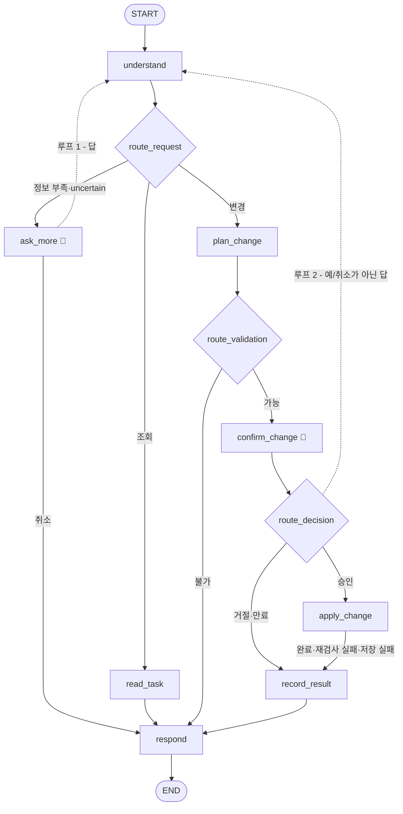

# 설계서 — 가상 금융 업무 AI Agent

| 항목 | 내용 |
|---|---|
| 문서 성격 | **구현하면서 자라나는 문서.** 어떻게 만드는가 — 구조, 흐름, 데이터, 규칙 |
| 무엇을 왜 만드는가 | [기획서.md](기획서.md) |
| 설계가 어떻게 바뀌어 왔나 | [설계변경기록.md](설계변경기록.md) — 초안(FigJam)과의 차이, 바뀐 이유 |
| 만드는 순서 | [구현계획.md](구현계획.md) |
| 날짜별 작업과 결정 과정 | [devlog/](../devlog/) |

## 변경 이력

| 날짜 | 내용 |
|---|---|
| 2026-09-26 | 기획서에서 설계 내용을 옮겨와 새로 만듦. State 칸 표(4장) 추가 |
| 2026-09-29 | 직접 써 보기 — 짐작한 출금 계좌는 비우고 되묻기, 되묻는 질문에 업무 이름, 처리 불가 안내에 예시 문장, SDK 경고 숨김 |
| 2026-09-28 | 검수 — 시나리오 확인을 `scenarios.py`로 분리, 수정 해석 실패·수정 중 되묻기 취소에도 승인 대기 요청을 잃지 않음, temperature 인자 제거 |
| 2026-09-28 | Step 7·8 — slot 정보를 `intents.SLOTS`로 이동, 카드 일시 잠금, 되묻기(`ask_more`)·수정 루프, State `missing`·`loop`·횟수 |
| 2026-09-28 | Step 6 — `rollback` 노드와 저장 성공 분기 제거, `record_result`와 처리 기록, 무결성 규칙 10, 상태 `expired`, 저장 재시도 |
| 2026-09-28 | Step 5 — 즉시이체·승인 흐름, `transfer_id`와 무결성 규칙 9, 승인 답 규칙, 승인 유효 시간, 실행 직전 재검사, 규칙 8 코드 강제 |
| 2026-09-28 | Step 4 — LLM에 대화 기록 대신 **이전 상태** 전달, `intent`·`params`가 턴을 넘어 이어짐, 이어받을 계좌 규칙, CLI 루프. temperature가 무시된다는 사실 기록 |

> 설계가 바뀌면 이 문서를 **현재 상태로** 고치고, 바뀐 내용과 이유는 [설계변경기록.md](설계변경기록.md)에 남긴다.
> 이 문서는 "지금 설계가 어떤가", 변경기록은 "어떻게 여기까지 왔나"를 담는다.

---

## 목차

1. [설계 원칙](#1-설계-원칙)
2. [시스템 구조](#2-시스템-구조)
3. [워크플로우](#3-워크플로우)
4. [State](#4-state)
5. [데이터](#5-데이터)
6. [intent와 slot](#6-intent와-slot)
7. [향후 기술 검토](#7-향후-기술-검토)

---

## 1. 설계 원칙

이 프로젝트에서 판단이 갈릴 때 따르는 기준.

### 원칙 1 — 노드는 "단계"를 표현하고, "업무"를 표현하지 않는다

노드 이름에 `transfer`, `card` 같은 업무명을 넣지 않는다.
업무 종류는 State의 `intent` 필드가 들고 있고, 그래프는 절차만 안다.
업무별로 다른 부분은 `functions.py`의 표(`READ_TASKS`, 나중에 `HANDLERS`)에 두고, 노드는 표에서 찾아 쓰기만 한다.

### 원칙 2 — 데이터를 바꾸는 곳은 단 한 군데다

`data_store.save()`를 호출하는 노드는 `apply_change` 하나뿐이다.
`read_task`와 `plan_change`는 읽기만 한다.

> 조회 쪽 코드는 `save`를 **import조차 하지 않는다.** 실수로든 아니든 망가뜨릴 방법 자체를 없앤다.

### 원칙 3 — 승인 전에는 아무것도 바꾸지 않는다

`plan_change`는 "무엇을 바꿀지"만 정하고 데이터는 건드리지 않는다.
`interrupt`가 그래프를 완전히 멈추는 방식으로 동작하므로,
계획과 실행은 **물리적으로 다른 노드**여야 한다.

### 원칙 4 — 실행 직전에 다시 검증한다

승인을 기다리는 사이 잔액이 바뀔 수 있다 (TOCTOU).
`apply_change`는 저장 전에 검증을 한 번 더 돌린다.

### 원칙 5 — 모든 길은 하나의 출구로 모인다

성공·실패·거절 어느 경로든 `respond` → `END`로 나간다.
`END`는 하나다. 응답 생성이 한 곳에 모여야 말투와 형식이 일관된다.
LLM도 입구(`understand`) 한 곳에만 둔다. 사람의 말이 들어오는 곳에서만 번역하고, 안쪽은 코드로 처리한다.

### 원칙 6 — 실패는 세 종류로 나눠서 다룬다

모든 "안 되는 상황"을 똑같이 에러로 처리하지 않는다. 이후 모든 코드가 이 기준을 따른다.

| 종류 | 예 | 누구 잘못인가 | 다루는 법 |
|---|---|---|---|
| **업무상 거절** | 잔액 부족, 없는 계좌, 이미 잠긴 카드 | 아무도 아님 — 정상적인 결과 | **에러를 내지 않는다.** Handler의 `validate`가 `(None, 사유)`로 돌려준다 |
| **저장 실패** | 무결성 위반, 파일 잠김, 깨진 JSON | 데이터나 환경 문제 | **우리 에러를 낸다** → `apply_change`가 받아서 실패로 안내·기록. 파일은 atomic write로 이전 그대로라 되돌릴 것이 없다 |
| **버그** | 오타로 인한 `KeyError`, 타입 실수 | 코드를 짠 사람 | **받지 않는다.** 그대로 터지게 둬서 빨리 발견한다 |

> 에러(예외)는 "예상하지 못한 일"에 쓰는 도구다. 평범한 거절까지 에러로 만들면 진짜 사고와 섞여서 구분이 안 된다.
> 반대로 `except Exception:`으로 전부 받으면 오타 하나도 "저장에 실패했습니다"로 뭉개져 원인을 못 찾는다.
> 외부 API처럼 실패 종류를 다 알 수 없는 곳은 **그 호출 한 줄만** 넓게 감싼다 (`understand`의 LLM 호출).

**저장 실패용 에러 계층** (`src/data_store.py`)

```
DataStoreError        ← 둘을 한꺼번에 받을 때 (apply_change)
├── IntegrityError    ← 무결성 규칙 위반. 같은 데이터라 다시 해도 실패 → 재시도하지 않음
└── StorageError      ← 파일을 읽거나 쓸 수 없음. 파일 잠김 등은 다시 하면 될 수 있음 → 재시도 대상
```

"다시 하면 되느냐"로 나눈 이유: 재시도(`RetryPolicy`)를 붙일 때 `retry_on=StorageError`로 **파일 문제만 골라** 재시도하기 위해서다.
파이썬 기본 에러(`PermissionError`, `JSONDecodeError` 등)는 `data_store` 안에서 `StorageError`로 바꿔 내보내되,
`raise ... from e`로 원래 원인을 함께 남긴다.

> **Windows 주의**: `bank_data.json`을 편집기로 열어둔 채 저장하면 파일 교체가 `PermissionError`로 거부된다.
> `StorageError`로 나타나며, 편집기를 닫으면 해결된다.

---

## 2. 시스템 구조

```
langgraph-financial-agent/
├── data/
│   ├── initial_data.json   원본 (읽기 전용, git으로 관리)
│   └── bank_data.json      작업용 복사본 (실행 중 변경, git 제외)
├── src/
│   ├── main.py             CLI 입력 루프, 중단/재개 처리
│   ├── scenarios.py        대화 시나리오 확인 (그래프 + 업무 + 저장, 가짜 LLM 포함)
│   ├── graph.py            State 정의, 노드, 조건부 Edge
│   ├── functions.py        업무별 조회 함수·문장 틀·변경 Handler
│   ├── intents.py          intent 이름·slot의 유일한 정의처
│   ├── integrity.py        데이터 무결성 검사 (10개 규칙)
│   ├── config.py           환경 변수(API 키) 불러오기
│   └── data_store.py       JSON 복사·읽기·저장 (유일한 파일 접근 통로)
├── docs/                   기획서, 설계서, 설계변경기록, 구현계획
├── devlog/                 세션별 개발일지
├── .env                    API 키 설정 (git 제외)
└── .env.example            .env 견본 (키 이름만, 값 없음)
```

### 실행 방식

```bash
uv run python src/main.py        # 프로그램 실행
uv run python src/integrity.py   # 데이터 무결성 검사
```

`src/` 안의 파일끼리는 **폴더 이름 없이** 불러온다.

```python
from data_store import load        # O
from src.data_store import load    # X — 이 프로젝트에서는 쓰지 않는다
```

> `python src/main.py`로 실행하면 파이썬이 `src/` 폴더를 기준으로 모듈을 찾기 때문이다.
> 두 방식을 섞으면 한쪽에서 `ModuleNotFoundError`가 나므로, 한 가지로 통일한다.
> 각 모듈은 맨 아래 `if __name__ == "__main__":` 블록으로 **단독 실행해서 확인**할 수 있게 만든다.

### API 키와 환경 변수

키는 코드에도, git에도 두지 않는다. `src/config.py`의 `load_env()`가 두 파일을 순서대로 읽는다.

| 순서 | 파일 | 담는 것 | git |
|---|---|---|---|
| 1 | 프로젝트 `.env` | 이 프로젝트만의 설정. 공용 키 파일의 위치(`SHARED_ENV_FILE`) | 제외 |
| 2 | `SHARED_ENV_FILE`이 가리키는 파일 | 여러 실습이 함께 쓰는 API 키 (프로젝트 밖) | 해당 없음 |

- **먼저 읽은 값이 이긴다** (`load_dotenv`는 이미 있는 값을 덮어쓰지 않음). 그래서 프로젝트 `.env`의 `LANGSMITH_PROJECT`가 공용 파일의 값보다 우선한다
- **코드에 절대경로를 적지 않는다.** 코드는 GitHub에 올라가고, 다른 컴퓨터에는 그 경로가 없기 때문이다
- 다른 컴퓨터(채점자)는 `cp .env.example .env` 후 `.env`에 `GEMINI_API_KEY`를 직접 넣으면 된다
- 키 이름은 `GEMINI_API_KEY`와 `GOOGLE_API_KEY` 둘 다 받는다
- 키가 없으면 LLM을 부를 때가 아니라 **처음 필요할 때 바로** `ConfigError`로 알린다 (fail fast)
- 키 **값**은 출력하거나 로그에 남기지 않는다

```bash
uv run python src/config.py   # 키가 준비됐는지 True/False만 확인
```

### 시간 기준

| 항목 | 결정 |
|---|---|
| 기준일 | **실행 시점의 실제 날짜** ("이번 달"은 오늘이 속한 달). 해당 기간에 거래가 없으면 빈 목록이 정상 |
| 시간대 | 한국 표준시(UTC+9) 고정. 데이터의 `occurred_at`이 `+09:00`으로 저장되어 있으므로 기준도 맞춘다 |
| 구현 규칙 | 현재 시각은 **한 함수에서만** 얻는다. `datetime.now()`를 여기저기 직접 쓰지 않는다 |

> 현재 시각을 한 곳에서만 얻어야 테스트할 때 그 함수 하나만 바꿔서
> "10월이라면?" 같은 상황을 흉내 낼 수 있다.
> 시간대는 `ZoneInfo("Asia/Seoul")` 대신 `timezone(timedelta(hours=9))`를 쓴다.
> Windows에는 시간대 데이터베이스가 기본으로 없어서 `ZoneInfo`가 실패할 수 있고,
> 한국은 서머타임이 없어서 고정 오프셋으로 충분하기 때문이다.

### LLM

| 항목 | 결정 |
|---|---|
| 모델 | `gemini-3.5-flash-lite`. **`temperature`를 주지 않는다** — 이 모델은 무시하고 경고만 낸다 (2026-09-28 확인). 같은 질문에도 답이 흔들릴 수 있다고 보고 설계한다 |
| 부르는 곳 | `understand` **한 곳뿐** — 질문 한 번에 1회 |
| 방식 | Structured Output (`with_structured_output`) — LLM의 답을 정해진 칸으로 받음. 칸의 `description`도 LLM에게 가는 지시문이다 |
| 넘기는 데이터 | **지금 말 하나 + `<이전 상태>`**(직전 업무·값·이어받을 계좌·보여준 후보), 내 계좌·카드 **이름만** (잔액은 넘기지 않음). 대화 기록은 넘기지 않는다 |

**LLM에 맡기는 것과 코드가 하는 것** — 말의 뜻(유지·변경·추가·전체, "두 번째 거")은 LLM이, **세면 알 수 있는 사실**(이어받을 계좌가 하나인가)은 코드가 정해서 `<이전 상태>`에 적어준다. 흔들리면 안 되는 판단은 LLM에 두지 않는다.

---

## 3. 워크플로우



🛑 표시가 `interrupt`로 멈추는 지점이다. 노드 8개, 조건부 Edge 4개(`route_request`·`route_ask`·`route_validation`·`route_decision`), 루프 2개.

> v1에는 `apply_change` 뒤에 `저장 성공?` 분기와 `rollback` 노드가 있었다. 복사본에서 바꾸고 atomic write로 한 번에 교체하므로 저장이 실패해도 **파일은 이전 그대로**라 되돌릴 것이 없어서 뺐다 (설계변경기록 B19).

### 구현 상태

| 노드·Edge | 역할 | 상태 |
|---|---|---|
| `understand` | 사용자 말 → intent + slot (LLM 1회) | ✅ Step 3 |
| `route_request` | 조회 / 그 외 (지금은 2갈래) | ✅ Step 3 — 변경·정보 부족 갈래는 Step 5·8 |
| `read_task` | 조회 실행 (읽기만) | ✅ Step 3 |
| `respond` | 결과 → 문장 (정해진 틀) | ✅ Step 3 |
| `main.py` CLI 루프 | 입력 반복, 종료 단어, 멈춰 있으면 다음 입력을 `Command(resume=...)`로 | ✅ Step 4 · Step 5 |
| `plan_change`, `confirm_change`, `apply_change`, `route_validation`, `route_decision` | 승인 흐름 | ✅ Step 5 — `route_decision`의 `unclear` → `confirm_change` 되돌아가기 포함 |
| `record_result` | 처리 기록 (승인 화면까지 간 요청: 완료·취소·만료·실패) | ✅ Step 6 — 완료는 `apply_change`가 거래와 같은 저장으로 |
| `ask_more`, `route_ask`, 루프 1·2 | 되묻기·수정 | ✅ Step 8 |

### 저장소가 두 개라는 점 (중요)

| 저장소 | 담는 것 | 프로그램을 꺼도 남나 |
|---|---|---|
| `data/bank_data.json` | 계좌 잔액, 거래 내역, 카드 상태, 처리 기록 | **남는다** |
| Checkpointer | 대화 맥락, 승인 대기 중인 처리안 | 1차는 메모리 → 사라짐 |

**은행 데이터는 Checkpointer와 무관하다.** `apply_change`가 직접 JSON에 쓰기 때문이다.
1차에서 `InMemorySaver`를 써도 이체한 잔액은 그대로 남는다.
사라지는 것은 "승인 질문에 아직 답하지 않은 상태" 뿐이며, 이는 3차의 재시작 복구에서 해결한다(`SqliteSaver`로 교체).

### 저장 통로 (`data_store`)

```
save(data)
  [0] 무결성 검사 ── 실패 → IntegrityError  (파일 하나도 안 건드림)
  [1] 같은 폴더의 임시 파일에 끝까지 쓰고 디스크에 기록 (fsync)
  [2] 임시 파일로 진짜 파일을 한 번에 교체 (os.replace) ── 실패 → StorageError (진짜 파일은 옛날 그대로)
```

- **atomic write** — 쓰다가 죽어도 반쯤 쓰인 파일이 남지 않는다
- 작업용 복사본은 `load()`가 처음 불릴 때 없으면 원본에서 만든다 (lazy initialization). 복사도 `save()`를 거친다
- JSON은 UTF-8, 한글 그대로(`ensure_ascii=False`), 들여쓰기 2칸

---

## 4. State

노드들이 주고받는 데이터. **다른 노드가 읽는 것만 넣는다.** 사람이 나중에 보려는 것(LLM의 판단 근거 `reason`)은 State가 아니라 로그로 남긴다.

| 칸 | 수명 | 쓰는 곳 | 읽는 곳 | 도입 |
|---|---|---|---|---|
| `messages` | **대화 내내** 쌓임 (`add_messages`). 기록용 — LLM에는 마지막 하나만 | 사용자 입력, `respond` | `understand` | ✅ Step 3 |
| `intent` | **턴을 넘어 이어짐** | `understand` | `understand`(다음 턴), `route_request`, `read_task`, `respond` | ✅ Step 3 · Step 4 |
| `params` | **턴을 넘어 이어짐** | `understand` | `understand`(다음 턴), `read_task` | ✅ Step 3 · Step 4 |
| `inferred` | 한 턴 | `understand` | `respond` | ✅ Step 3 |
| `result` | 한 턴 (`understand`가 비움) | `read_task` | `respond` | ✅ Step 3 |
| `plan` | 승인 대기 중 (만든 시각 `created_at` 포함) | `plan_change` | `confirm_change`, `apply_change` | ✅ Step 5 |
| `decision` | 한 턴 | `confirm_change` | `route_decision`, `respond`, `confirm_change`(다시 보여줄 때) | ✅ Step 5 |
| ~~`request_id`~~ | – | – | – | 두지 않음 — 기록 번호는 `record_result`·`apply_change`가 저장할 때 만든다. 다른 노드가 읽지 않음 |
| `missing` | 한 턴 | `understand` | `route_request`, `ask_more`, `respond`, `understand`(후보) | ✅ Step 8 |
| `loop` | 루프 한 번 | `ask_more`, `confirm_change` | `understand` (읽고 비움) | ✅ Step 8 |
| `ask_count` | 요청 하나 | `ask_more` | `route_request` (최대 3) | ✅ Step 8 |
| `revision_count` | 요청 하나 | `confirm_change` | `confirm_change` (최대 5) | ✅ Step 8 |

- Checkpointer가 같은 대화(`thread_id`)의 State를 계속 들고 있다. `understand`는 이번 턴 값을 쓰기 **전에** 직전 `intent`·`params`·`result`(보여준 후보)를 읽어 LLM에게 `<이전 상태>`로 준다
- `intent`·`params`는 **기본으로 유지**한다. LLM이 이번 말의 뜻으로 "이번 턴의 최종 값"을 통째로 낸다 — 같은 업무면 바꾼 칸만 고치고("아니 5만 원"), "전부"면 계좌 목록을 비운다. **코드는 합치지 않는다** (말의 뜻을 규칙으로 판단하게 되므로)
- 다른 업무로 넘어가면 **이어받을 계좌**만 옮긴다. 이어받을 계좌는 코드(`_carry_account`)가 정한다 — 직전 값에 계좌가 **하나**일 때만. 둘 이상(두 계좌 조회, 이체의 출금·입금)이면 없음 → 되묻기
- `accounts`가 비어 있으면 **전체**다. B안에서는 "말하지 않음 = 유지"를 LLM이 이전 값을 다시 적는 것으로 표현하므로, 코드에 도착한 빈 목록은 항상 "전체"를 뜻한다
- `inferred`, `result`는 그 턴의 처리 결과라서 매 턴 새로 쓴다. 이전 상태에서 이어받은 이름은 추측(`inferred`)으로 치지 않는다
- 재시작 복구(3차) 때는 `decision`을 **반드시 비운다.** 명세: "이전 승인만으로 변경을 자동 실행하지 않는다"

---

## 5. 데이터

`data/initial_data.json`의 최상위 키 7개.

| 키 | 개수 | 비고 |
|---|---|---|
| `accounts` | 5 | user_01 4개 + user_02 1개 |
| `cards` | 4 | 전부 체크카드(`debit`), 초기 상태 `active` |
| `transactions` | 30 | 2026년 8~9월 분포. 잔액과 정확히 일치 (아래 무결성 규칙) |
| `addresses` | 2 | 집 / 회사 |
| `bills` | 5 | 전부 미납(`unpaid`) |
| `requests` | 0 | 처리 기록이 쌓이는 곳 |
| `reissue_applications` | 0 | 재발급 신청이 쌓이는 곳 |

### 초기 데이터에 일부러 심어둔 상황

테스트하고 싶은 케이스를 데이터에 미리 넣어뒀다. 이를 **fixture**(고정 테스트 데이터)라 한다.

| 심어둔 것 | 무엇을 테스트하려고 |
|---|---|
| user_01과 user_02가 **똑같이 "생활비"** 계좌 보유 | 별명만으로 계좌를 특정할 수 없는 상황 → 소유자 필터링 |
| 비상금 계좌 75,000원 | 잔액 부족 |
| 생활비 520,000원 | 조건부 이체("40만원 남기고") 시 이체액 120,000원 계산 |
| 저축 1,850,000원 | 이체 한도(100만원) 초과 |
| 보험료 납기일 2026-09-20 | 기한이 지난 청구서 납부 |
| 5만원 이상 카드 결제 5건 | 금액 조건 거래 내역 조회 |
| 스타벅스 결제 2건 | 가맹점 조건 거래 내역 조회 (2차) |

### 무결성 규칙

데이터가 "은행 장부로서 말이 되는지"를 10개 규칙으로 검사한다.
검사는 눈이 아니라 코드(`src/integrity.py`)로 하고, **`save()`가 저장할 때마다** 돌린다.

| # | 규칙 |
|---|---|
| 1 | 계좌 잔액 = 입금 합계 − 출금 합계 (**모든 계좌는 0원에서 시작** — 실제 계좌 개설과 같음) |
| 2 | 시간순으로 따라가도 잔액이 한 번도 음수가 되지 않음 |
| 3 | 거래의 소유자 = 그 거래가 속한 계좌의 소유자 |
| 4 | 카드 결제는 그 계좌에 연결된 카드로만 |
| 5 | ID 중복 없음, 가리키는 대상(계좌·카드)이 실제로 존재 |
| 6 | 금액은 0보다 큰 정수(잔액은 0 이상), 거래 유형은 `deposit` / `withdrawal` |
| 7 | 기준 시각보다 미래의 거래 없음 |
| 8 | **같은 소유자**의 계좌 별명·카드 이름은 겹치지 않음 (다른 소유자끼리는 허용) |
| 9 | 같은 `transfer_id`의 거래는 **출금 1 + 입금 1**, 금액·시각이 같고 계좌가 다름 (이체가 아닌 거래는 `null`) |
| 10 | 모든 이체(`transfer_id`)에 **완료 기록**이 있고, 완료 기록의 `transfer_id`는 실제 거래에 있음. `request_id` 중복·`status` 값도 검사 (규칙 5·6) |

> 규칙 8은 [6장](#6-intent와-slot)의 설계를 받치는 전제다. LLM은 **이름**으로 계좌·카드를 고르고
> 저장은 **ID**로 하므로, 한 사람 안에서 이름 → ID가 정확히 1:1이어야 한다.
> 2차의 계좌 별명 변경 기능이 이 규칙을 어기려 하면 저장 단계(`save()`)에서 막힌다.

```bash
uv run python src/integrity.py                      # 원본 검사 → "결과: 10/10 통과"
uv run python src/integrity.py data/bank_data.json  # 작업용 복사본 검사
```

> 이 검사는 초기 데이터용만이 아니다. 이체 기능을 만든 뒤
> **"이체 후에도 장부가 맞는가?"** 를 확인하는 데 재사용한다.
> 이체 코드가 거래 기록을 빠뜨리면 규칙 1에서 바로 걸린다.

> **이체 짝 (규칙 9, Step 5)**: 즉시이체는 출금 1줄 + 입금 1줄을 **같은 `transfer_id`**(`tr_001`…)로 묶어 적는다.
> 전에는 월세 같은 외부 출금과 이체 출금이 기록상 똑같이 생겨서 짝을 검사할 수 없었다.
> 이제 이체 코드가 입금 줄을 빠뜨리면 잔액을 맞춰 적더라도 규칙 9가 저장 전에 막는다.

### 상태 값 정의

명세에서 "구현에 맞게 정의한다"고 한 값들.

| 대상 | 값 | 뜻 |
|---|---|---|
| `cards.status` | `active` | 사용 가능 |
| | `locked` | 일시 잠금 (해제 가능) |
| | `reported_lost` | 분실 정지 (해제 불가, 재발급 대상) |
| `bills.status` | `unpaid` / `paid` | 미납 / 납부 완료 |
| `requests.status` | `completed` / `cancelled` / `expired` / `failed` | 처리 완료 / 사용자 취소 / 승인 유효 시간 지남 / 실패(재검사 거절·저장 실패, `reason`에 사유) |
| State `decision` | `approve` / `reject` / `expired` / `revise` / `unclear` / `revise_rejected` / `too_many` / `stop` | 승인 / 거절 / 유효 시간 지남 / 수정 요청 / 수정했지만 바뀐 게 없음 / 수정안이 검사에서 걸림 / 수정 5번 초과 / 되묻기 중 취소 |

---

## 6. intent와 slot

사용자 말을 해석할 때 쓰는 두 가지 표준 용어.

| 용어 | 뜻 | 비유 |
|---|---|---|
| **intent** (의도) | 사용자가 **무엇을 하려는가** | 신청서의 종류 (이체 신청서, 카드 정지 신청서) |
| **slot** (값) | 그 일에 **필요한 정보** | 신청서의 빈칸 (출금 계좌, 금액) |

파이썬 함수로 옮기면 intent는 **함수 이름**, slot은 **매개변수**다.

```python
def account_list_with_balance(accounts=None):            # 기본값이 있는 매개변수 = 선택 slot
    ...                                                   # 내 계좌를 읽고, accounts가 있으면 그 계좌들만 남김

def transfer_instant(from_account, to_account, amount):   # 기본값이 없는 매개변수 = 필수 slot
    ...                                                   # 이체 처리
```

### 원본은 코드 한 곳

intent 목록의 **유일한 정의처는 `src/intents.py`** 다. 아래 표는 그 내용을 옮겨 적은 것이며,
둘이 다르면 **코드가 맞다.** 이름을 바꿀 때는 `intents.py`를 먼저 고치고 이 표를 따라 고친다.

### 1차 intent 목록

| intent | 설명 | 종류 | 필수 slot | 선택 slot |
|---|---|---|---|---|
| `account_list_with_balance` | 계좌 목록과 잔액 조회 | 조회 | — | `accounts` (목록) |
| `transfer_instant` | 즉시이체 | 변경 | `from_account`, `to_account`, `amount` | — |
| `card_lock_temporary` | 카드 일시 잠금 | 변경 | `card` | — |

**표 밖의 특별한 값** (`intents.py`)

| 값 | 어디에 | 뜻 | 누가 넣나 |
|---|---|---|---|
| `unsupported` | intent | 이 에이전트가 처리할 수 없는 요청 (잡담, 날씨 등) | LLM |
| `not_understood` | intent | LLM이 형식을 어겼거나 알 수 없는 이유로 실패 | 코드 |
| `llm_busy` | intent | AI 서버가 바쁨(503·429) 또는 20초 안에 답이 없음 — 1번 재시도 후에도 실패 | 코드 |
| `uncertain` | 계좌·카드 slot | 말은 했지만 목록 중 어느 것인지 모름 | LLM |

### 규칙 1 — 이름은 `대상_동작_세부`

```
account_list_with_balance   account(계좌) · list(목록) · with balance(잔액 포함)
transfer_instant            transfer(이체) · instant(즉시)
card_lock_temporary         card(카드) · lock(잠금) · temporary(일시적인)
```

대상을 맨 앞에 두면 **알파벳순 정렬만으로 같은 업무끼리 모인다.**
2차에 이체가 3종류(`transfer_instant`, `transfer_conditional`, `transfer_split`)가 되어도 구분된다.
`temp`처럼 오해할 수 있는 줄임말(temperature로도 읽힘)은 쓰지 않는다.

### 규칙 2 — 처리가 다르면 나누고, 대상만 다르면 slot으로

| 사용자 문장 | 처리 | 판단 |
|---|---|---|
| "내 계좌 목록 보여줘" | 내 계좌를 목록으로 | `account_list_with_balance` |
| "생활비 잔액 얼마야?" | 같은 처리, 생활비만 | 같은 intent + `accounts=["생활비"]` |
| "생활비랑 저축 잔액 보여줘" | 같은 처리, 두 계좌만 | 같은 intent + `accounts=["생활비", "저축"]` |
| "내 계좌에 총 얼마 있어?" | **더하는** 처리 추가 | 별도 intent (2차) |

intent끼리 범위가 겹치면 안 된다(**상호 배타성**). 겹치면 `understand`가 하나를 고르지 못하고
실행할 때마다 결과가 흔들린다. 예를 들어 "목록"과 "잔액"을 나눴다면,
"내 계좌 목록과 잔액 보여줘"는 둘 다에 해당해버린다.

### 규칙 3 — 필수 slot과 선택 slot

| 종류 | 비어 있으면 | 그래프에서 |
|---|---|---|
| 필수 (`required`) | 실행할 수 없음 | `missing`에 적히고 `ask_more`로 되묻기 (루프 1) |
| 선택 (`optional`) | 그대로 실행 | 결과를 좁히지 않음 (전체 목록) |

### 규칙 4 — 계좌·카드 slot에는 LLM이 허용 목록에서 고른 실제 이름이 들어간다

`understand`가 실행될 때 **내 계좌(카드) 이름 목록**을 읽어서 LLM에게 허용값으로 준다.
LLM은 **역할 나누기**와 **이름 고르기**를 한 번의 호출에서 함께 한다.

```
허용값: [생활비, 저축, 여행 자금, 비상금, uncertain]      ← 내 계좌 이름만. 잔액은 넘기지 않음

"생활비에서 여행 갈 때 쓰는 통장으로 10만원"
    ↓ understand (LLM 1회)
from_account = "생활비"
to_account   = "여행 자금"          ← 뜻으로 골랐다. 글자 비교로는 찾을 수 없는 표현
amount       = 100000
reason       = "..."                ← 판단 근거. 로그·디버깅용이며 분기에는 쓰지 않음
```

| slot 값 | 뜻 | 그래프에서 |
|---|---|---|
| 실제 이름 | 확실히 그 대상 | 진행 |
| `uncertain` | **말은 했는데** 어느 것인지 모름 | 후보를 보여주며 되묻기 (`ask_more`) |
| 비어 있음 | **아예 말하지 않음** | 필수 slot이면 되묻기 (`ask_more`) |

- 한 문장에 이름이 여러 개 나와도 된다. **역할 나누기는 LLM이** 한다 ("~에서" → 출금, "~으로" → 입금)
- 이름 → ID 바꾸기는 검색이 아니라 **표에서 찾아보기**다. 무결성 규칙 8 덕분에 정확히 1:1
- 허용 목록은 사용자마다 다르고 별명이 바뀌면 달라지므로, Pydantic 모델을 **실행할 때 만든다** (`create_model`)
- 각 칸의 `description`은 LLM에게 그대로 전달되는 지시문이다. 가장 중요한 규칙은 **"이전 상태에도, 이번 말에도 없는 칸은 비워둔다"** (모든 칸은 "이번 턴의 최종 값")
- 목록에 없는 **종류**의 계좌("주식 계좌")라도 계좌 업무를 원하면 `unsupported`가 아니라 그 업무 + `uncertain` → 후보를 보여주며 안내한다. 결과가 없을 뿐 업무 안의 요청이라, 막지 않고 올바른 방향으로 유도한다
- 보여준 후보는 순서로 고를 수 있다 ("두 번째 거" → `<이전 상태>`의 후보 순서)
- **출금 계좌만은 짐작을 허용하지 않는다.** 말했거나, 이어받았거나, 보여준 후보에서 고른 이름만. 아무 계좌도 말하지 않았는데 LLM이 채우면 코드가 비우고 되묻는다. 돈이 **나가는** 칸이라 피해가 크기 때문이다 (입금 계좌·조회·카드는 지금처럼 추측하고 밝힌다)
- LLM이 고른 intent와 상관없는 칸은 코드가 버린다 (`intents.py`의 `required`·`optional` 기준)
- 칸마다 **무엇을 가리키는 칸인지**(`kind`: 계좌·카드), 사용자에게 부를 이름(`role`), 이름 뒤에 붙일 말(`suffix`)은 `intents.SLOTS`에 있다. 후보 목록은 `functions.NAME_LISTS[kind]` — 그래프는 두 표를 찾아 쓰기만 한다 (Step 7)
- LLM이 **그럴듯하지만 틀린** 이름을 고를 수 있다. 조회는 결과를 보면 바로 알 수 있고,
  변경은 `confirm_change`가 실제 이름과 방향("생활비 → 여행 자금")을 보여주며 확인받는다

**뜻으로 추측했으면 해석을 밝힌다**

LLM이 고른 이름이 사용자 말에 **글자로 들어 있지 않으면**(띄어쓰기는 무시) 뜻으로 추측한 것이다 (State의 `inferred`).
이때는 답 앞에 어떻게 이해했는지 밝힌다.

```
"여행 갈 때 쓰는 통장 잔액"  →  '여행 자금' 계좌로 이해했어요.
                                 여행 자금 계좌 잔액은 310,000원입니다.
"생활비 잔액"               →  생활비 계좌 잔액은 520,000원입니다.        ← 글자 그대로라 안내 없음
```

| 표현 | 사용자의 의도 | LLM의 동작 | 우리 처리 |
|---|---|---|---|
| "여행 갈 때 쓰는 통장" | 계좌를 **설명**함 | 여행 자금 | 찾되 해석을 밝힘 |
| "휴가비 계좌" (없는 이름) | 이름을 댔는데 **그런 이름이 없음** | 여행 자금 (추측) | 해석을 밝혀 사용자가 바로 알아챔 |
| "주식 계좌" | 뜻이 통하는 계좌가 없음 | `uncertain` | 내 계좌 목록을 보여주며 다시 묻기 |

- 이 확인은 **막기 위한 것이 아니라 알려주기 위한 것**이다. 막으면 뜻으로 찾는 장점이 사라진다
- LLM은 추측했다는 사실을 스스로 표시하지 않는다. 그래서 **코드가 알아채서** 알린다

### 규칙 5 — 검증은 두 층

| 층 | 무엇을 보나 | 누가 | 어기면 |
|---|---|---|---|
| **형식** | "LLM이 약속을 지켰나" — 허용 목록 안의 값인가, 정수인가 | **Pydantic 모델에 선언** | `ValidationError` (LLM의 실수) → 재시도나 되묻기 |
| **업무** | "사용자 요청이 실행할 수 있는 내용인가" — 금액 > 0, 출금 ≠ 입금, 잔액 | **Handler의 `validate`** | 업무상 거절 → 사유를 담아 안내 (에러 아님) |

"금액 > 0"과 "출금 ≠ 입금"을 Pydantic에 넣지 않는 이유: 사용자가 정말로 "-1만 원"이나
"생활비에서 생활비로"라고 말했을 수 있다. 그때 LLM은 실수하지 않았고, 사용자에게
**"이체 금액은 0원보다 커야 합니다"** 처럼 이유를 알려줘야 한다(명세 요구사항).
Pydantic이 막으면 LLM의 형식 실패처럼 보여서 정확한 이유를 안내할 수 없다.

> 판단 기준: **"LLM이 지켜야 하는 약속"은 Pydantic, "사용자 요청이 말이 되는가"는 코드.**
> 28번 실습에서 Pydantic의 `le=1000000`(형식상 최대치)과 코드의 `MAX_TRANSFER`(업무 한도)를 따로 둔 것과 같은 구분이다.
> 이 구분은 [설계 원칙 6](#원칙-6--실패는-세-종류로-나눠서-다룬다)의 "업무상 거절 / 저장 실패 / 버그"와 이어진다.

### 승인 흐름 (Step 5)

```
plan_change     형식 검사(그래프, intents.py 기준) → 업무 검사(Handler.validate) → 처리안 + 만든 시각
confirm_change  🛑 승인 화면: [해석 안내(필요할 때만)] + 방향·금액 + 이체 후 잔액 + 답하는 방법
                답 분류: 정해진 단어와 정확히 같을 때만 승인/거절, 나머지는 unclear → 다시 보여줌
                승인이라도 처리안을 만든 지 5분(APPROVAL_TTL)이 지났으면 expired
apply_change    장부를 새로 읽어 **같은 validate**로 재검사 → Handler.apply → save(무결성 검사)
```

- **검사는 세 겹**: ① `plan_change`의 validate(승인 화면을 띄워도 되나) ② `apply_change`의 validate(지금도 실행해도 되나, 같은 함수) ③ `save()`의 무결성 검사(우리 코드가 장부를 망가뜨리지 않았나)
- **승인 답에 LLM을 쓰지 않는다.** 돈이 나가는 마지막 관문이라 "자연스러움"보다 "잘못 승인하지 않음"이 우선이다. 부분 일치도 쓰지 않는다 ("아니요, 진행하지 마"가 "진행"에 걸리면 안 됨)
- `interrupt`는 재개될 때 노드를 **처음부터 다시 실행**한다. 그래서 `confirm_change`는 문장만 만들고 부작용(저장)은 다음 노드에 둔다
- 멈춘 대화에 **새 요청**을 보내면 대기 중인 승인은 버려지고 처음부터 처리된다 (`main.py`는 멈춰 있으면 다음 입력을 승인 답으로 보낸다)
- **규칙 8은 코드가 강제한다**: 다른 업무로 넘어가며 다른 칸에서 옮겨 온 계좌가 "이어받을 계좌"가 아니면 `understand`가 그 칸을 비운다. 프롬프트로 알려줘도 LLM이 두 번 중 한 번꼴로 어겼다

### 처리 기록 (Step 6)

승인 화면까지 간 요청만 `requests`에 남긴다. 승인 화면 전의 거절(잔액 부족, 형식 문제)은 고객이 그 자리에서 결과를 들었으므로 기록하지 않는다 (판단 근거는 로그에).

```json
{"request_id": "req_001", "owner_id": "user_01", "intent": "transfer_instant",
 "details": {"from_account_id": "acc_001", "to_account_id": "acc_002", "amount": 100000, "transfer_id": "tr_001"},
 "status": "completed", "reason": null,
 "requested_at": "2026-09-28T15:00:00+09:00", "finished_at": "2026-09-28T15:00:20+09:00"}
```

- `details`는 업무마다 다르고(Handler의 `details()`), **이름이 아니라 ID**를 적는다 — 계좌 별명은 바뀔 수 있다
- **완료 기록은 거래와 같은 `save()` 한 번에** 남긴다 → "이체는 됐는데 기록이 없는" 상태가 생길 수 없고, 규칙 10이 이를 검사한다
- 취소·만료·실패는 `record_result`가 따로 저장한다. 이 저장이 실패해도 대화는 멈추지 않고 로그에 남긴다 (잔액은 이미 바뀌지 않은 상태)
- 저장은 `data_store`가 **파일 쓰기만 0.2초 간격 3번까지** 재시도한다 (Windows에서 파일이 잠깐 잠기는 경우). 재시도 원인을 아는 곳에서 해결해 그래프는 단순하게 둔다

### 되묻기와 수정 (Step 8)

```
루프 1  understand가 missing을 적음 → ask_more 🛑 "출금 계좌를 알려 주세요. 고를 수 있는 계좌: …"
        → 답을 새 메시지로 붙여 understand로 → 이전 상태(params)를 보고 빈 칸만 채움
루프 2  승인 화면에서 예/취소가 아닌 답 → understand(수정 해석) → plan_change(재검사) → 승인 화면
```

- **병합 코드가 없다.** 구현계획엔 "되돌아왔을 때 params를 합친다"가 있었지만, `understand`가 이전 상태를 보고 "이번 턴의 최종 값"을 내므로(Step 4 B안) 따로 합치지 않는다
- 이름 칸이 비었으면 **후보를 함께** 보여준다 ("카드 잠가줘" → "고를 수 있는 카드: …"). "두 번째 거"처럼 순서로 골라도 된다
- 되묻기는 **3번**까지, 중간에 "취소"면 그만둔다 (승인 화면 전이라 기록 없음)
- 승인 화면에서 "예"/"취소"가 아닌 답은 모두 **수정 요청**으로 `understand`가 해석한다 (Step 5의 "다시 묻기"를 대신함)
  - 바뀐 게 없으면("음 잠깐만") → "'예' 또는 '취소'로 답해 주세요" + 승인 유효 시간은 **이어감** ("음"으로 시간을 늘릴 수 없게)
  - 수정안이 검사에서 걸리면(잔액 초과) → 사유 + **이전 처리안으로** 다시 묻기. 처리안에 만든 값(`params`)을 담아 두고 되돌린다
  - 승인 대기 중 **다른 업무**("생활비 잔액 얼마야?") → 지금 요청을 먼저 끝내게 승인 화면을 다시 보여준다 (승인 화면까지 간 요청은 모두 기록한다는 약속 유지)
  - 수정은 **5번**까지, 넘으면 `cancelled`(사유: 수정 초과)로 기록
  - 수정을 해석하다 **LLM이 실패**해도 승인 화면을 다시 보여준다. 수정하다 되묻기로 넘어가 "취소"하면 `cancelled`로 기록한다 (검수에서 추가)
- 루프에서 돌아온 `understand`는 `loop` 칸으로 알아채고, 요청 하나 동안 이어지는 값(처리안·횟수)을 비우지 않는다

### 규칙 6 — 답변 문장은 정해진 틀로

`respond`는 LLM을 쓰지 않고 **정해진 틀**로 문장을 만든다. 업무별 틀은 `functions.py`에 업무 함수와 나란히 두고(`READ_TASKS`), `respond`는 표에서 찾아 쓰기만 한다.

- 숫자가 LLM을 거치지 않아 **틀릴 일이 없다** (은행 앱에서 가장 중요)
- 질문 한 번에 LLM 호출이 **1회**로 끝난다
- 함수는 **데이터**를(잔액은 숫자 `520000`), `respond`는 **문장**을("520,000원") 맡는다

---

## 7. 향후 기술 검토

### 답변 문장을 LLM으로 (음성 모드와 함께)

음성 모드처럼 자연스러운 말투가 중요해지면 **숫자는 틀이 만들고 LLM은 앞뒤 말투만** 다듬는 방식을 검토한다.
틀 방식이 이미 있으므로, LLM 문장이 이상할 때 보여줄 **안전망**으로 그대로 쓸 수 있다.
LLM으로 문장 전체를 쓰게 하면 묻지 않은 합계를 스스로 계산해 덧붙이는 등의 위험이 있다.

### Jev (TypeSafe AI) — 확률 기반 판단 시험 후보

2026-09 얼리 액세스로 나온 모델. 문장을 만들지 않고 **정해진 선택지 중 고른 값과 확률**만 돌려준다.
자유로운 숫자 추출("10만 원" → 100000)은 못 해서 `understand` 전체를 대체할 수는 없다.

| 시험해볼 곳 | 이유 |
|---|---|
| 승인 응답 분류 ("응" / "취소" / "아니, 5만 원만") | 선택지 3개짜리 판단. 확률이 낮으면 되묻기 |
| 계좌·카드 이름의 "애매함" 판단 | LLM의 `uncertain` 자기 신고 대신 **확률로** 되묻기 결정 ("휴가비" 같은 경우) |

- 확인할 것: 실행 중에 만드는 선택지 목록 지원 여부, 개인 사용 무료 여부, 응답 속도, LangChain 연동
- 얼리 액세스·실험적 기능이라 **핵심 경로가 아닌 곳에서 먼저** 시험한다
