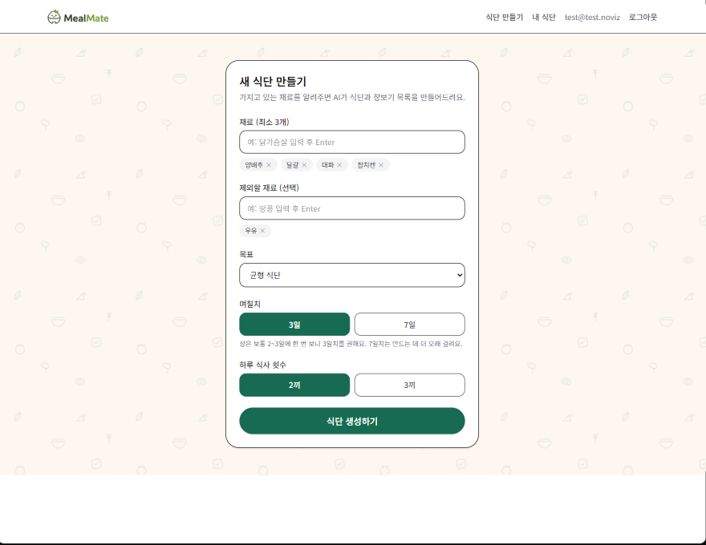
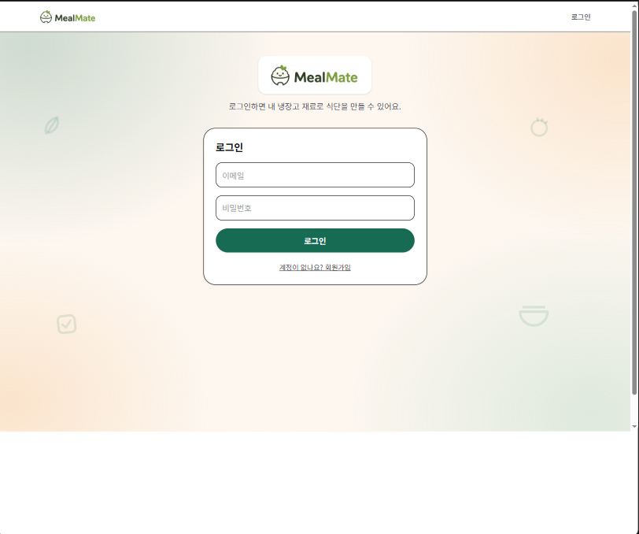
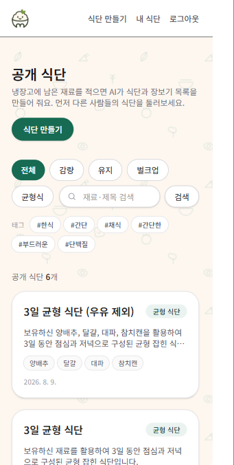

# MealMate

**냉장고에 있는 재료로 며칠치 식단을 한 번에 짜주는 웹 서비스**

[](https://mealmate-inky.vercel.app)


---

## 왜 만들었나

냉장고에 재료는 있는데 뭘 해먹을지 매번 고민하다가 결국 배달을 시킨다. 식단을 짜보려 해도 며칠치를 한 번에 계획하는 게 귀찮다.

그래서 **가진 재료를 적으면 며칠치 식단과 장보기 목록이 한 번에 나오는** 서비스를 만들었다.

## 화면

| 공개 식단 목록 | 재료 입력 | AI가 만든 식단 |
|:--:|:--:|:--:|
|  |  |  |

| 끼니별 조리법 | 로그인 | 모바일 |
|:--:|:--:|:--:|
|  |  |  |

## 기능

- **식단 생성** — 재료를 입력하면 Gemini가 식단과 장보기 목록을 만든다. 기본 3일, 최대 7일
- **조리법 온디맨드 생성** — 끼니를 눌렀을 때 조리법을 만든다. 미리 다 만들면 쓰지 않을 조리법까지 생성하게 되어 비용이 낭비된다
- **끼니 단위 재생성** — 마음에 안 드는 한 끼만 다시 뽑는다
- **실천율 추적** — 끼니 완료 체크, 장보기 체크
- **공개/비공개 토글** — 공개한 식단은 로그인 없이도 볼 수 있다
- **마크다운 복사** — 식단 전체를 텍스트로 옮긴다

## 이 프로젝트에서 신경 쓴 것

### LLM 출력을 믿지 않는다

이 서비스에서 가장 중요한 판단이었다. **AI가 만든 식단에 알레르기 재료가 들어가면 사고다.** 그래서 세 겹으로 막았다.

```
1) responseSchema 로 응답 구조 자체를 강제        →  lib/gemini.ts
2) 받은 결과를 애플리케이션에서 다시 검증           →  lib/mealPlan.ts
     ├─ validateStructure()      구조가 맞는가
     └─ findAllergyViolations()  알레르기 재료가 섞였는가
3) 검증에 실패하면 1회 재생성 후 그래도 실패하면 거부  →  app/api/plans/route.ts
```

알레르기 검사는 단어를 그대로 비교하지 않는다. "우유"를 피해야 하는 사람에게 "연유"나 "생크림"이 들어간 식단을 주면 안 되므로, **파생 재료까지 걸러내는 규칙**을 따로 뒀다.

### 봐야 할 파일

| 파일 | 역할 |
|---|---|
| [`lib/mealPlan.ts`](lib/mealPlan.ts) | 프롬프트 구성과 출력 검증. 이 프로젝트의 핵심 |
| [`lib/gemini.ts`](lib/gemini.ts) | Gemini 호출 래퍼. `responseSchema` 강제, `thinkingBudget: 0` |
| [`app/api/plans/route.ts`](app/api/plans/route.ts) | 생성 → 검증 → 재생성 → 저장 흐름 |
| [`lib/mealRegenerate.ts`](lib/mealRegenerate.ts) | 끼니 단위 재생성 |

`thinkingBudget: 0`으로 둔 이유는 식단 생성이 긴 추론이 필요한 작업이 아니기 때문이다. 응답 속도와 비용이 더 중요했다.

### 데이터 격리

Supabase RLS(Row Level Security)로 사용자별 데이터를 분리했다. 조리법은 **소유자만 생성**할 수 있지만 **이미 만들어진 조리법은 비로그인 사용자도 열람**할 수 있게 정책을 나눴다. 공개 식단을 공유하는 기능이 성립하려면 이 구분이 필요했다.

## 막혔던 문제들

개발 과정에서 실제로 겪은 것들이다. 자세한 기록은 [`docs/개발일지.md`](docs/개발일지.md)에 있다.

**로컬에선 되는데 배포만 실패했다.** 파일명을 `signupForm.tsx`로 두고 `SignupForm`으로 import하고 있었다. Windows 파일 시스템은 대소문자를 구분하지 않아서 로컬에서는 멀쩡히 돌아갔지만, Vercel의 리눅스 환경에서는 파일을 못 찾는다. **개발 환경과 배포 환경의 차이가 빌드 실패로 드러난 첫 사례였다.**

**로그인이 그냥 뚫렸다.** Next.js 16에서 `middleware.ts`가 `proxy.ts`로 이름이 바뀐 걸 몰랐다. 파일은 그대로 있는데 프레임워크가 읽지 않으니 인증 미들웨어가 통째로 무력화된 상태였다. 에러도 안 났다. **동작하지 않는데 조용한 실패가 제일 무섭다는 걸 배웠다.**

**로딩 스피너가 영원히 돌았다.** API 라우트의 일부 분기에서 응답을 반환하지 않고 끝나고 있었다. 이후 "모든 분기는 반드시 응답을 반환한다"를 체크리스트에 넣었다.

**조리법이 중복 생성됐다.** 진행 중 상태를 불리언 하나로만 추적해서, 여러 끼니의 조리법을 동시에 요청하면 서로를 덮어썼다. 끼니 단위로 상태를 관리하도록 고쳤다.

## 기술 스택

| 구분 | 사용 |
|---|---|
| 프레임워크 | Next.js 16.3 (App Router), React 19.2, TypeScript |
| 스타일 | Tailwind CSS 4 |
| 데이터 | Supabase (PostgreSQL + Auth + RLS) |
| AI | Google Gemini (`gemini-3.5-flash`), `@google/genai` |
| 검증 | Zod |
| 배포 | Vercel |

## 실행 방법

```bash
npm install
cp .env.example .env.local   # 아래 값들을 채운다
npm run dev
```

```
NEXT_PUBLIC_SUPABASE_URL=
NEXT_PUBLIC_SUPABASE_ANON_KEY=
SUPABASE_SERVICE_ROLE_KEY=
GEMINI_API_KEY=
NEXT_PUBLIC_SITE_URL=http://localhost:3000
```

DB 스키마는 [`supabase/migrations/`](supabase/migrations/)에 있다.

## 문서

| 문서 | 내용 |
|---|---|
| [기획서](docs/spec/기획서.md) | 요구사항과 화면 설계 |
| [개발일지](docs/개발일지.md) | 막힌 지점과 해결 과정 |
| [제작매뉴얼](docs/spec/제작매뉴얼.md) | 구현 순서 |
| [라이브 데모 유지](docs/라이브데모_유지.md) | Supabase 무료 플랜 자동 정지 방지 |

---

개인 프로젝트 · 개발 기간 3일 · 커밋 34개
