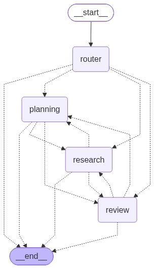

# 종합소득세 신고 준비 도우미

> "나 세금 신고 뭐 준비해야 해?"라고 물으면, 내 상황을 파악해서 준비물 목록을 만들어주고
> 빠뜨린 것을 짚어주는 멀티 에이전트 시스템

LangGraph로 구현한 조사·기획·검토 3개 에이전트를 라우터가 요청에 맞게 골라 실행합니다.



---

## 왜 만들었나

국내 세무 서비스(삼쩜삼, 토스 세이브잇, 국세청 원클릭 등)는 모두 **"홈택스에 이미 쌓여 있는
데이터"를 가공**하는 쪽에 있습니다. 그래서 다음은 아무도 다루지 않습니다.

| 빈 자리 | 놓치면 |
|---|---|
| "당신이 신고 대상인지" 판정 | N잡러가 대상인 줄 모르고 넘어가 무신고가산세 20% |
| 지급명세서 누락 탐지 | 거래처 미제출 시 홈택스에 안 뜸 → 나중에 추징 |
| "증빙을 지금 확보하라" 알림 | 3만원 초과는 적격증빙 필수인데 5월엔 이미 늦음 |
| 지방소득세(위택스) 별도 신고 | 홈택스만 끝내고 가산세 |

미국에는 이 자리를 채우는 서비스(TaxCaddy의 Document Request List)가 있지만 국내에는 없습니다.

### 하는 것 / 하지 않는 것

| 한다 | 하지 않는다 |
|---|---|
| 신고 의무·신고 방식 판별 | 세액 계산 |
| 방식에 맞는 준비물 목록 생성 | 유불리 판단 ("추계가 유리합니다") |
| 빠진 항목 점검 | 절세 자문 |
| 개별 지출의 경비 **가능성**과 필요 증빙 안내 | "이 지출은 경비입니다" 단정 |

**계산기가 아니라 체크리스트 생성기입니다.** 세무대리는 자격사의 영역이고, LLM은 산술 연산에
약합니다. 이 경계는 규제 회피이자 기술적 한계를 인정한 설계 선택입니다.
모든 금액·한도는 "가정"으로 표시하며, 최종 확인은 사용자와 국세청의 몫으로 남깁니다.

---

## 구조

### 에이전트

| 에이전트 | 역할 | 패턴 |
|---|---|---|
| **조사** | 소득 구성 → 신고 의무·방식 판별 → 적용 항목 분류 | Orchestrator-Worker |
| **기획** | 준비물 목록 + 마감 역산 일정 | 단일 노드 |
| **검토** | 빠진 항목 점검, 개별 지출의 경비 가능성 판단 | Reflection (최대 2회) |

### 설계 포인트

**라우터는 도메인을 모릅니다.** "조사/기획/검토 중 무엇이 필요한가"만 판단하고,
"장부냐 추계냐" 같은 세무 판별은 조사 에이전트 안에서 합니다. 덕분에 도메인을 바꿔도
라우터는 그대로 쓸 수 있습니다.

**에이전트 인계는 대기열로 처리합니다.** 라우터가 실행 순서를 정하면 각 에이전트가
`Command(goto=...)`로 다음 차례에게 넘깁니다. 조건부 엣지와 매핑 딕셔너리가 필요 없습니다.

```python
def handoff(state, current, updates) -> Command:
    remaining = state["todo_agents"][1:]          # 대기열 맨 앞이 자기 자신
    goto = remaining[0] if remaining else END
    return Command(update={**updates, "todo_agents": remaining, ...}, goto=goto)
```

**각 에이전트가 자기 전제조건을 검사합니다.** 라우터가 순서를 잘못 잡아도
정보가 없으면 조사를 먼저 요청하고 돌아옵니다. 사용자가 조사를 명시적으로 거부한
경우에만 가정을 밝히고 진행합니다.

```
"노트북 200만원 경비 되나?"  →  review 진입 → 소득 유형 모름 → research로 보냄
                            →  research가 파악 → review로 복귀 → 판단
```

**되묻기는 라우터를 건너뜁니다.** 정보가 부족해 되물었다면 다음 턴에 분류를 다시 할
필요가 없으므로, `pending_agent`에 남겨둔 자리로 곧장 돌아갑니다. LLM 호출 1회를 아낍니다.

**무한루프 방지는 두 층입니다.** 검토→기획 되돌리기는 State 카운터로 1회까지(업무 규칙),
그 위를 `recursion_limit`이 받칩니다(버그 안전망).

---

## 실행

### 준비

```bash
pip install langgraph langchain-google-genai python-dotenv pydantic pillow
```

```bash
cp .env.example .env
```

`.env`에 [Google AI Studio](https://aistudio.google.com/apikey)에서 발급한 키를 넣습니다.
다른 위치의 `.env`를 쓰려면 환경 변수 `TAX_PREP_ENV`에 경로를 지정하면 됩니다.

### 대화형 실행

```bash
python src/main.py
```

```
무엇을 도와드릴까요? > 프리랜서 개발자인데 종합소득세 뭐 준비해야 돼?

[실행 순서] 1. research → 2. planning
```

### 구조도 다시 그리기

```bash
python scripts/render_graph.py
```

---

## 테스트

| 파일 | 확인하는 것 | LLM 호출 |
|---|---|---|
| `scripts/test_judgement.py` | 기장의무·경비율 판정 (경계값 포함) | **0회** |
| `scripts/test_obligation.py` | 신고 의무 판정 (경계값 포함) | **0회** |
| `scripts/test_preconditions.py` | 라우터가 놓쳐도 각 노드가 막아내는가 | **0회** |
| `scripts/test_router.py` | 라우터가 요청을 올바른 에이전트로 보내는가 | 5회 |
| `scripts/test_scenarios.py` | 끝에서 끝까지 시나리오 검증 | 약 20회 |

```bash
python scripts/test_judgement.py
```

LLM을 부르지 않는 테스트가 57개입니다. 리팩터링할 때 부담 없이 돌릴 수 있습니다.

---

## 진행 상태

세 에이전트가 모두 동작합니다.

| | 상태 |
|---|---|
| 라우터 + 대기열 인계 | 완료 |
| 전제조건 검사 · 되묻기 · 되돌리기 사이클 | 완료 |
| 노드 단위 재시도 (`RetryPolicy`) | 완료 |
| 판정 함수 (신고 의무 · 기장의무 · 경비율) | 완료 |
| 조사·기획·검토 에이전트 | 완료 |

작업 과정과 판단 근거는 [worklog/](worklog/)에 날짜별로 남겨두었습니다.

### 확장 로드맵

| 단계 | 내용 |
|---|---|
| 2차 | 가드레일 · 판정 함수 Tool 승격 · 라우터 정확도 평가 · 과다공제 위험 경고 |
| 3차 | 국세청 자료 RAG(근거 인용) · 연말정산 도메인 추가 · 카드내역 자동 분류 |

3차의 "연말정산 도메인 추가"는 프롬프트의 도메인 지식 부분만 교체하면 되도록
역할 정의와 도메인 지식을 분리해 두었습니다.

자세한 설계 근거와 결정 기록은 [PLAN.md](PLAN.md)에 있습니다.

---

## 기술 스택

Python 3.13 · LangGraph · LangChain · Gemini (`gemini-3.5-flash-lite`) · Pydantic · LangSmith
