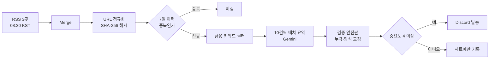

# 금융 뉴스 브리핑 Agent

멀티캠퍼스 AIM 2주차 미니프로젝트2 제출 리포지토리입니다.

매일 아침 8시 30분, 여러 뉴스 매체의 기사 중 금융 관련 기사만 골라 요약하고 중요도를 매겨 디스코드로 자동 발송하는 n8n 워크플로우입니다.

## 왜 만들었나

자산운용사 리서치팀은 매일 아침 여러 뉴스 사이트를 각자 개별적으로 순회합니다. 여기서 세 가지 문제가 생깁니다.

| 문제 | 결과 |
| --- | --- |
| 팀원마다 다른 사이트를 본다 | 정보 비대칭 |
| 비금융 기사를 사람이 걸러낸다 | 시간 낭비 |
| 같은 기사를 여러 번 연다 | 중복 노동 |

**한 명이 한 번 정리해서 팀 전체에 뿌리면 되는 일**을 각자 반복하고 있는 구조입니다. 그 한 명을 자동화했습니다.

## 동작 흐름

중복 차단과 키워드 필터를 **LLM 호출보다 앞에** 둔 것이 이 설계의 핵심입니다. 이유는 아래 트러블슈팅에 있습니다.

## 문서

| 파일 | 내용 |
| --- | --- |
| [미니프로젝트2_김민석.md](./미니프로젝트2_김민석.md) | **제출 문서** — 요구사항 체크, 판단 근거, 테스트 결과 |
| [docs/00_개발요청서.md](./docs/00_개발요청서.md) | 원본 개발 요청서 |
| [docs/01_개발기획서.md](./docs/01_개발기획서.md) | 상세 개발 기획서 (노드 설계, 프롬프트, 근거) |
| [docs/02_구축가이드.md](./docs/02_구축가이드.md) | 처음부터 끝까지 구축 절차 |
| [workflow/finance_news_briefing.json](./workflow/finance_news_briefing.json) | n8n 워크플로우 (import 가능) |

## import 후 필수 설정

워크플로우 JSON에는 자격증명·웹훅 URL·스프레드시트 ID가 플레이스홀더로 되어 있습니다. n8n에 import한 뒤 아래를 채워야 동작합니다.

1. `이력 조회` / `이력 기록` — Google Sheets 자격증명 + 스프레드시트 ID
2. `Gemini Chat Model` — Google Gemini API 자격증명
3. `Discord 발송` — 실제 Discord 웹훅 URL
4. Workflow Settings → Timezone = `Asia/Seoul`

자세한 절차는 [구축 가이드](./docs/02_구축가이드.md)를 참고하세요.

## 요구사항 요약

| 항목 | 처리 |
| --- | --- |
| RSS 수집 | 연합뉴스·한국경제·매일경제 3개 |
| 중복 발송 방지 | 정리한 URL의 SHA-256 해시로 대조, LLM 호출 이전 차단 |
| 금융 키워드 필터 | LLM 앞에 배치 (비용 절감) |
| LLM 요약/중요도 | Gemini + Structured Output, 중요도 4 이상만 발송 |
| 발송 | 여러 기사를 메시지 1개로 묶어 Discord 발송, 0건인 날도 구분 가능 |
| 이력 기록 | Google Sheets에 자동 누적 |

## 막혔던 문제들

기획서가 v1.0에서 v1.6까지 여섯 번 개정된 건, 실기동에서 실제로 터진 문제들 때문입니다. 전체 기록은 [개발기획서](./docs/01_개발기획서.md)의 변경 이력에 있습니다.

### LLM 호출 188회 → 4회

처음에는 필터를 통과한 기사를 **건별로** LLM에 보냈습니다. 필터 통과가 188건이었고, 첫 배치부터 `429 Too Many Requests`가 났습니다. 무료 티어의 분당 5요청 한도에 걸린 겁니다.

세 가지를 동시에 적용해 해결했습니다.

1. **키워드 필터 강화** — LLM 앞단에서 더 많이 걸러낸다
2. **일일 상한 40건** — 아무리 많아도 그 이상은 보내지 않는다
3. **10건씩 배치 요약** — 한 번의 호출로 10건을 처리한다

결과적으로 호출 수가 **188회에서 4회로** 줄었습니다. 비용 제약이 오히려 더 나은 설계를 강제한 사례였습니다.

### Discord에 같은 메시지가 3통 갔다

RSS 3개를 하나의 하류 노드에 직접 연결했는데, **n8n은 이걸 병합하지 않고 하류 체인 전체를 3번 실행**합니다. 문서만 보고는 알 수 없었고 실기동에서 메시지가 3통 발송되고 나서야 알았습니다. Merge 노드를 필수로 넣는 것으로 정정했습니다.

### 배치 요약에서 기사가 사라졌다

10건을 묶어 보냈는데 6건만 돌아오는 경우가 있었습니다. LLM이 조용히 일부를 빠뜨린 겁니다. 각 기사에 id를 붙여 보내고 **응답에서 id를 되짚어 누락을 검사**하도록 바꿨습니다.

### 메시지가 잘렸다

중요도 4 이상 기사가 17건까지 늘어나 Discord의 2,000자 제한에 걸렸습니다.

여기서 `MIN_IMPORTANCE`를 5로 올리면 간단히 해결되지만, **그건 요구사항 위반**입니다. 요청서에 중요도 4 이상을 보내라고 되어 있으니까요. 대신 중요도 판정 기준이 요청서 원문에서 느슨해져 있던 것을 되돌려, 4점이 남발되지 않도록 프롬프트를 고쳤습니다.

**숫자를 만지면 증상은 사라지지만 요구사항은 어긋납니다.** 어느 쪽을 고쳐야 하는지 구분하는 게 중요하다고 생각합니다.
